# 地图编辑器使用说明

## 基本介绍

地图编辑器是针对基岩版（C++版）的地图编辑工具，界面分为提供基础功能的菜单栏、集成各种工具及属性的工具栏、进行地图绘制修改的操作区三个部分。

目前地图编辑器提供了笔刷工具、地形工具、橡皮工具、选取工具等等常用的便捷工具，开发者可以通过这些工具在操作区像使用绘图软件一样，对地图存档进行修改与绘制。

建议跟随下面的视频进行学习哦。

<video id="video" controls="" preload="none" width=800 height=450>
	<source id="mp4" src="https://mc.v.netease.com/2020/0316/364bf2f89fce29f049ee14951c3bda56qt.mp4" type="video/mp4">
</video>

## 镜头移动方式

编辑器内的操作区里，默认的镜头移动方式类似我的世界飞行模式：

- WASD键控制前后左右的移动，Shift键向下移动，空格键向上移动；

- 长按鼠标右键并移动鼠标，可调整当前视角；

- 使用鼠标滚轮沿当前镜头方向前进/后退。

可于菜单的设置->操作方式中将移动方式更改为镜头模式。在镜头模式下，W/S键控制移动为沿镜头方向的前进/后退。

## 功能结构

地图编辑器的主要操作分为4个模块：

- **选取**：选取特定的方块集合，被选中的方块会显示包围盒；
- **编辑**：对选取的方块进行快速编辑；
- **笔刷**：切换至笔刷工具，使用画刷的方式快速放置方块；
- **地形**：切换至地形工具，快速构造地形。

### 选取功能

点击工具栏中的“选取”按钮，进入选取模式，然后可在操作区选取方块。

在操作区中，选择一个方块作为初始点，然后左键按住拖拽至结束点，以初始点和结束点为对角线生成包围盒。

可于左上角切换为复选模式（右侧按钮），此时可同时拉取多个包围盒。包围盒内的方块即为被选中的方块。

可对包围盒进行以下操作：

- 左键悬浮于指定面并长按拖动，可调整面的位置；

- 左键悬浮于指定面的边缘并长按拖动，可调整与该面相邻的面的位置；

* 选中包围盒后左键拖拽坐标轴上的红绿蓝轴点，可将包围盒向对应方向移动；拖拽白色原点则自由移动包围盒；

- 取消包围盒有两种操作方式：1，右键点击包围盒，然后点击取消选择按钮；2，使用快捷键取消对该包围盒的选取；

- Ctrl+鼠标滚轮调整包围盒的纵向位置；

- 用键盘方向键调整包围盒的水平位置。

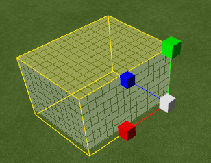

对选中的包围盒及其内部的方块可进行以下即时操作：

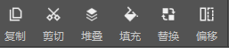

- 剪切/复制: 将包围盒及内部方块剪切/复制至剪贴版；

- 堆叠：将选中区域沿X/Y/Z轴定向堆叠指定次数；

- 填充：将选中区域中的全部空间替换成选定的方块；

- 替换：将选中区域中含有的某一种方块全部替换为选定的方块；

- 偏移：将选中区域及内部方块向指定方向偏移指定的距离；

- 删除：框选包围盒后使用delete快捷键快速删除包围盒内的模型。

### 编辑功能

选中包围盒后，点击工具栏的编辑按钮进入编辑模式；此时，对于选中区域的编辑会更改其内部的方块结构。

编辑过程中显示的图像为模拟生成的结果，编辑完成后点击游戏窗口上方的“确认生成”方可正式生效。

编辑模式下，对包围盒的操作方式和选取模式下的方式基本相同，但编辑模式下，操作会同步修改包围盒内的方块（如面调整、整体移动、放缩等）。

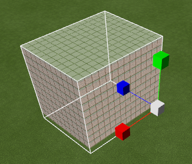

旋转和规则缩放等操作可在编辑模式下唤出的二级工具栏中进行。

### 笔刷功能

点击工具栏中的“笔刷”按钮，进入笔刷模式。在笔刷模式下，在操作区内点击或长按左键，可快速生成方块。在材质预设窗口中，可调整笔刷生成方块的参数。

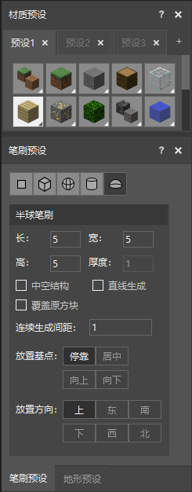

目前提供了单点、方形、球形、圆柱、半球等多种形状的笔刷。笔刷有多种设置参数，我们以半球笔刷为例进行说明：  

- 笔刷大小：除了单点笔刷是固定的1个方块大小外，其他笔刷均可设置长、宽、高3个参数；
- 中空结构：勾选后，会生成中空结构（3x3x3以上体积才有效），壁体的厚度由“厚度”参数决定；
- 直线生成：勾选后，先单击一个坐标，然后单击另一个坐标，就会在以两点为端点的线段上生成方块；
- 覆盖原方块：若勾选，则笔刷的方块会覆盖地图上位置重叠的已有方块；
- 连续生成间距：按住鼠标拖动时，生成方块的间距；
- 放置基点：选择“停靠”时，笔刷方块会贴着鼠标选中的方块放置，比如鼠标选中方块的上面，则笔刷方块生成在方块上方，鼠标选中方块的下面，则笔刷方块生成在方块下方；选择“居中”时，会以选中的方块作为中心生成笔刷方块；选择“向上”时，会以选中的方块作为下顶点生成笔刷方块；选择“向下”时，会以选中的方块作为上顶点生成笔刷方块。
- 放置方向：对于非中心对称的笔刷形状，可选择不同的放置方向；以半球笔刷为例，就有6种放置方向，可在编辑器中实际体验不同方向的放置效果。
-  方块朝向：对于有朝向的方块（如床、末地烛等）可以通过数字键旁边的 “上下左右” 方向键调整方块的朝向。而对于铁轨、红石线等，则由方块间的连接关系生成对应的朝向。 

### 地形功能

点击工具栏的“地形”按钮，即可进入地形操作模式。在地形操作模式中，可通过点击或长按快速调整区域内的方块，下面具体介绍每个地形操作的效果。

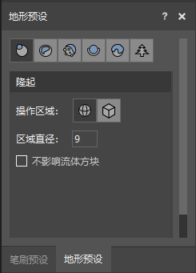

- 隆起：让指定区域内的方块隆起1格。其中区域可选择球形区域或者立方体区域，可通过区域直径或区域边长设置区域大小。如果勾选“不影响流体方块”，那么地形操作不会影响到已有的水或岩浆方块。
- 侵蚀：去掉突出的方块。参数的意义同隆起。
- 平滑：去掉突出的方块，填充凹陷的地方，让选中区域变得更加平滑。参数意义同隆起。
- 填充：填充凹陷的地方和空洞。参数意义同隆起。
- 顶层覆盖：在选中区域覆盖一层材质预设窗口中选定的材质。如果效果中选择“替换”，则会替换已有顶层方块，如果选择“覆盖”，则会在已有顶层方块上方生成新的方块。可通过“层数”设置替换或覆盖的方块层数。其他参数的意义同隆起。
- 植物：在选定的坐标上生成植物，可选择的植物类型有6种树木、竹子、仙人掌、蘑菇。其中，橡树、云杉树、丛林树可选择体型（普通或大型）。需要注意的是，植物生成是有一定限制条件的，比如仙人掌不能在草方块上生成，树木不能在石块上生成等等，当鼠标点击位置不符合生成条件时，不会生成植物，且在编辑器底栏会提示“该地点无法放置当前类型的植物”。

### 素材功能

选中包围盒后，可使用“保存为素材”功能可将包围盒内模型存入素材库长期使用。

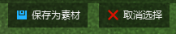

在素材库选中素材后，可以在游戏内自由放置多次。放置完成后，点击“确认生成”即在游戏内生成对应方块。

素材数据保存在mdl文件中,素材库可在不同地图之间使用。

- 导入: FBX等模型资源可以通过导入转换成素材文件，也可以直接导入素材文件。

  首先选择对应的模型文件（支持fbx或obj格式文件）。 

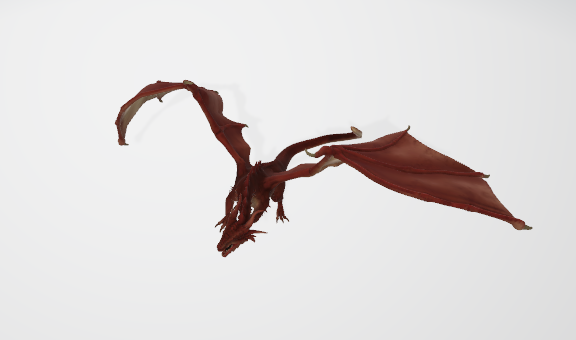

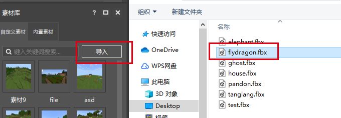

​		 然后设置对应的素材名称和需要转换的素材大小 

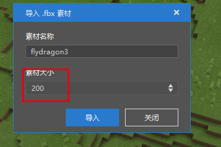

​	     转换完成的素材，即可放置到地图场景中 。

- 导出： 生成的素材文件，还可以通过导出功能，共享给其他开发者合作使用。选择对应的素材文件，鼠标右键使用导出功能，即可将生成的素材文件导出。 

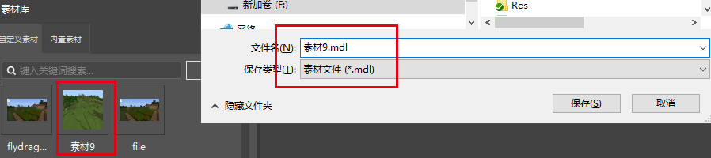

## 结构功能

选择"保存为结构"功能，即可将包围盒选择范围内的方块保存为结构文件。

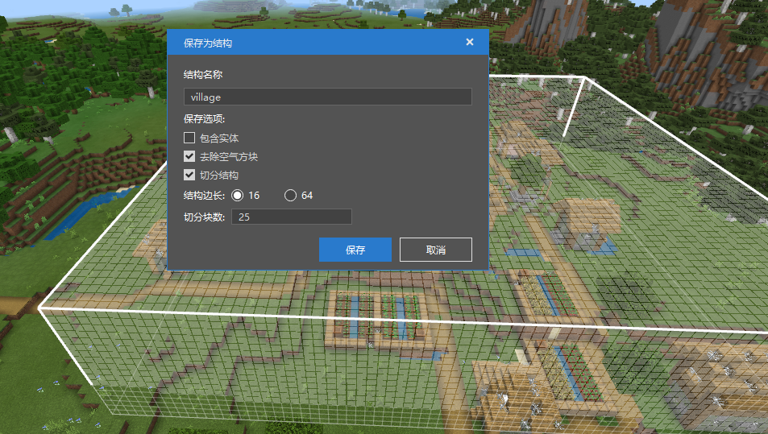

选择包含实体：则保存的结构数据文件中将包含实体(动态,可移动)对象信息。

选择去除空气方块：则生成的结构数据文件中将不包含空气方块信息。

选择切分结构：则会按照选择的结构边长，将结构切分成多个结构数据文件，适用于大范围的方块信息保存。

生成的结构文件在当前作品的 行为包的structures/命名空间 文件夹下 。

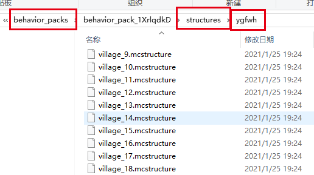

使用结构方块，输入对应结构文件所在文件夹和文件名称即可使用此结构。

如果选择了切分结构，将选择范围内的方块生成多个结构文件保存，则会同时生成对应的各个结构文件基础坐标的配置信息。

解析此配置文件，通过ModSDK的<a href="../../mcdocs/1-ModAPI/接口/世界/地图.html#placestructure" rel="noopenner"> PlaceStructure </a>接口在脚本中设置对应的坐标和结构文件名称信息，即可在对应维度地图中生成还原出保存的地图数据。

## 常用快捷键

以下为常用的快捷键。

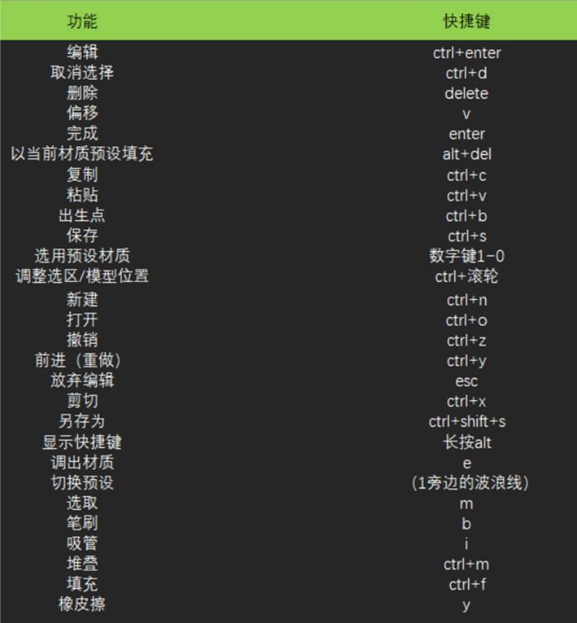
