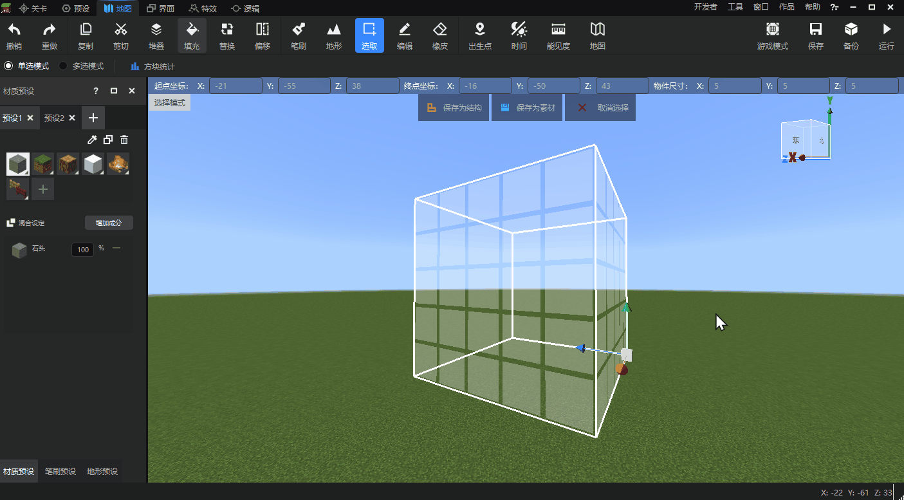

# 方块状态值设置

[本次更新](../10-新内容/1-开发工作台/976-1.0.12.md)，我们新增了地图编辑器中方块状态值设置功能。这个功能让开发者能够在使用材质预设、笔刷、填充、替换等方块操作时，对所使用方块的状态值进行详细设定。这个功能旨在解决地图编辑器只能使用方块默认状态值，满足不了开发者多样化地图设计需求的问题。

下面我们来具体看下方块状态值设置功能是如何使用的吧！

## 材质预设状态值设置

我们创建一个新的材质预设。在【选择材质】窗口中，我们选择一个带有多种状态值的方块，可以看到窗口右下角出现了【状态值设置】tab。

展开tab，我们可以看到当前所选方块的可配置状态值，直接通过下拉选框调整即可修改所选方块的状态值，并应用到材质预设中。

- 从上图的示例中可看出，混合材质中的每个材质都能进行单独的状态值编辑。
- 方块贴图本身无法反应出状态值变化。为了方便开发者们对混合材质中每个材质进行准确判断，当鼠标悬停在混合材质面板的某个方块上时，会通过提示框展示该方块的具体状态值配置。

配置好的材质预设可以应用到笔刷、填充等多个功能，并且能够保留其中的状态值设置。

## 填充工具状态值设置

填充工具的方块选择也可以使用状态值设置进行精确调整。

我们可以直接使用在材质预设中设置好的预设项进行填充，也可以直接选择需要使用的方块，在下方设置其状态值后直接应用。

## 替换工具状态值设置

在引入了状态值之后，不同状态值的同种方块在替换窗口会分别显示，这样开发者可以单独对其中一种状态值进行替换处理，而不影响其他状态值的该方块。

开发者可以将鼠标悬停在左侧窗口的方块上，查看提示框上显示的状态值信息，判断是否是自己需要替换的状态值。

## 其他说明

- 材质预设窗口的【吸管】、【复制】工具均会保留方块状态值信息。
- 工具栏中的【方块统计】功能会将不同状态值的同种方块合并统计，而不会每种状态值单独统计。