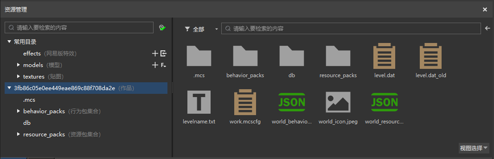
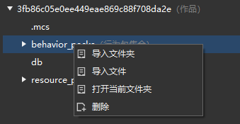

# 文件结构（旧版）

资源管理窗口中，左侧分为常用目录和作品目录两大部分，常用目录是作品内的文件夹的快捷进入方式。左侧选中某个文件夹时，右侧会显示该文件夹的内容。  

我的世界游戏引擎会从Mod中固定的路径读取所需的文件，因此文件要放到对应的文件夹中，否则在游戏内不会生效。例如，生物的行为JSON文件必须放在行为包下的entities文件夹中。

下面是地图类型作品的文件夹结构。

作品文件夹  
|--&nbsp;.mcs&nbsp;&nbsp;*//文件夹，保存了编辑器配置信息。*  
|--&nbsp;behavior_packs&nbsp;&nbsp;*//文件夹，行为包集合，下面可放置多个行为包。*  
|&nbsp;&nbsp;&nbsp;|--&nbsp;behavior_pack_\*\*\*&nbsp;&nbsp;*//文件夹，行为包，命名并没有固定的格式。*  
|&nbsp;&nbsp;&nbsp;&nbsp;&nbsp;&nbsp;&nbsp;&nbsp;|--&nbsp;entities&nbsp;&nbsp;*//文件夹，放置实体的JSON文件，配置实体的血量、攻击、行为等。*  
|&nbsp;&nbsp;&nbsp;&nbsp;&nbsp;&nbsp;&nbsp;&nbsp;|--&nbsp;script_\*\*\*&nbsp;&nbsp;*//文件夹，Python脚本文件夹，一般为script加特定字符串。*  
|&nbsp;&nbsp;&nbsp;&nbsp;&nbsp;&nbsp;&nbsp;&nbsp;|--&nbsp;items&nbsp;&nbsp;*//文件夹，放置物品的原版JSON文件，配置物品的使用时间、效果等。*  
|&nbsp;&nbsp;&nbsp;&nbsp;&nbsp;&nbsp;&nbsp;&nbsp;|--&nbsp;netease_items&nbsp;&nbsp;*//文件夹，放置网易版自定义物品的JSON文件。*  
|&nbsp;&nbsp;&nbsp;&nbsp;&nbsp;&nbsp;&nbsp;&nbsp;|--&nbsp;netease_blocks&nbsp;&nbsp;*//文件夹，放置网易版自定义方块的JSON文件。*  
|&nbsp;&nbsp;&nbsp;&nbsp;&nbsp;&nbsp;&nbsp;&nbsp;|--&nbsp;loot_tables&nbsp;&nbsp;*//文件夹，放置掉落配置JSON文件。*  
|&nbsp;&nbsp;&nbsp;&nbsp;&nbsp;&nbsp;&nbsp;&nbsp;|--&nbsp;recipes&nbsp;&nbsp;*//文件夹，放置原版的配方JSON文件，如工作台、熔炉配方。*  
|&nbsp;&nbsp;&nbsp;&nbsp;&nbsp;&nbsp;&nbsp;&nbsp;|--&nbsp;spawn_rules&nbsp;&nbsp;*//文件夹，放置原版的生物生成规则的JSON文件。*  
|&nbsp;&nbsp;&nbsp;&nbsp;&nbsp;&nbsp;&nbsp;&nbsp;|--&nbsp;trading&nbsp;&nbsp;*//文件夹，放置原版的交易配置文件。*  
|&nbsp;&nbsp;&nbsp;&nbsp;&nbsp;&nbsp;&nbsp;&nbsp;|--&nbsp;storyline&nbsp;&nbsp;*//文件夹，放置逻辑编辑器生成的逻辑文件。*  
|&nbsp;&nbsp;&nbsp;&nbsp;&nbsp;&nbsp;&nbsp;&nbsp;|--&nbsp;Galaxy&nbsp;&nbsp;*//文件夹，放置逻辑编辑器中的宏文件。*  
|&nbsp;&nbsp;&nbsp;&nbsp;&nbsp;&nbsp;&nbsp;&nbsp;|--&nbsp;pack_manifest.json&nbsp;&nbsp;*//文件，配置行为包的信息，包括uuid、版本信息。*  
|--&nbsp;resource_packs&nbsp;&nbsp;*//文件夹，资源包集合，下面可放置多个资源包。*  
|&nbsp;&nbsp;&nbsp;|--&nbsp;resource_pack_\*\*\*&nbsp;&nbsp;*//文件夹，资源包，命名并没有固定的格式。*  
|&nbsp;&nbsp;&nbsp;&nbsp;&nbsp;&nbsp;&nbsp;&nbsp;|--&nbsp;entity&nbsp;&nbsp;*//文件夹，放置实体客户端的配置JSON文件。*  
|&nbsp;&nbsp;&nbsp;&nbsp;&nbsp;&nbsp;&nbsp;&nbsp;|--&nbsp;attachables&nbsp;&nbsp;*//文件夹，放置原版装备模型的文件。*  
|&nbsp;&nbsp;&nbsp;&nbsp;&nbsp;&nbsp;&nbsp;&nbsp;|--&nbsp;models&nbsp;&nbsp;*//文件夹，放置模型文件，包括原版生物模型文件、骨骼模型文件等。*  
|&nbsp;&nbsp;&nbsp;&nbsp;&nbsp;&nbsp;&nbsp;&nbsp;|--&nbsp;materials&nbsp;&nbsp;*//文件夹，放置材质文件，一般来说无需关心。*  
|&nbsp;&nbsp;&nbsp;&nbsp;&nbsp;&nbsp;&nbsp;&nbsp;|--&nbsp;effects&nbsp;&nbsp;*//文件夹，放置网易版的粒子和序列帧JSON文件。*  
|&nbsp;&nbsp;&nbsp;&nbsp;&nbsp;&nbsp;&nbsp;&nbsp;|--&nbsp;textures&nbsp;&nbsp;*//文件夹，放置各类图片文件，文件夹内按用途又分成了不同文件夹。*  
|&nbsp;&nbsp;&nbsp;&nbsp;&nbsp;&nbsp;&nbsp;&nbsp;|--&nbsp;netease_items_res&nbsp;&nbsp;*//文件夹，放置网易版自定义物品的客户端配置文件。*  
|&nbsp;&nbsp;&nbsp;&nbsp;&nbsp;&nbsp;&nbsp;&nbsp;|--&nbsp;sounds&nbsp;&nbsp;*//文件夹，放置音效文件。*  
|&nbsp;&nbsp;&nbsp;&nbsp;&nbsp;&nbsp;&nbsp;&nbsp;|--&nbsp;texts&nbsp;&nbsp;*//文件夹，放置文本lang文件。*  
|&nbsp;&nbsp;&nbsp;&nbsp;&nbsp;&nbsp;&nbsp;&nbsp;|--&nbsp;ui&nbsp;&nbsp;*//文件夹，放置界面JSON文件。*  
|&nbsp;&nbsp;&nbsp;&nbsp;&nbsp;&nbsp;&nbsp;&nbsp;|--&nbsp;font&nbsp;&nbsp;*//文件夹，放置字体文件，一般来说无需关心。*  
|&nbsp;&nbsp;&nbsp;&nbsp;&nbsp;&nbsp;&nbsp;&nbsp;|--&nbsp;pack_manifest.json&nbsp;&nbsp;*//文件，配置资源包的信息，包括uuid、版本信息。*  
|--&nbsp;.db&nbsp;&nbsp;*//文件夹，保存了地图信息。*  
|--&nbsp;level.dat&nbsp;&nbsp;*//文件，地图相关数据，无需关心。*  
|--&nbsp;level.dat_old&nbsp;&nbsp;*//文件，地图相关数据，无需关心。*  
|--&nbsp;levelname.txt&nbsp;&nbsp;*//文件，记录了存档名字。*  
|--&nbsp;world_behavior_packs.json&nbsp;&nbsp;*//文件，配置这个存档会使用哪些行为包。*  
|--&nbsp;world_resource_packs.json&nbsp;&nbsp;*//文件，配置这个存档会使用哪些资源包。*  
|--&nbsp;world_icon.jpeg&nbsp;&nbsp;*//文件，原版中部分地方会用到该图标作为作品封面。*  
|--&nbsp;work.mcscfg&nbsp;&nbsp;*//文件，保存了编辑器配置信息。*

Addon类型的作品内没有地图文件、behavior_packs、resource_packs，只有行为包、资源包。Addon中的行为包和资源包的结构和上面的说明一样。

对Mod文件结构更深入的解析可以查看[Mod是如何工作的](../20-玩法开发/13-模组SDK编程/1-Mod开发简介/3-Mod是如何工作的.md)。

在文件夹上右键，可以选择导入文件或文件夹，导入操作会把选择的文件拷贝到作品文件夹中。我们需要使用资源时（如设置物品图标），都要先导入到作品文件夹内。  

