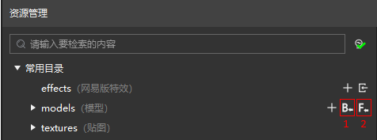
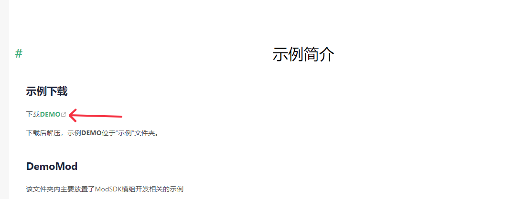
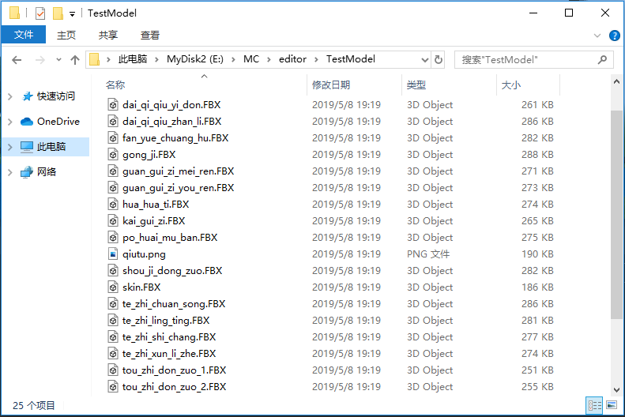
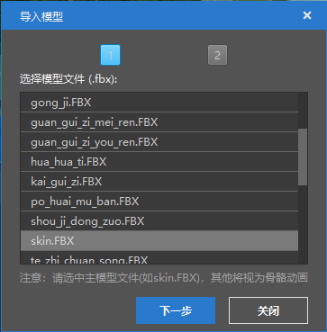
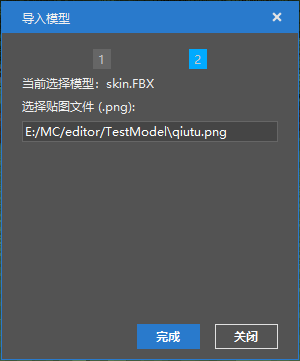
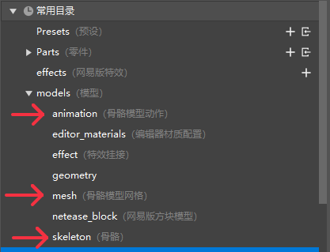

# 资源导入（旧版）

一般我们会用其他专业制作软件来制作游戏资源，有一些资源可以直接为作品所用，如图片资源、音效资源，有一些资源则由于我的世界引擎有特殊格式要求，需转换格式，如模型资源。目前支持以下格式的资源转换：

- BlockBench软件制作的Free Model转换为基岩版中的方块模型；功能入口为下图中的1按钮，具体介绍见[自定义方块模型](../20-玩法开发/15-自定义游戏内容/2-自定义方块/5-自定义方块模型.md)。  
  

- 3D Max等专业建模软件导出的FBX模型，转换为基岩版中的骨骼模型；功能入口为上图中的2按钮。

下面详细介绍导入FBX模型文件的方式。

进入[DEMO示例下载](../20-玩法开发/13-模组SDK编程/60-Demo示例.md)，点击下图中的“下载DEMO”按钮下载离线文档，使用其中的资源“6-4资源制作->工具和示例->fbxRes->datiangou”进行学习。  

点击导入FBX模型按钮，选择模型所在的文件夹（比如上面提到的datiangou文件夹)。一个典型的FBX模型文件夹如下图（这是一个有多个动作的模型）。  

以上面的模型为例，导入时选择“TestModel”文件夹，在弹出的界面中，选择主模型文件，然后点击“下一步”。主模型的命名一般为skin.FBX，如果文件中的没有skin.FBX的文件，那么就需要手动选择正确的主模型文件，否则导入可能会出错。  

接下来选择模型对应的贴图文件，一般来说编辑器会自动选择对应贴图。点击“完成”，模型就导入完成了。  

在models文件夹下的mesh、skeleton、animation三个文件夹存储了转换后的模型文件。  
