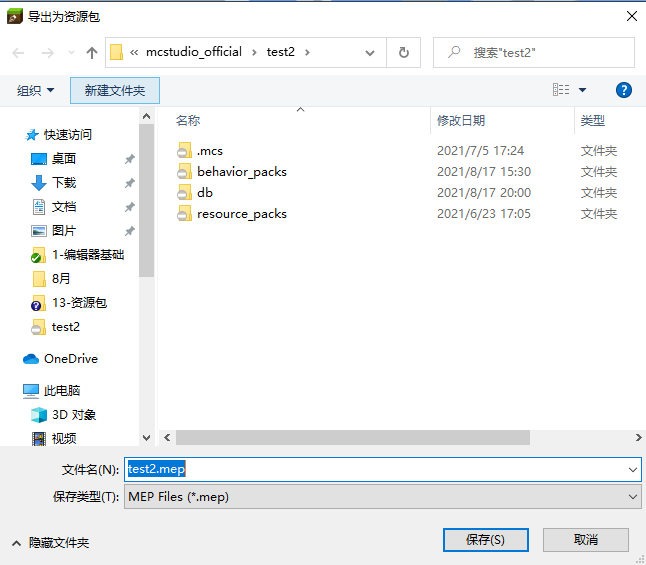
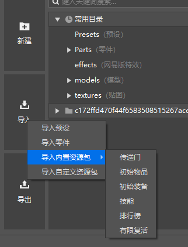

# 资源包导入导出

资源包包含了组件中的可以公用的一部分内容。可以被导入到其他组件中，来实现一些共用模块的复用。

可以导入内置的资源，也可以导入指定位置的资源包

## 资源包导出

您可以使用资源管理器中的“导出”功能来制作一个资源包：

点击“导出”按钮后，会弹出“导出为资源包” 界面， 在该界面，您可以选择相应的文件，然后点击“导出”按钮进行导出。

点击“导出”按钮后，选择对应的文件路径进行保存为资源包（mep文件），一个资源包就成功导出了。

## 资源包导入

您可以使用资源管理器中的“导入”按钮来进行资源包的导入

选择“导入内置资源包”，您可以直接导入内置的资源包

选择“导入自定义资源包”，您可以选择资源包的路径进行导入

## 导入规则

1、对于资源包中一般的文件，若目标组件中不存在对应的文件，将会直接复制到对应的路径。若目标组件中存在相同的文件，则直接跳过。若目标组件中存在同名但内容不同的文件，则中止本次导入，并提示冲突。

2、对于behavior_pack_XXX和resource_pack_XXX中的文件，将会合并到目标组件中第一个behavior_pack_XXX和resource_pack_XXX中对应的路径 。

3、对于resource_pack_XXX中特殊文件，将会对各个文件进行对应的合并处理，无法正确的合并时，将会中止本次导入，并提示冲突。

4、特殊文件的相对路径为有`blocks.json、materials/common.json、models/mobs.json、models/netease_models.json、sounds/sound_definitions.json、textures/flipbook_textures.json、textures/flipbook_textures_items.json、textures/item_texture.json、textures/terrain_texture.json、ui/_ui_defs.json` 以及texts目录下的lang文件。

## 注意事项

1、资源包导出时，如果相关路径的文件发生了改变，需要重新导出。

2、暂不支持Script目录的导入导出。

