# 内容库征集活动投递指南

## 一、征集时间
详情可查看[活动链接](https://mc.163.com/dev/nrkzj/)

1. 内容征集：2022年10月12日-2022年11月2日
2. 初步评审与问题反馈：2022年11月3日-2022年11月9日
3. 资源问题修复：2022年11月10日-2022年11月24日
4. 最终评审结果公布：2022年11月30日
5. 奖励发放：评审结果公布后45个工作日内
6. 资源入库：评审结束后陆续进行
## 二、征集范围
详情可查看[活动链接](https://mc.163.com/dev/nrkzj/)

本次活动提供以下8种推荐类型供开发者们参考，特别需要强调的是，除了上述8种推荐类型之外，同样欢迎开发者投递其他类型的资源，只要是对模组开发有助力和提升的资源，评审团会参照已有类型进行评分和评奖哦~
1. 特效包：中国版粒子、中国版序列帧特效和原版的粒子特效
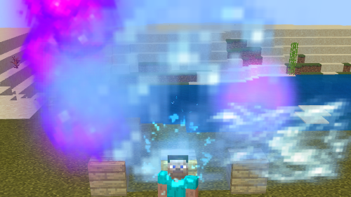
2. 建筑、场景素材包：用于搭建游戏内各类建筑的结构体（.mcstructure后缀）或素材（.mdl后缀）
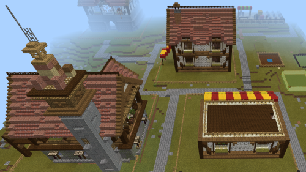

3. 界面包：用于和玩家交互的各类HUD和交互窗口资源，如成就系统，技能栏、自定义的角色展示界面等等。
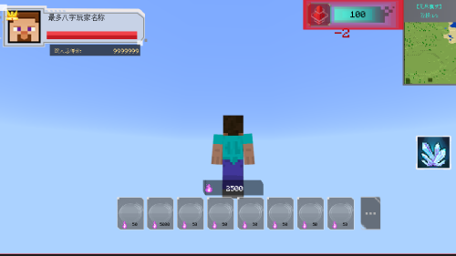

4. 音效包：用于模拟游戏环境或特定动作的背景音乐或音效文件，支持ogg、wav、fsb三种格式
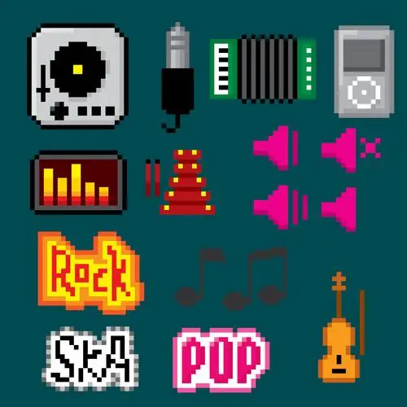

5. 角色模型：用于玩家或实体的模型资源，支持骨骼模型（fbx格式）和原版bb模型
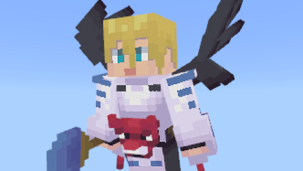

6. 模块化的功能包：用于实现某种特定功能的代码，如使用代码实现的连锁挖矿、自动种植等代码包
 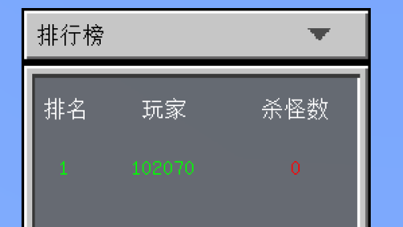

7. 完整玩法示例：实现某种完整玩法的包体，如官方模组大闹天宫等玩法模组。

8. 贴图集：使用在实体皮肤、物品、方块、界面等地方的贴图资源
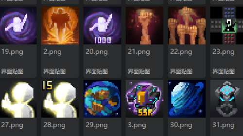

## 三、活动奖励
详情可查看[活动链接](https://mc.163.com/dev/nrkzj/)

1. 一等奖（3名）：奖金1500+纪念版周边大礼包
2. 二等奖（5名）：奖金800+纪念版周边大礼包
3. 三等奖（10名）：奖金300+周边大礼包
4. 创作鼓励奖（无数量限制）：周边大礼包

> 只要你的资源符合比赛规则，达到入库标准，至少可获得创作鼓励奖，经评审后还有机会获得更高奖项的现金和纪念版周边奖励

## 四、投递指南
 **1. 选择自己的投递类型，可选择推荐类型或自由发挥**

 **2. 将所投递的资源用编辑器打开，这里用特效包举例，如下图中，确认要投递的是所有中国版特效**
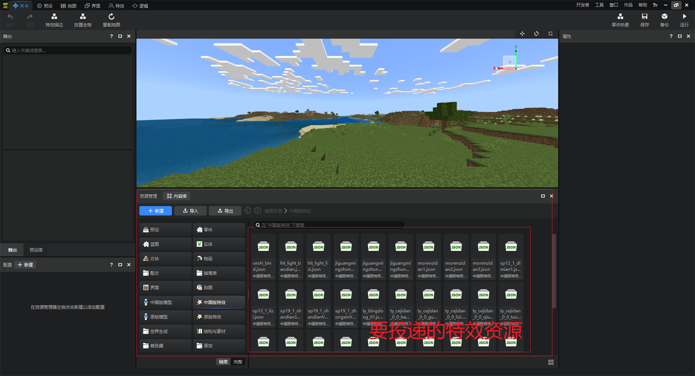

 **3. 新建一个文本文件(txt文件)，命名为说明文档.txt，填写好自己的信息和资源使用说明**
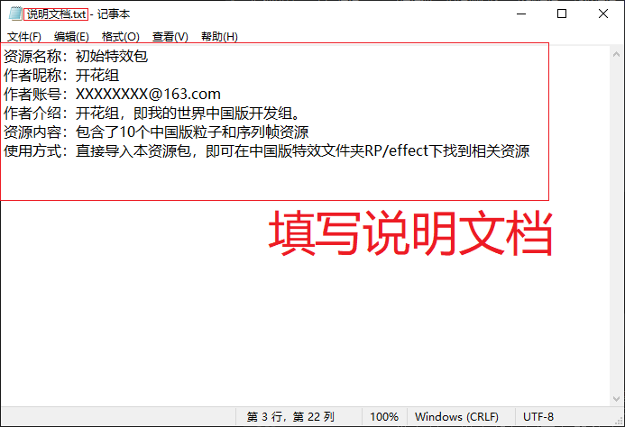

 **4. 将说明文档放入编辑器的文件中，方便下一步一并勾选导出**

 **5. 点击导出，勾选所有特效相关的json和贴图资源，当然也别忘了上一步导入的说明文档.txt**
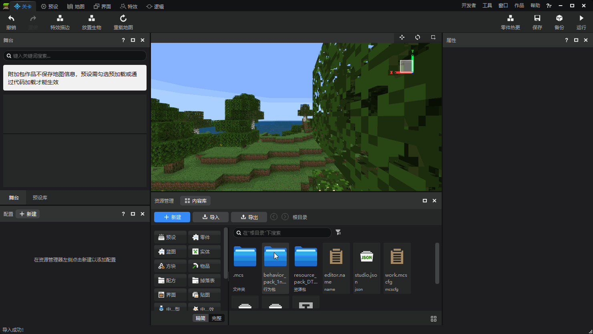

>如果你无法确定所投递的资源依赖哪些json和贴图，可全选导出，并在说明文档说明你投稿的详细内容。

 **6. 按照以下格式编辑邮件，将刚才导出的mep文件添加到附件，并发送到邮箱Minecraft_dev@service.netease.com**
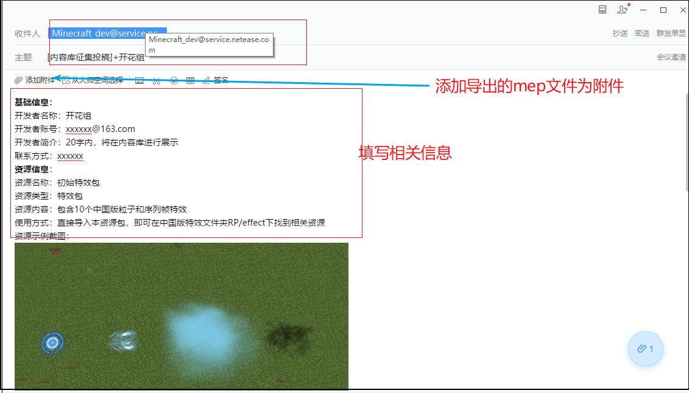

## 五、温馨提示
1. 如果开发者在投稿过程中遇到问题，可扫码进入我的世界开发者频道→内容库征集活动子频道进行咨询和交流。
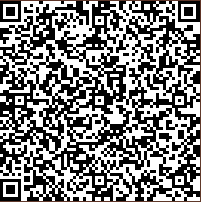