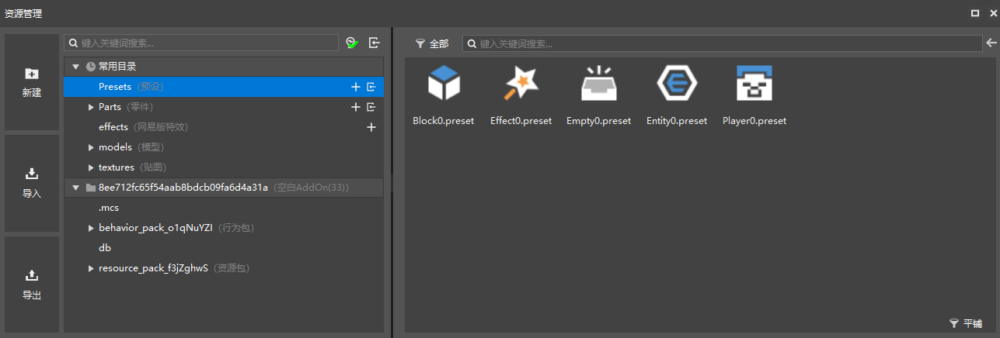
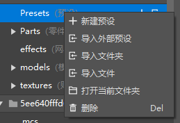
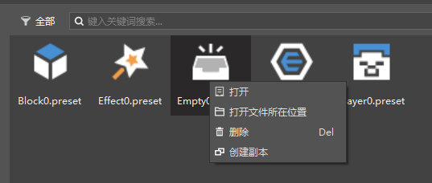
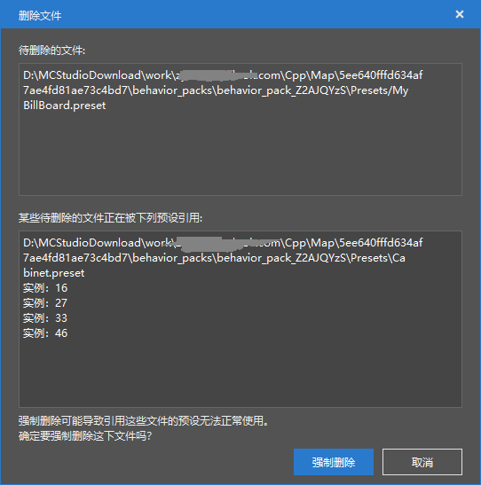

# 资源管理器

## 功能介绍

资源管理窗口中

- 左侧为新建按钮、导入按钮和导出按钮。
- 中间分为常用目录和作品目录两大部分，常用目录是作品内的文件夹的快捷进入方式。
- 左侧目录选中某个文件夹时，右侧会显示该文件夹的内容。

右键文件夹，可以对文件夹执行如下图的操作，每个文件夹提供的操作不尽相同。

右键文件，可以对文件执行如下操作，不同文件提供的操作不尽相同。

- 打开：打开选中的文件
- 打开文件所在位置：在系统资源管理器中打开该文件所在的文件夹
- 删除：将选中文件从作品文件夹中删除
- 创建副本：对选中内容创建一个副本（目前仅支持预设和零件）
> 某个零件文件夹的右键菜单也提供了创建副本选项，功能与上述的创建副本一致。
## 删除预设与删除零件

在预设架构里，存在大量的引用关系，包括预设文件的引用和预设实例的引用。

当删除某个预设或零件时，如果他已经在使用中了，会弹出如下界面，强制删除将自动将其在其他预设和场景中的实例中的引用也删除。

预设架构下的零件不是一个单文件，而是有一系列的配套文件（如前所述）。 

|&nbsp;&nbsp;&nbsp;&nbsp;&nbsp;&nbsp;&nbsp;&nbsp;|--&nbsp;script_\*\*\*&nbsp;&nbsp;*//文件夹，Python脚本文件夹，一般为script加特定字符串。*  
|&nbsp;&nbsp;&nbsp;&nbsp;&nbsp;&nbsp;&nbsp;&nbsp;&nbsp;&nbsp;&nbsp;|--&nbsp;Parts&nbsp;&nbsp;*//文件夹，里面是零件文件夹的子文件夹的链接，正常情况下应与Parts文件夹的内容相同，自动生成，一般无需处理。*

|&nbsp;&nbsp;&nbsp;&nbsp;&nbsp;&nbsp;&nbsp;&nbsp;|--&nbsp;Parts&nbsp;&nbsp;*//文件夹，放置所有的零件文件夹。*  
|&nbsp;&nbsp;&nbsp;&nbsp;&nbsp;&nbsp;&nbsp;&nbsp;&nbsp;&nbsp;&nbsp;|--&nbsp;\*\*\*&nbsp;&nbsp;*//文件夹，放置一个零件的所有文件，名称在新建时确认，不要修改。*  
|&nbsp;&nbsp;&nbsp;&nbsp;&nbsp;&nbsp;&nbsp;&nbsp;&nbsp;&nbsp;&nbsp;&nbsp;&nbsp;&nbsp;|--&nbsp;\*\*\*.part&nbsp;&nbsp;*//零件本体文件。*  
|&nbsp;&nbsp;&nbsp;&nbsp;&nbsp;&nbsp;&nbsp;&nbsp;&nbsp;&nbsp;&nbsp;&nbsp;&nbsp;&nbsp;|--&nbsp;\*\*\*Part.py&nbsp;&nbsp;*//零件脚本文件。*  
|&nbsp;&nbsp;&nbsp;&nbsp;&nbsp;&nbsp;&nbsp;&nbsp;&nbsp;&nbsp;&nbsp;&nbsp;&nbsp;&nbsp;|--&nbsp;\*\*\*PartMeta.py&nbsp;&nbsp;*//零件元数据文件。*  
|&nbsp;&nbsp;&nbsp;&nbsp;&nbsp;&nbsp;&nbsp;&nbsp;&nbsp;&nbsp;&nbsp;&nbsp;&nbsp;&nbsp;|--&nbsp;\_init\_.py&nbsp;&nbsp;*//导入用，不要删除。*  

> 删除Parts文件夹下，某个零件的任意一个文件，将触发整个零件的删除。
