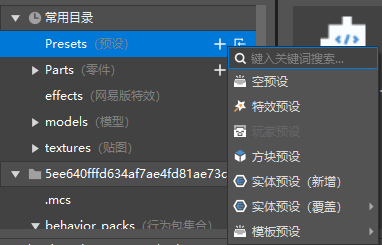

# 新建文件

## 新建文件向导

点击资源管理器的新建，弹出新建文件向导。

你可以在新建文件向导中创建预设，零件，代码、配置。

使用新建文件向导创建文件除了可以新建文件之外，还提供：

- 文件类型说明
- 实体预设，部分配置等选择数据模板（如下图所示）
- 文件命名
- 预设和零件的配套文件创建
- ModMain脚本文件和配套文件的创建
- 脚本代码文件中自动生成必要代码

所以对于新建文件向导支持的文件类型，我们推荐您使用这种方式进行新建。

## 文件夹新建

除了新建文件向导之外，我们还提供了通过文件夹新建的方法。

点击对应的文件夹的“+”，可以通过弹出的菜单进行快捷新建，可以通过这种方式新建的文件类型包括：

- 预设
- 零件
- 特效（序列帧）
- 特效（粒子）

