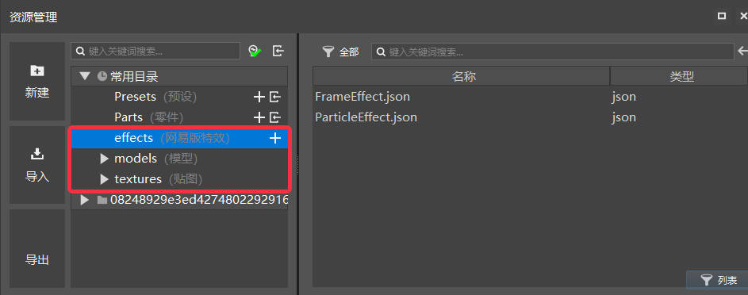
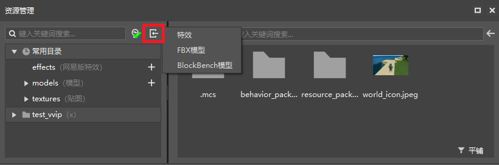
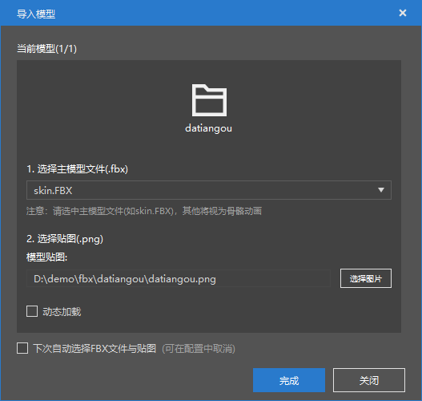
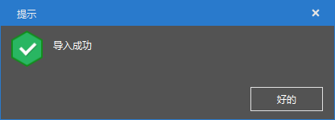
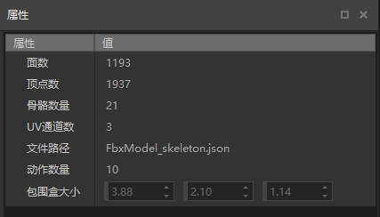
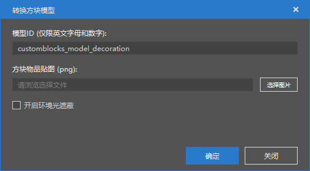
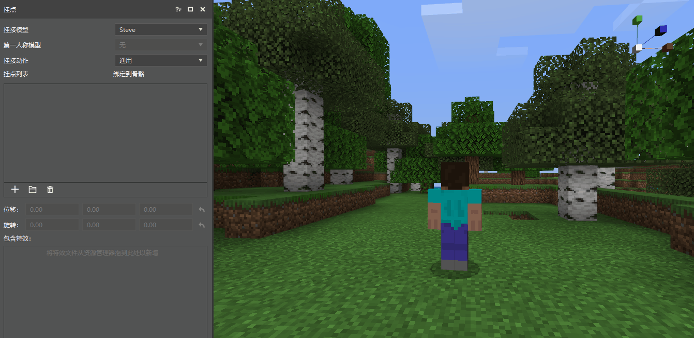
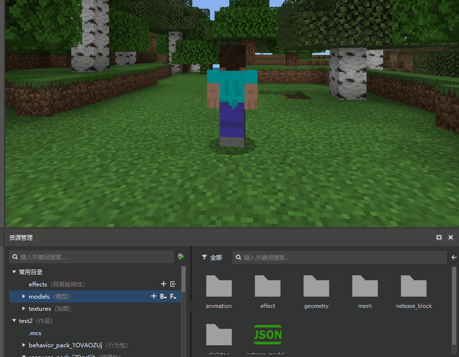

# 入门教程01-模型导入与使用

本篇教程主要介绍以下内容：

1. 我的世界里支持的模型种类有哪些。
2. 特效编辑器里如何导入外部模型。
3. 特效编辑器里如何使用模型。

## 模型支持

在我的世界中，模型的支持主要有两种格式：

>1.FBX通用模型: 以 .fbx 为后缀格式的模型文件。这是一种通用的模型格式，目前几乎所有主流的三维软件中都可以支持 fbx 模型的导出，内部包含信息很丰富，目前的版本中主要支持骨骼模型贴图和骨骼动画。

>2.原版模型: 以.bbmodel 为后缀格式的模型文件。这是专为我的世界制作的模型格式，特点是制作简单且自由。

## 常用目录介绍

如上图所示，在特效编辑器中，资源管理器包含5个常用目录，其中3个与特效相关，分别是：

1. effects 目录：网易自定义特效目录，创建和导入的自定义特效文件都存放在这里目录里。

2. models 目录：模型相关目录，导入的模型骨骼、骨骼动作、骨骼模型网格、网易自定义方块和对应各个模型的特效挂接文件都存放在这个目录的对应文件夹下。

3. textures 目录：贴图目录，特效贴图、骨骼贴图和动画序列帧文件都存放在这个目录的对应文件夹下。

> 图中常用目录只是一种快捷方式，将作品下的资源包展开后也可以找到对应的目录。

## 模型的导入

> 提示：本章需要使用外部模型导入，如果缺少模型，请下载[demo资源](https://x19.gdl.netease.com/demo.zip)，demo 里包含一个大天狗骨骼模型和三个bbmodel模型，以及一个序列帧文件。

如上图所示，在资源管理器的搜索栏的右侧，有两个按钮，分别为筛选按钮和导入按钮，点击红色区域的导入按钮，会出现特效、FBX模型、BlockBench模型，选择选项就可以执行对应的导入功能，下面分别介绍三种资源的导入方式：

### 导入fbx模型

在导入之前，可以先观察 datiangou 模型有哪些东西，打开文件夹，可以看到里面包含了一张 datiangou.png 的贴图和若干个 fbx 文件，为什么有这么多 fbx 文件呢？

通常在制作骨骼模型的同时，也会制作相应的骨骼动画（即模型的动作），每个骨骼动画都会导出成单独的 fbx 文件。使用 [Autodesk FBX Review](https://www.autodesk.com/products/fbx/fbx-review) 可以预览 fbx 模型和播放相应的动作。在这些 fbx 模型中，有一个是主模型文件，即其他的动画都是基于这个主模型为基准导出的，这个和具体的导出配置有关，这里不做详细介绍，只要了解到有主模型文件这个概念即可。

接下来就开始正式导入 fbx 模型了，首先点击  按钮，再选择FBX模型，会出现文件夹选择界面，选择模型所在文件夹，点击确定，出现界面如下：

各个选项的含义如下：

1. 选择主模型，整个文件夹下的其他以此模型为基准的骨骼动画都会被自动导入，如果主模型选择错误，可能会导致其他骨骼动画导入异常。

2. 选择贴图文件，有些模型可能包含多个贴图文件，这里仅支持单个贴图，所以要选择好相应的贴图文件。

3. 动态加载，该选项用于控制模型在游戏中的加载方式，动态加载是指在游戏中使用到该模型时才会去加载对应的模型资源。因为游戏默认启动时全部加载，当包含模型较多时，建议使用动态加载，控制加载数量。

4. 下次自动选择FBX文件和贴图，勾选此项下次会默认选择该文件夹下的贴图文件和模型文件（可在作品-设置-其他取消勾选）。

当选择完成后，主界面的左下方的tips会显示正在导入模型。当模型导入完成后，会弹出提示导入成功的弹窗，这样模型就导入完毕了。

导入后文件分散在 models 文件夹下的各个文件夹内，展开 models 的文件夹，点击骨骼模型网格文件夹或者骨骼文件夹，都可以查看到对应的导入文件，点击文件就可以在右侧属性栏里查看对应的模型属性信息。

### 导入 bbmodel 模型

接下来尝试导入 bbmodel 模型，同样点击导入按钮，并选择BlockBench模型，出现文件选择界面，选择下载的demo/bbmodel/decoration文件夹下的bbmodel文件，选择完成后出现如下导入界面：

各个选项的含义如下：

1. 模型ID，导入模型的唯一ID。

2. 方块物品贴图，一般 bbmodel 中会内置贴图，如果需要引入外部贴图可以在这里进行选择。

3. 开启环境光遮蔽，用于提高模型对光线的处理。

bbmodel模型 导入后的文件存放在 models/netease_block 文件夹和 textures/blocks 文件夹下，具体的使用方法可以参考 [自定义方块模型](../../20-玩法开发/15-自定义游戏内容/2-自定义方块/5-自定义方块模型.md)

## 模型的使用

导入模型完成后，应该如何将主角切换到对应的模型呢，这里有2种方式：

1. 在模型挂接面板里的挂接模型选择对应的模型。

    

2. 当存在模型挂接文件时，直接点击模型挂接文件也会将模型切换回对应的模型，展开 models 文件夹，选择 effect 文件夹，在 effect 文件夹下点击相应的挂接文件即可。

    

将主角切换到对应模型后，我们便可开始进行特效的创建和使用了。