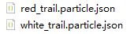
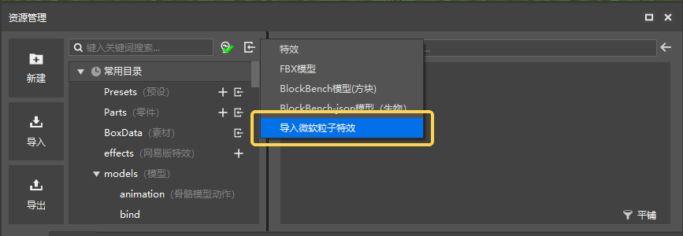
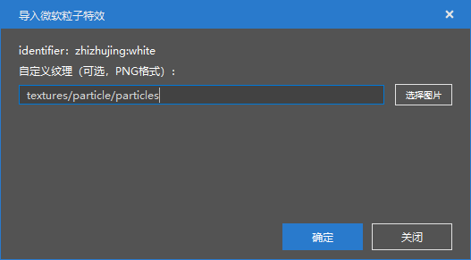
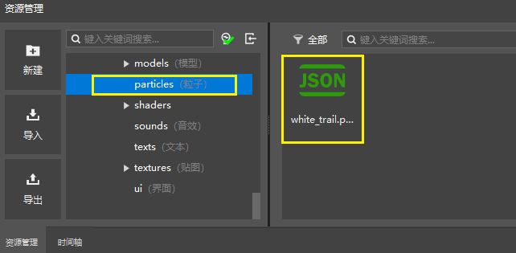
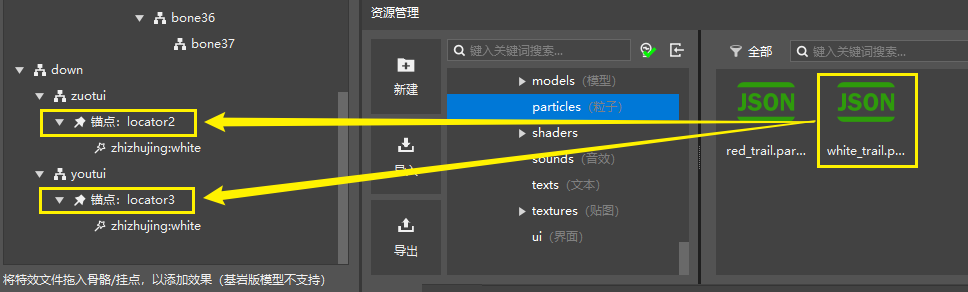
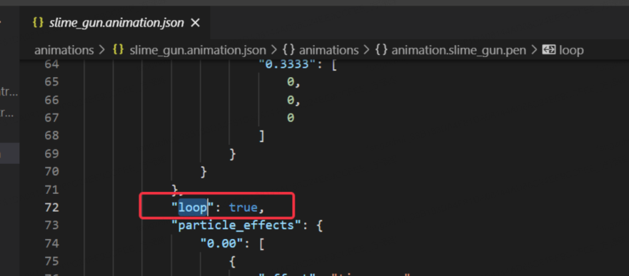

# 原版模型挂接微软粒子特效

## 资源导入前的准备

通常我们会直接编辑json文件或者使用Snowstorm来编辑微软粒子特效。编辑完成后，我们会导出成后缀为【.particle.json】的文件，例如下面我们准备了两个微软粒子特效文件：

> 【注意】
> 1. 导入微软粒子特效时，一定要注意特效文件的identifier不能与已有的特效相同，否则后导入的特效会直接覆盖先前导入的特效。
>     
>  
> 2. 微软粒子特效配置文件中有一项【**Emitter Lifetime**】，用于控制粒子特效的播放是单次还是循环播放。如果选用循环播放（looping）并绑定在实体动作上，则会在实体执行该动作后持续存在于挂点位置，不会自动消失，且类似行走、跑步、攻击等高频重复的动作将会反复产生循环播放的粒子特效导致较为严重的卡顿问题。所以如果希望特效在动作播放后能消失而不是持续驻留，需要将【Emitter Lifetime】的**模式（Mode）** 选为 **单次（once）** 而不是 **循环（looping）**。
>     

## 微软粒子特效导入编辑器

点击资源管理器左上角的资源导入按钮，我们可以在下拉列表中选择【导入微软粒子特效】。

选择好先前保存的white_trail.particle.json，会弹出如下的窗口。这里我们可以选择特效的纹理，这里默认为原生纹理，我们可以点击【选择图片】按钮将其更改为其他纹理资源。点击【确认】后，特效即导入成功，我们可以在资源包的particles文件夹找到刚刚导入的微软粒子特效文件。
按照同样的方法，我们可以导入red_trail.particle.json粒子。

## 将微软粒子特效挂接到原版模型锚点

正如我们将中国版特效挂接到骨骼模型挂点上一样，我们可以直接将资源管理器中的微软粒子特效资源拖动到左侧模型挂接面板的【锚点】上。

> 【注意】
> 1. 当前不支持直接在编辑器中新增或调整原版模型的锚点，如果需要修改，则需要在Blockbench或者模型json文件中调整完毕后再导入使用。
> 2. 不同动作用到的特效需要分别挂接，调整一个动作的特效挂接不会影响其他动作的特效。

此处，我们在xingzou动作下，把white_trail粒子挂接到模型两个脚步锚点上。

然后我们切换到【时间轴】面板，点击【播放】按钮，即可在预览窗中查看粒子挂接后的效果。

现在，我们切换到另一个动作gongji，并且把red_trail粒子挂接到模型背部的8个锚点上，使其能够在攻击动作播放时显示红色攻击特效。然后我们播放不同的动作，即可看到不同的微软粒子特效效果。

## 常见问题

1. 如果微软粒子特效挂接的bb模型动作时长为0，则在编辑器中可能会出现同时多次发射该粒子的情况。
2. 如果bb模型动作时长不为0，但是仍然出现了动作播放时仍然出现了两次播放该粒子的情况，请检查下所挂接的动作json文件中是否存在“loop”字段，如果存在，将其删除。

