# 入门教程03-骨骼模型挂接中国版特效

本篇教程主要介绍以下内容：

1. 挂接面板说明。

2. 骨骼模型如何挂接中国版特效。

## 挂接面板说明
 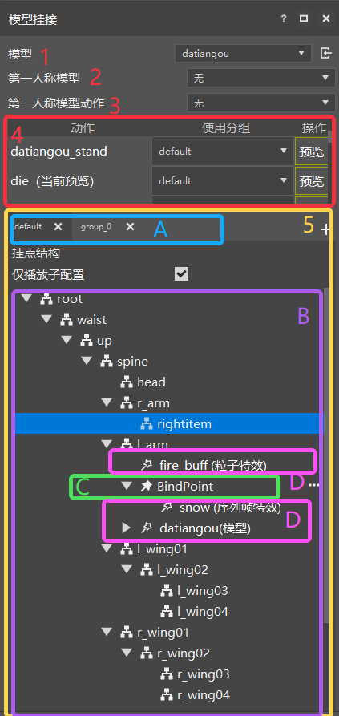

上图是特效编辑器里的模型挂接面板，其各个参数说明如下：

1. 模型：用于显示和修改当前挂接模型名称。

2. 第一人称模型：用于显示和修改当前挂接模型的第一人称模型。具体用法可参考[第一人称模型修改](./5-第一人称模型修改.md)
3. 第一人称模型动作：用于显示和修改当前挂接模型的第一人称视角播放的模型动作

4. 动作列表：用于显示和修改和预览当前挂接模型的骨骼动画，并为每个动作提供了单独的分组选择下拉框，开发者可以在此选择每个动作使用不同的分组，双击某一动作或点击右边的预览按钮能够切换当前游戏窗口预览的动作，如下图所示。

 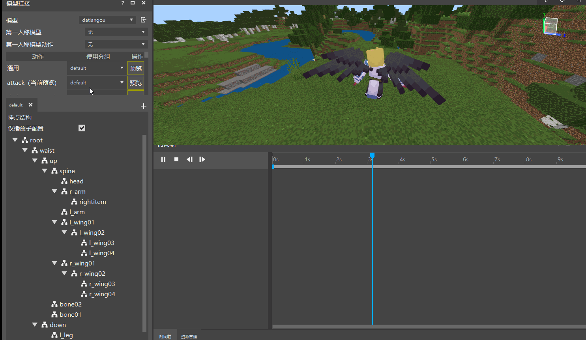

另外特效编辑器为每个模型都默认添加了一个空动画“通用”，在“通用”下，模型不会播放任何动画。

  > Steve 不算骨骼模型，所有没有骨骼动画。

5. 挂点列表：图中黄色方框内的部分就是挂点列表，用于显示和管理骨骼模型当前的骨骼节点和特效挂接结构。挂点列表包含挂接分组、挂点结构、挂接点和挂接资源（如图中ABCD所示）。

    - A-挂接分组：存放一系列挂接信息，通过创建多个不同的分组可以有效管理同个模型不同状态下的挂接信息，当前挂接分组主要用于第4点中的动作列表，可为每一个动作选择不同分组下的挂点信息以达到切换特效的功能。
  
        >操作按钮：挂点分组右侧的可以新增挂点分组，每个分组右侧的X可以删除当前挂点（default分组只能清空挂接信息，不可删除）

    - B-挂点结构：通过列表或树结构实时展示当前挂接模型的骨骼/部件结构以及相对应的挂接资源信息
    - C-挂接点：挂接资源信息的一种，用于挂接特效资源等，即模型挂接的特效信息是存放在挂接点的，每个模型拥有不同的挂接位置，挂接点可以调整自身挂接特效的位置。
    - D-挂接资源：粒子特效，序列帧特效，骨骼模型等我们需要挂接到当前模型身上的资源。可以直接挂接到骨骼模型、部件（无法挂接模型）或挂接点上。
    - 快捷操作：在挂点列表的任意节点右键可触发快捷操作，对于不同类型节点支持的快捷操作如下
        >骨骼节点：新建挂点、绑定模型、复制分组（挂点信息）、粘贴分组（挂点信息）、复制（当前节点挂点信息），粘贴（当前剪贴板的特效信息），粘贴信息（当前节点挂点信息）
        
        >部件节点：新建挂点、复制分组（挂点信息）、粘贴分组（挂点信息）、复制（当前节点挂点信息），粘贴（当前剪贴板的特效信息），粘贴信息（当前节点挂点信息）

        >挂接点节点：删除、重命名、复制分组（挂点信息）、粘贴分组（挂点信息）、复制（当前节点），粘贴信息（当前节点挂点信息）粘贴（节点）、创建副本

        >特效资源节点（粒子、序列帧、模型）：删除、复制分组（挂点信息）、粘贴分组（挂点信息）、复制（当前节点）

以上即为挂接面板的参数，下面来进行实际使用。

## 模型挂接特效

经过前面两个入门教程，在存档里拥有的资源为：一个骨骼模型 dataiangou 及相应的骨骼动画，两个特效文件：fire_buff.json 红色粒子特效和 snow.json 蓝色雪花圆圈特效。确定了这些资源后就可以正式开始特效挂接。

> 如果没有模型也不影响，用默认的 Steve 即可，只是无法播放其他动作。

1. 首先点击挂接模型，将 Steve 切换到 datiangou，即可看到人物变成了大天狗的模型，然后找到动作run，双击或点击右侧的预览，再点击时间轴上的播放按钮，就可以看到播放奔跑动作。

    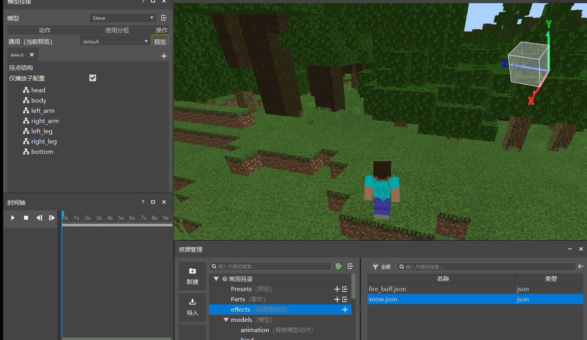

2. 创建挂接分组，点击新建挂接分组按钮 ，输入 buff，即可创建 buff 分组，然后在该分组选中挂点结构中的l_arm，右键选择新建挂接点fire01和fire02，如图所示：

    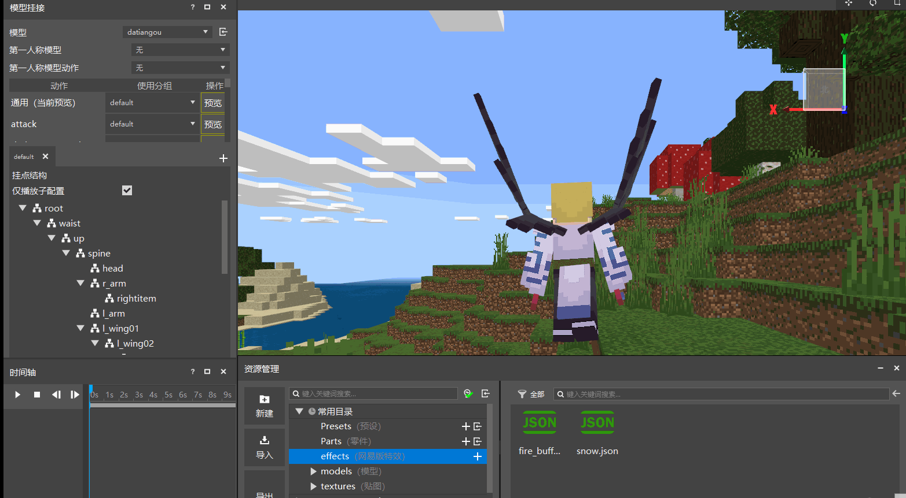
    > 注意:模型的具体挂接位置是由模型本身确定的

3. 点击资源管理器，将里面的 fire_buff.json 拖入到fire01挂接点中，点击时间轴的播放，即可看到模型的左肩部产生红色buff特效

    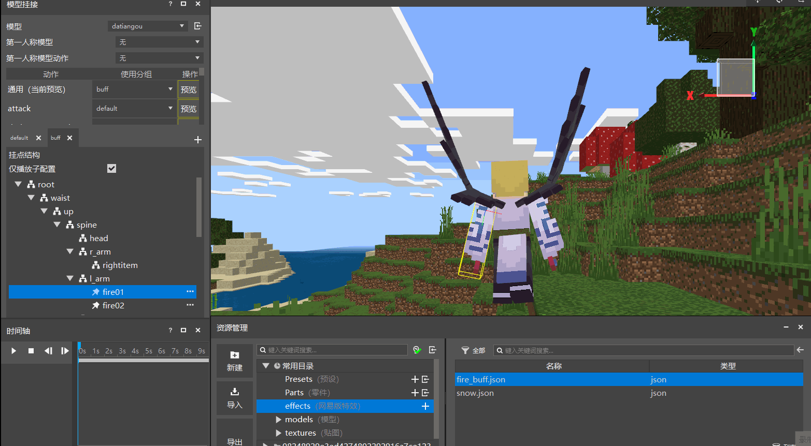

4. 点击挂接点 fire02，将 fire02 的挂接位置修改为大天狗的右臂(r_arm)，同样的将 fire_buff.json 拖入到包含特效中，即可看到效果如下：

    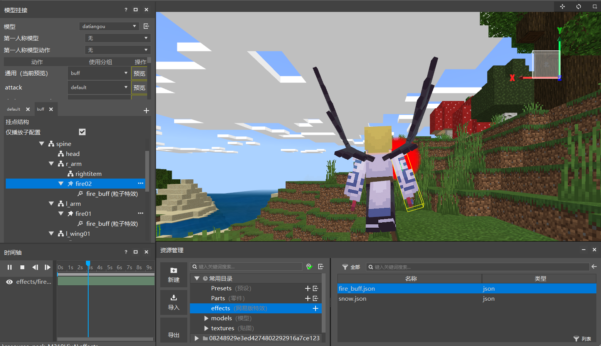

5. 修改了 fire02 后，为什么已经在左肩和右肩都挂了粒子特效，仍然只有右肩在播放呢？这里可以从两个方面去修改播放效果：

    - 从挂点结构修改，当点击某个挂接点时，仅仅会显示该挂接点的包含特效，所以我们只需点击 root根节点 挂接分组即可全部显示。如图所示：

        
    - 取消勾选仅播放子配置：取消勾选后会播放当前挂接模型分组下的所有特效，与选中root根节点效果一致，如图所示
        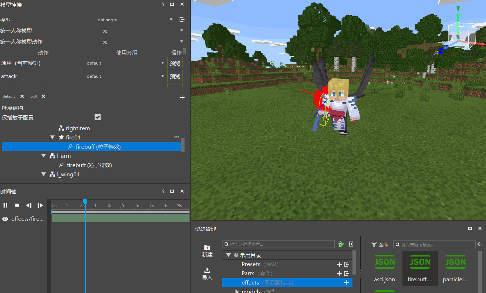
    - 从时间轴修改(不推荐)。在时间轴上包含有特效的显示开关，分别为特效显示状态  和特效关闭状态 ，通过点击 fire_buff.json 前面的  即可打开该特效的显示，如图所示：

        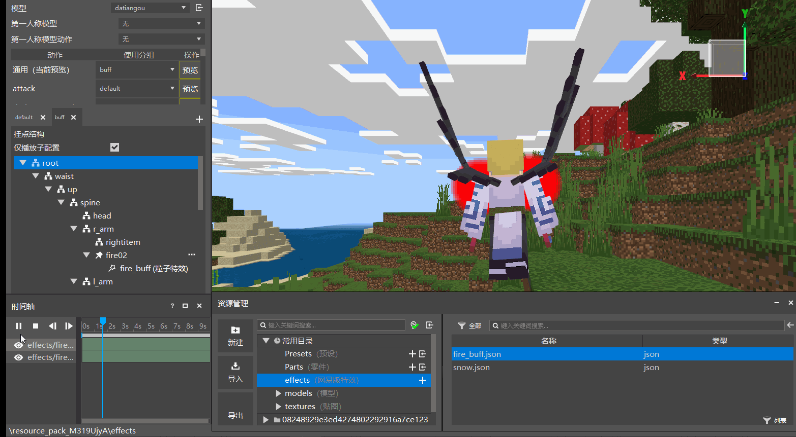

挂接粒子特效之后，接下来开始挂接序列帧特效。由于序列帧特效是一个光圈，期望是将其挂接到两个位置：一个是人物的背后，另一个是人物头顶，步骤如下：

6. 新建 snow01 挂接点，选择挂机位置为 spine，可以看到序列帧特效正好在人物的身上，如果觉得看不清，可以点击预览设置，选择主角和相机分离，这样可以360°查看人物。

    

7. 如果要将序列帧特效挂载人物的背后，需要调节特效的位置，这里需要使用挂接面板里的位移功能。注意位移仅能模型为骨骼模型而且选择为挂接点时才可用(如果是默认的 Steve 无法使用位移功能)。位移的调整方式有两种：

    - 第一种是使用可视化调节，直接点击左上方工具栏中的移动按钮，在游戏界面中使用弹出的坐标拖柄进行位置的调节：

        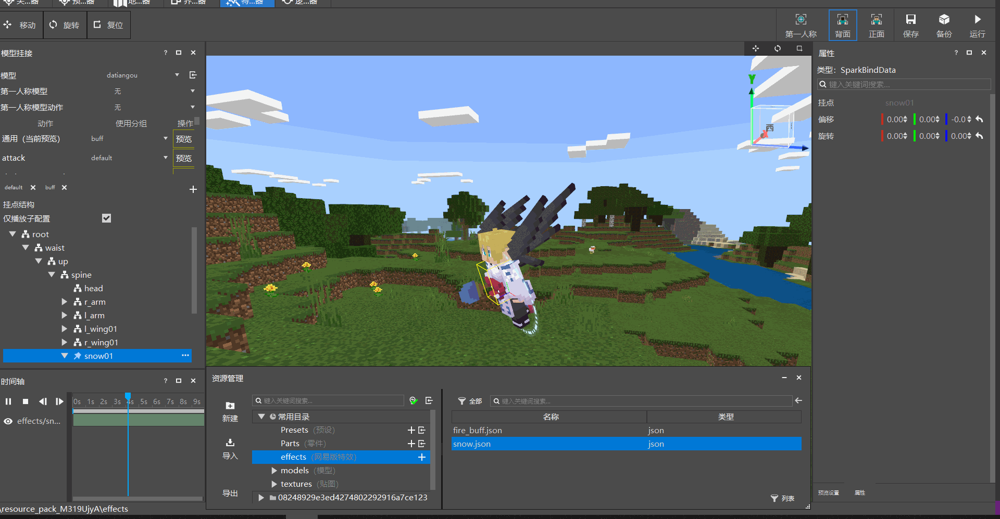

        > 点击按钮  后会出现 x, y, z 三个方向的轴，延轴方向拖动即可拖动特效的位置。

    - 第二种是直接在挂接点的属性面板位移处输入相应的位移量即可，即将位移修改为 0, 0, -0.5 即可查看效果

        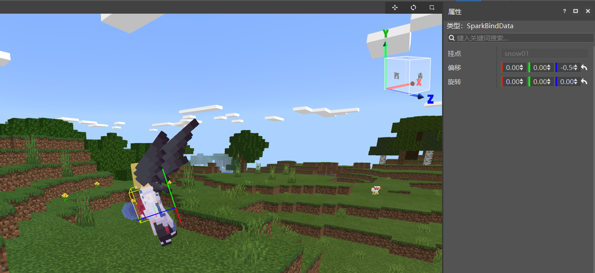

8. 背后的序列帧特效挂接完了，可以开始挂接头顶的序列帧特效了。新建 snow02 挂接点，选择相机位置为 head，这里不仅仅需要调节位移，还需要调整旋转让序列帧特效能够水平于人物的头顶，旋转的调节和位移一样，都是拥有两种方式，同样可以用可视化的方式来调节，如图所示：

    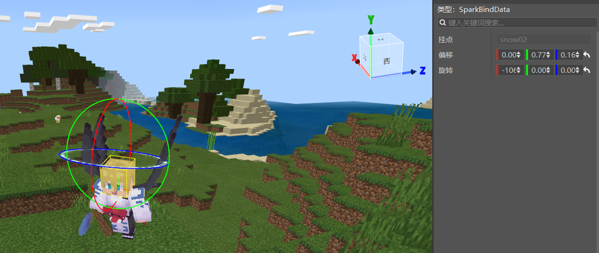

最后点击root根节点，查看所有特效的效果如下：

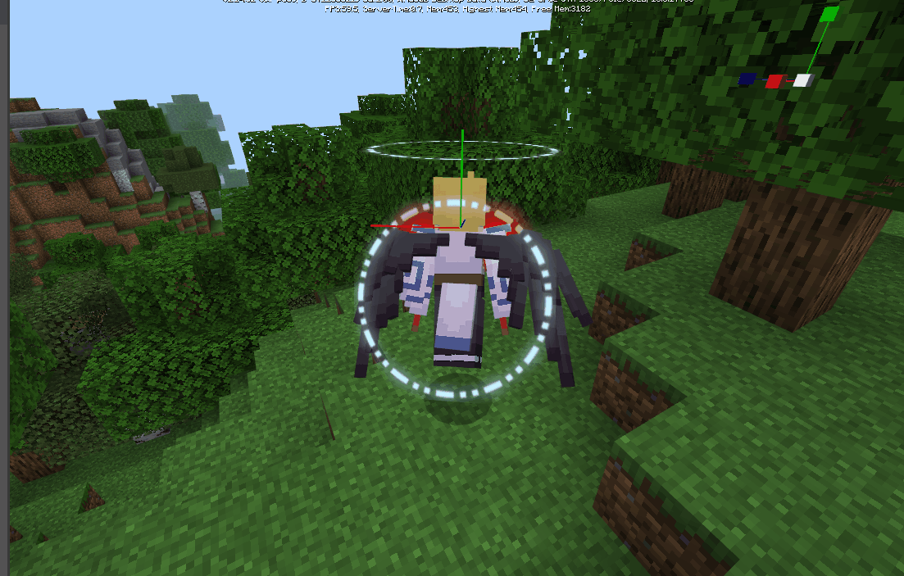

最后明显可以看到不是很完美，头顶的序列帧特效太大了，那么应该如何让它变小呢，这个就作为课后练习让查看教程的各位努力尝试把。
