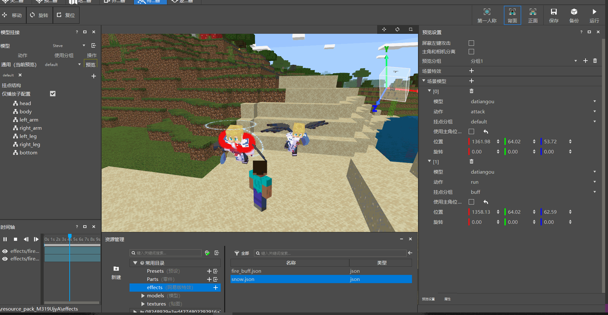

# 入门教程04-预览功能

本篇教程主要介绍以下内容：

1. 预览面板功能。

2. 使用预览面板预览模型和特效。

## 预览面板功能

默认的预览面板如图所示：

特效模型预览用于快速的预览指定模型和挂在其身上的特效，不仅如此，也可以在场景中添加其他模型和特效。

其中各个参数说明如下：
- **屏蔽左键攻击**：用于开关是否屏蔽Steve左键攻击的动作。
- **主角和相机分离**，用于开关是否让相机可以360°查看模型视角，默认的游戏视角仅能查看主角的正面或者背面，而且视角固定，通过打开视角分离，可以更为方便的查看模型。

    

- **预览分组**：保存和管理预览设置的一系列设置和特效模型的挂接信息，通过切换分组可以快速切换预览多种配置的场景特效和模型。

- **场景模型**，用于在场景中批量显示任意模型，其配置项如下：

    

  - 模型：用于选择显示的模型(仅支持骨骼模型)。

  - 动作：模型预览时播放的骨骼动画。

  - 挂接分组：模型预览时选择特效的挂接分组。

  - 使用主角位置：勾选起来会默认使用当前主角位置，如果取消勾选，则可以将模型放置于指定坐标中。

  - 旋转：用于修改模型的旋转角度。

- **场景特效**：用于在场景中任意地点显示自定义特效，其配置项如下：
- 
  
  - 特效：用于选择要播放的特效，仅支持位于 effects 文件夹下的网易自定义特效。

  - 使用主角位置：勾选起来会默认使用当前主角位置，如果取消勾选，则可以将特效放置于指定坐标中。

  - 旋转：用于修改特效的旋转角度。

## 预览模型和特效

了解了以上预览功能后，可以直接在场景中添加模型和特效了，首先来添加特效，点击场景特效上的 + 号，选择已有的 fire_buff.json，点击播放，即可看到特效在场景中被渲染。

> 为了显示方便，这里将模型修改为不带任何特效的 Steve。

如图为演示预览场景特效：

如图为演示预览场景模型：

预览功能整体来说比较简单，主要是为了让玩家能够更加方便的预览多个模型和多个特效。
