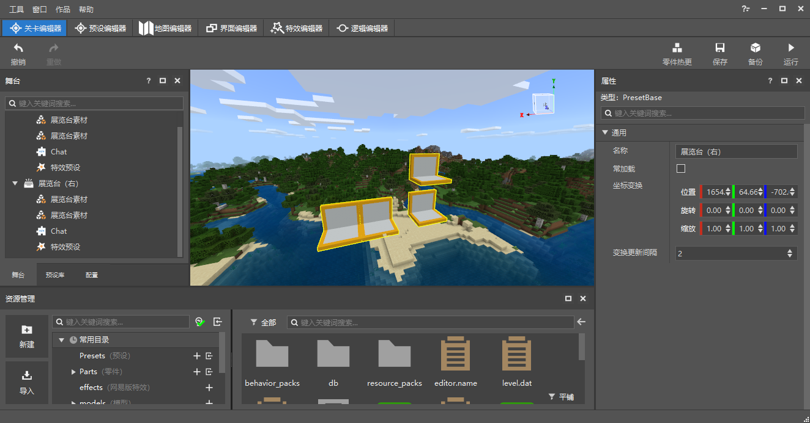
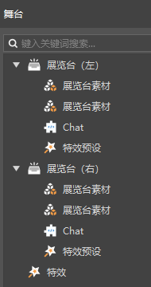
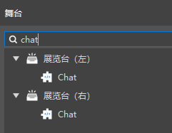
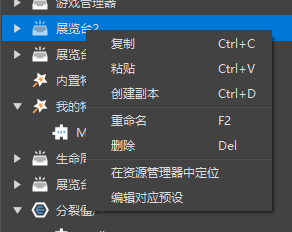
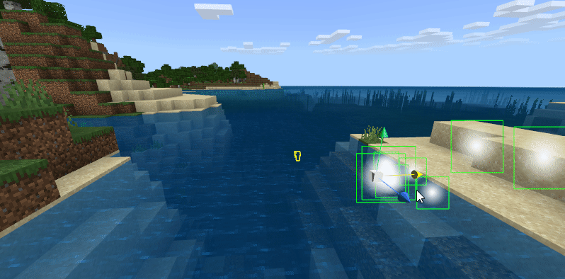
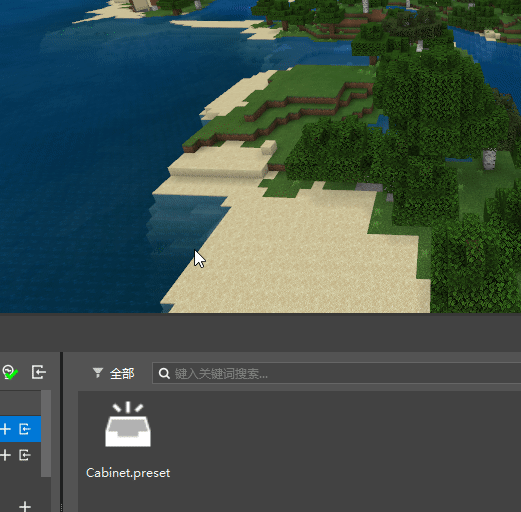
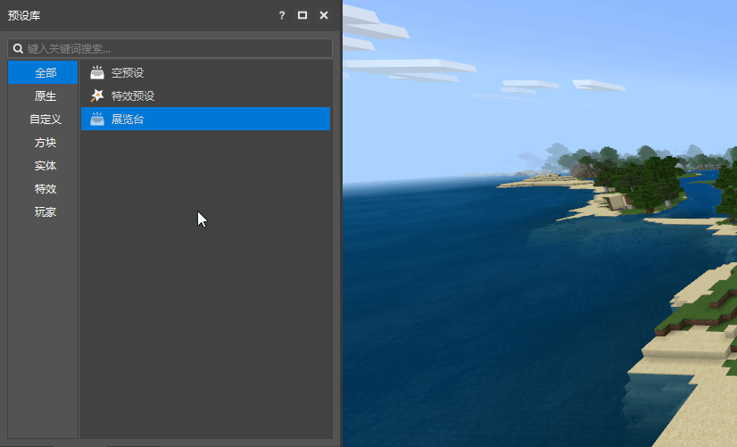

# 关卡编辑器

## 重做概述

关卡编辑器是主编辑器，其关卡编辑器的功能主要是

- 对地图（场景）的展示
- 在场景中放置实例，即将预设进行实例化
- 实例的显示和坐标变换的调整
- 实例的属性编辑

## 舞台

> 此文章仅关注预设的放置和管理，关于生物的，请查看[放置和管理生物](./4-放置和管理生物.md)

舞台中显示当前场景中存在的所有实例，舞台条目与实例一一对应。

实例的父子关系通过左右层次和折叠展现出来，与预设编辑器的层次面板相同。

> 当前在舞台中不支持挂接关系和顺序的调整。

不同种类的实例使用不同的图标。

你可以在舞台上执行如下操作：

- 单击条目，在舞台和预览窗中同时选中这一条目，并且关卡编辑器的属性窗口也显示这一条目的属性。
- 双击条目，选中。并且预览窗中相机飞行至该条目的实例附近。
- 键入关键字并搜索，显示匹配的条目。（包括这个条目的各级父节点）

右键舞台的预设条目（目前仅支持第一个层级的条目，不支持子条目），会出现如下的菜单：

- 复制：复制这个条目的实例
- 粘贴：在舞台中粘贴复制的实例
- 创建副本：在舞台中创建这个实例的副本
- 重命名：对这个实例进行重命名
- 删除：删除这个实例
- 在资源管理器中定位：资源管理器打开这个实例对应的预设的路径，并选中预设
- 编辑对应预设：打开预设编辑器并编辑这个实例对应的预设

## 预览窗

目前4个编辑器均包含预览窗，预览窗是针对编辑器进行过特殊改动的《我的世界》，关卡编辑器的预览窗与最终的效果最为接近。

为了区分预设实例和MC地图本身，所有的实例都会显示黄色的描边。

> 事实上，所有的实体都会显示描边，即使没有绑定预设。

### 修改实例的坐标变换

当选中实例时，会显示这个实例的坐标变换拖柄。使用主键盘区的123来切换变换拖柄的功能。

#### 1：位置拖柄

位置拖柄的3个轴与预览窗右上角的轴向的方向相同。

使用鼠标拖拽某个箭头，可以让实例沿着这个方向移动。

移动的时候，你可以在属性面板中发现，这个实例的位置属性也在改变。

> 对于素材来说，由于MC的方块只能位于整数位置，所以，在移动停止的时候，素材的位置会自动取整。
>
> 如果一个空预设下，或者空预设的子预设下有挂接素材，那么这个空预设的位置也会取整。
>
> 上述取整的规则无论是坐标系拖拽还是在属性面板输入数值，都会生效。

#### 2：旋转拖柄

按2，切换到旋转拖柄，会显示3个扇环，拖拽扇环进行角度的修改。

素材只能以90°作为步长旋转，如下图。

#### 3：缩放拖柄

按3，切换到缩放拖柄，拖拽缩放拖柄，来实现各个轴向的缩放。（目前还不支持通过拖柄进行整体缩放）

素材并不适合使用这种方式进行缩放，对于素材的缩放，您仍然可以使用类似地图编辑器的选区的方式。

> 注意：素材在编辑器中，当前任何情况下实际的缩放值都不会小于0.01。

## 在场景中放置实例

实例只有放置在场景中才会生效。

当前有两种方式可以在场景中放置预设以生成实例。

### 资源管理器拖拽

资源管理器找到常用目录的Presets目录。

将想要实例化的预设拖拽至场景中即可。

### 预设库拖拽

预设库是新版编辑器中新增的一个面板。

所有您创建的预设，以及编辑器内置的预设都可以在这个地方看到。

你可以通过下图的方式，直接将预设拖拽到场景中进行实例化。

如果你的关卡编辑器中没有显示预设库，你可以通过编辑器的顶部菜单-窗口-预设库，打开这一面板。

预设库与舞台一样支持搜索功能。

## 功能区

关卡编辑器顶部的功能区目前支持6个功能，分别是

- 撤销：移除上一次操作造成的影响，目前支持无限次的撤销，当切换编辑器后，不再记录之前的操作。
- 重做：重新进行上一次撤销的操作。
- 零件热更：当修改零件代码后，零件会自动热更，此按钮仅供自动热更由于某些原因不生效时使用。
- 保存：保存当前的地图和预设存档。由于保存地图的时间较长，所以仅当需要保存地图时才会保存地图。
- 备份：在启动器的作品库中生成一份当前作品的拷贝。
- 运行：保存所有编辑器的内容，并进行开发测试。

> 在编辑器保存时，玩家预设的实例不会保存在预设存档中，如果需要修改，请在预设编辑器中直接修改玩家预设

## 如何继续使用组件？

新版编辑器目前不再支持组件的属性编辑（你可以看到关卡编辑器中已经没有组件面板了）。

使用组件的作品在升级到新版编辑器之后，组件的逻辑仍然是生效的，仅编辑器不再支持。

我们会逐渐使用预设架构和配置代替当前的组件。

### 目前无需处理，可以转化为配置的组件

- 生物
- 物品 - 普通物品
- 物品 - 武器和工具
- 物品 - 盔甲
- 方块
- 配方

### 建议删除并替换为零件的组件

- 世界 - 基础属性，建议删除行为包目录下的script_World文件夹，并使用WorldPart零件。
- 玩家 - 基础属性，建议删除行为包目录下的script_Player文件夹，并使用PlayerBasicPart零件。

注意，这一步最好在刚刚升级作品后。

当前，创建新零件时，会在第一个script_xxx目录下生成零件文件的链接。如果在这之后想要删除组件文件夹，可以先通过新建文件向导创建一个ModMain，然后把Parts目录移动到新创建的script_xxx中，然后再删除需要删除的路径。

其他组件我们会在后续的更新中逐步支持。

