# 关卡编辑器（旧版）使用说明
## 基本介绍

关卡编辑器是配置和管理附加包（Add-ons）的中心，能够自定义维度、生物、物品、方块、配方等内容，通过组合这些游戏元素，形成自己独特的玩法。

对于不同的开发者来说，使用关卡编辑器的推荐方式也不一样。

- 新手阶段：通过组件来搭建玩法，熟悉各种自定义游戏元素。
- 熟手阶段：通过关卡编辑器的资源管理了解Addon的文件构成，研究组件的功能实现原理，在组件的基础上尝试做一些文件级别的修改。
- 高手阶段：使用关卡编辑器快速搭建玩法原型，之后做深度的文件修改。

建议先跟着下面的视频进行学习哦。  

<iframe src="https://cc.163.com/act/m/daily/iframeplayer/?id=5f3a56335655da63cc2c6c39" height="600" width="800" allow="fullscreen" />

下面简单介绍各个模块的作用，详细介绍可以在后面相应的章节中找到。  
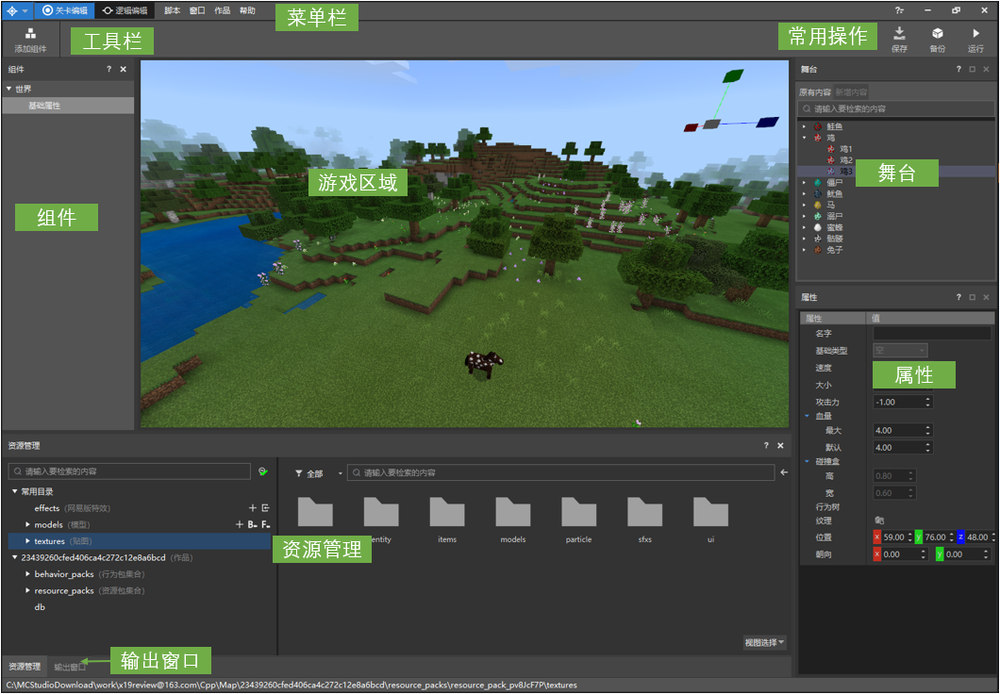

- 菜单栏：“作品”中可设置Add-on的命名空间，“脚本”中可安装Mod SDK的脚本提示库，“窗口”中可设置不同分项窗口的可见性。
- 工具栏：目前仅有“添加组件”按钮，用于添加组件到作品中；
- 组件：配置自定义的游戏元素，比如物品、生物、方块等等；通过不同的组件搭配形成玩法。
- 属性：当选择“组件”中的内容时，在属性面板中会显示相应的组件属性。
- 游戏区域：游戏区域运行着《我的世界》，可配合进行生物、坐标等的编辑。
- 舞台：显示当前游戏区域中的生物。
- 资源管理：管理作品内的文件， 文件格式转换的入口也都在这里。
- 常用操作：包含“保存”、“备份”、“运行”等按钮。

## 组件
### 添加组件
点击工具栏的“添加组件”按钮，然后选择某个组件，即可添加组件，如下图。在组件窗口中右键也可添加组件。  
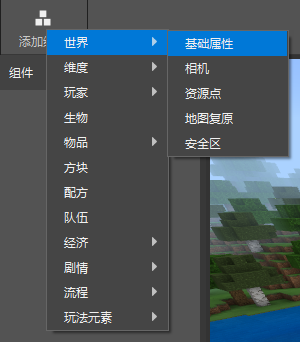

在组件上点击右键，可以查看组件的简介，了解组件的大致功能。  
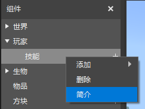

在属性面板上，将鼠标移到配置框上，稍等一会就会显示说明文字。  
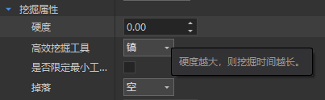

### 基础组件简介

由于鼠标悬浮在组件的配置项上时都会显示介绍，因此这里主要介绍组件中较难理解的属性。

#### 世界->基础属性 组件

组件列表中，在“世界”上右键，添加“基础属性”组件。
组件列表中点击“基础属性”，可以在属性面板中看到可配置的属性。  
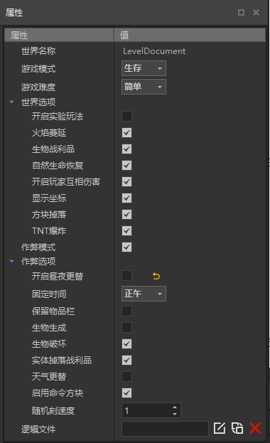

世界的配置项和游戏内的设置基本相同，下面是部分配置项的说明：

- 游戏难度：如果设置为“和平”，那么游戏中无法放置僵尸等攻击型生物。当无法在游戏区域放置生物时，记得先检查是否把游戏难度设置为和平了。
- 随机刻速度：这个值会影响小麦生长、冰雪融化等事件，具体可参考链接：[我的世界中文Wiki-刻](https://minecraft-zh.gamepedia.com/刻)，[我的世界英文Wiki-tick](https://minecraft.gamepedia.com/Tick)
- 逻辑：如果想实现一些比较特殊的流程，比如当玩家走到某个区域时，世界时间变为黑夜，那就需要用逻辑文件来实现。创建逻辑文件需使用逻辑编辑器，具体使用说明见[逻辑编辑器说明文档](../12-可视化编程/50-旧版逻辑编辑器使用说明/95-旧版逻辑编辑器使用说明.md)。下图中，左侧按钮表示新建一个逻辑文件，中间按钮表示选择一个逻辑文件，右侧按钮为清空逻辑配置。玩家、物品、生物中也可配置逻辑文件，后面不再赘述。  
  

需要注意的是，世界基础属性中的设置是在玩家进入游戏再设置的，因此，如果基础属性中设定为生存模式，即使玩家进入存档前设定为冒险模式，进入游戏后也会被修改为生存模式。

#### 玩家->基础属性 组件

在“玩家”上右键，添加“基础属性”组件。点击“基础属性”，可以在属性面板中看到玩家可配置的属性。

下面说明部分配置项的意义：

- 是否锁定饥饿值：如果锁定的话，玩家的饥饿值在游戏过程中不会变化。
- 名字是否透视：是否能够透过障碍看到玩家头顶的名字。如果要设计一个捉迷藏的游戏，玩家的名字就不应该透视。
- 逻辑文件：可关联逻辑编辑器制作的.ets文件，具体请查阅[逻辑编辑器使用说明](../12-可视化编程/50-旧版逻辑编辑器使用说明/95-旧版逻辑编辑器使用说明.md)。

#### 生物 组件

点击生物组件右侧的“+”号，可以添加自定义生物。

单击组件列表中的某个生物，可以在属性面板中配置其属性。 下面说明部分配置项的意义：

- 名字：配置生物的ID和游戏内名字等内容。如果勾选“是否覆盖原有生物”，那么生成的生物配置会覆盖原版的配置。
- 模型动作：目前支持选择原版的生物模型资源作为自定义生物的模型。在游戏内生物的碰撞都是按一个一个的长方体来计算的，这个长方体就是碰撞盒。
- 移动：这里的属性决定了生物如何移动和寻路。
- 战斗：配置生物的攻击和血量等基础战斗数值，以及生物的索敌方式和攻击方式。如果是想配置商人、对话NPC等无需战斗的NPC，可以不勾选“是否可战斗”。
- 行为：目前只支持配置“看向玩家”和“随机闲逛”两项行为，更多的行为可查看[基岩版实体组件文档](https://minecraft-zh.gamepedia.com/%E5%9F%BA%E5%B2%A9%E7%89%88%E5%AE%9E%E4%BD%93%E7%BB%84%E4%BB%B6%E6%96%87%E6%A1%A3)，然后在文件中手动添加更多的行为。
- 经济：配置生物的死亡掉落和交易表，需和经济中的掉落组件以及交易组件配合使用。
- 逻辑：可关联逻辑编辑器制作的.ets文件，具体请查阅[逻辑编辑器使用说明](../12-可视化编程/50-旧版逻辑编辑器使用说明/95-旧版逻辑编辑器使用说明.md)。

自定义生物配置好之后，点击生物右侧的放置图标，会进入放置生物的操作状态，如下图。  

然后鼠标移到游戏区域中，点击鼠标就能把生物放置到指定位置上。连续单击可连续放置生物，按ESC可以取消放置生物的操作。  
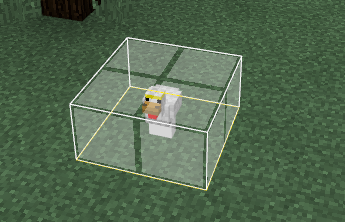

在舞台中，会显示当前玩家附近已经加载的区域内的所有生物。其中“原有内容”表示这次开启编辑器时就已经存在的生物，“新增生物”表示开启编辑器后新添加进来的生物。在舞台中点击生物，游戏区域内相应的生物会显示为选中状态。  
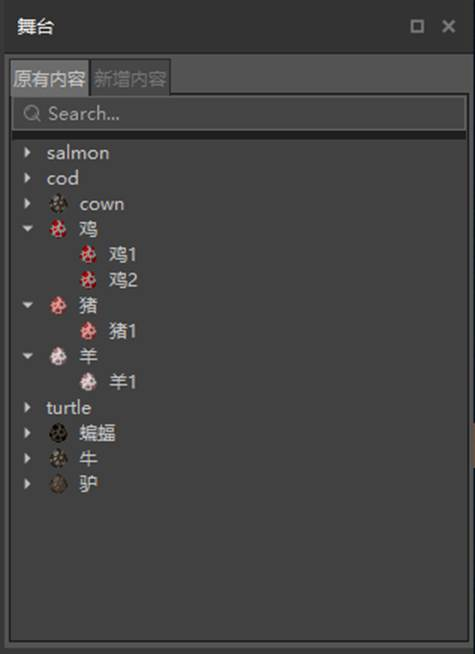

双击舞台中的生物时，会跳转到该生物所在的坐标。

**附注**：关卡编辑器中镜头移动方式与地图编辑器中相同。

#### 物品->基础物品 组件

在“物品”上右键，添加“基础物品”组件。点击基础物品组件右侧的“+”号，可以添加自定义物品。

点击列表中的物品，可在属性面板中配置属性。下面是部分配置项的意义：

- 自定义ID：ID需为英文和数字的组合，在游戏内用指令添加物品时（/give @s item_id），用到的就是这个ID。
- 贴图：物品显示在物品栏中的图标，需为PNG格式的图片。将资源管理窗口中的资源包/textures/items路径下的图片拖动到贴图栏即可完成设置。
- 特殊类型：这里可以选择物品的特殊类型，如“食物”或“生物蛋”。若为食物，则在游戏中能够食用并回复饥饿值，和原版食物一致；若为生物蛋，则在游戏中可以召唤生物，和原版生物蛋一致。值得注意的是，自定义生物时会自动生成生物蛋，如非必要，无需再为自定义生物配置生物蛋。

### 组件的搭配使用

组件目前分为以下大类：  

- 世界：包括相机和地形改变相关的组件；
- 维度：包括生物群系、自定义特征、生物生成规则等维度相关的功能；
- 玩家：包括技能、排行榜等和玩家相关的功能；
- 生物：用于添加自定义生物；
- 物品：用于添加食物、工具、装备、武器等自定义物品；
- 方块：用于添加自定义方块；
- 配方：用于添加自定义配方；
- 队伍：用于添加队伍配置；
- 经济：可配置掉落、交易、商店等物品流通相关的功能；
- 剧情：可配置对话和任务；
- 流程：包括开始游戏、结束游戏等控制游戏流程的组件；
- 玩法元素：包括塔防、起床战争等特定玩法所需的组件。

这些组件互相配合能够创造出完整的玩法，下面以“任务链模板”为例来说明组件如何配合。

任务链模板实现了一组任务，玩家可以一个接一个的做完所有任务，大致流程如下：

1. 玩家来到一个乡村，和村民对话后，接到一个任务去找到守卫士兵；
2. 士兵告知玩家怪物从地底冒出来了，让玩家去杀怪，杀怪会掉落装备；
3. 完成杀怪任务后，士兵让玩家去找火焰祭司，寻找封住地底裂隙的方法。

这是一个很简单的任务链，我们看看组件是如何配合实现这样的任务链的：  
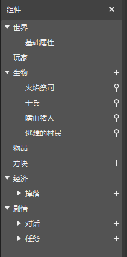

- 任务中涉及到的对话NPC和怪物，均为自定义生物，由生物组件配置；
- 对话功能，由对话组件配置；
- 任务功能，由任务组件配置；
- 击杀怪物会掉落战利品，由掉落组件配置战利品，在自定义生物中关联对应的掉落；
- 模板为冒险模式，由世界的基础属性组件控制。

除了“任务链模板”外，“对战玩法模板”、“塔防模板”也是由组件拼搭而成，可以参考学习。

### 组件的实质

每个组件都会生成相应的文件到作品中，编辑组件的属性，其实就是在修改这些文件。关卡编辑器通过组件的形式包装了这个修改过程，让修改变得可视化。

当对组件非常熟悉时，可能会有更加深入的需求，比如希望“开始流程”组件的界面更炫酷一点，比如希望给自定义生物添加更多属性，这个时候就可以直接去修改对应的文件，而无需拘泥于组件在属性面板中提供的属性。

**需要注意的是，目前编辑器的组件对手动修改的兼容还不完善，部分手动修改的内容在使用编辑器保存后会被覆盖。**

## 其他功能

### 常用操作

常用操作中有保存、备份、运行。  

- 保存：保存当前关卡编辑器中的所有配置。
- 备份：地图类型的作品可备份为Addon或地图，若备份为Addon则会去掉其中的地图数据；Addon类型的作品则只能备份为Addon。备份作品会显示在启动器的作品列表中。当准备对关卡进行较大的修改时，建议先备份。  
  

- 运行：运行游戏时当前的所有配置都会生效，用于综合测试游戏效果。运行会拉起独立的游戏客户端（Mod PC开发包），**在运行游戏时，可以按下F11切换操作模式，让鼠标可以自由移动**。

### 输出窗口

输出窗口中会显示编辑器运行的即时信息，是我们了解编辑器运行状况的帮手。各个窗口的输出信息有所区别：

- MC窗口：在调试模式下，会输出逻辑编辑器中“打印信息”节点中的信息，用于辅助调试逻辑。
- All窗口：编辑器运行所有的信息都会显示在这里。
- Warning窗口：一些警告类信息会显示在这里。
- Error窗口：报错信息显示在这里，如果编辑器出现问题，一般会在这里有报错信息。

## 如何提升开发能力

绝大部分的开发者，都是我的世界深度玩家，这为开发我的世界Addon打下了良好的基础。不过从玩家转变为开发者，仍然会碰到几个挑战：
- 如何快速的做出可以玩的作品，给自己持续的正向激励，避免在过长的学习周期中丧失热情；
- 游戏内常见的物品、配方等游戏元素，在背后是如何做到的，需要理解大量的新概念；
- 希望学习代码，如何找到现成的例子来辅助学习，而不是靠自己一点点摸索；
- Mod SDK接口非常非常的多，怎么知道用哪些接口来实现自己的设计。

组件是解决以上问题的一个重要方式。

通过修改已有的模板，能够快速生成特定的玩法。组件基本为可视化配置，结合属性的注释，能够了解游戏元素的基础属性有哪些。

前面提到修改组件其实就是在修改作品中的文件。那么通过研究组件文件的变化，能够知道Addon中不同文件的作用。
例如，我们修改自定义生物的名字为“演示生物”，如下图：  
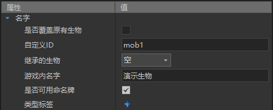

在作品文件夹中搜索“演示生物”（可通过VS Code打开作品文件夹后搜索），会发现这个配置实际是改到了zh_CN.lang文件，如下图：  
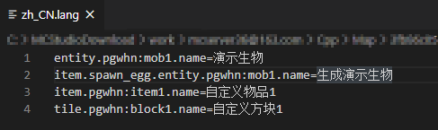

这样我们就知道，zh_CN.lang是语言文件，而生物的名字是通过entity.生物ID.name的方式来定义的。

其他的配置也可以通过类似的方式来熟悉。当对作品的文件结构有了更深入的了解后，则可以通过[我的世界中文Wiki-附加包](https://minecraft-zh.gamepedia.com/%E9%99%84%E5%8A%A0%E5%8C%85)来学习更多的Addon知识。有了前面的基础，再来看wiki就不会觉得难度太大了。

除了原版Addon已经支持的配置外，我的世界中文版还提供了Python代码写Mod逻辑的方式（也就是[Mod SDK](../13-模组SDK编程/2-Python脚本开发/0-脚本开发入门.md))，通过Python代码，能够实现很多丰富的玩法。

通过组件，我们能够学习到游戏内通用的功能是如何用代码实现的。以相机组件为例，在添加相机组件后，作品文件夹中会增加一个script_Sight的文件夹。  
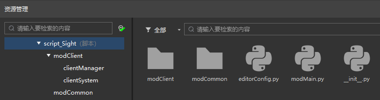

这个脚本文件夹实现的就是调整相机视角的功能。其中的editorConfig对应的就是属性面板中的配置。文件中的“VIEW_MODE”就对应属性窗口中的模式。  
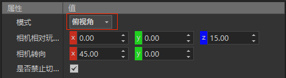  
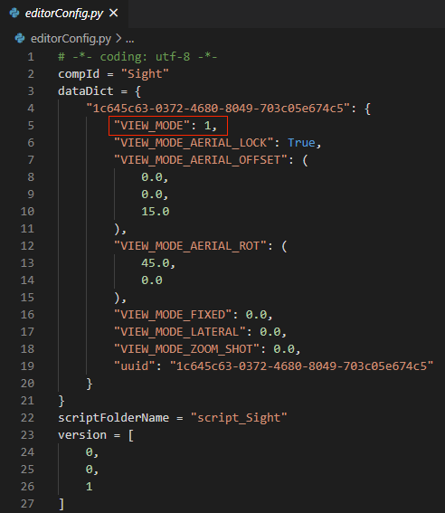

通过搜索“VIEW_MODE”，我们能够定位到这个组件的核心实现代码，通过研读这部分代码，了解到用了哪些接口实现功能。  
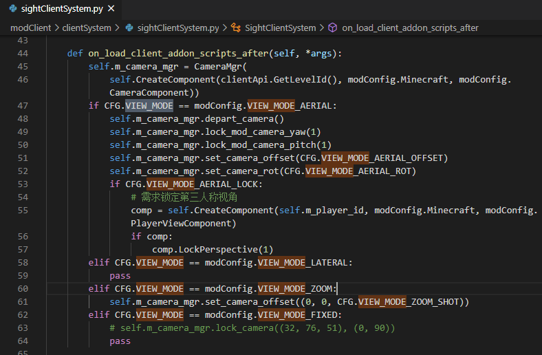

总的来说，我们可以通过组件，先看效果，再去研究原理，理解原理后，再利用这些原理来打造更好的作品，从而实现开发能力的提升。