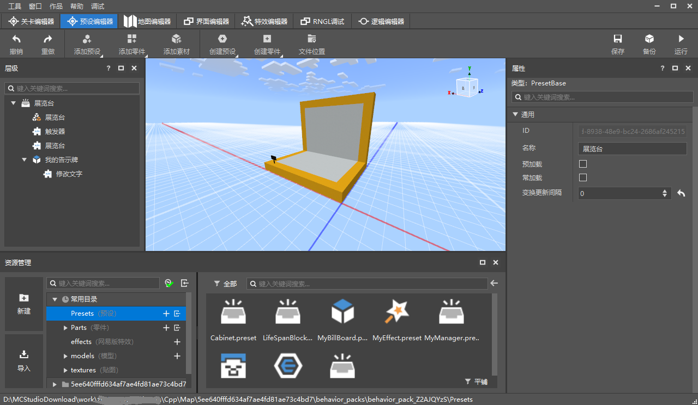
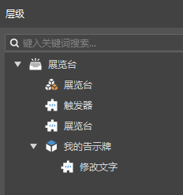
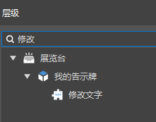
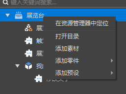
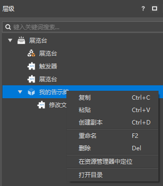

# 预设编辑器

## 什么是预设？

预设（Preset）就是预先设定的意思。即开发者们可以将方块、素材、实体、特效以及玩法逻辑拼装成一个预设。

预设作为文件被保存在行为包的Preset目录中，如下图，在资源管理器的常用目录中，可以找到Preset文件夹。

在使用时，一个预设作为一个整体被放置在游戏中，被放置到游戏中的预设被称为实例。

预设的后缀是.preset，如果你对预设到底是什么感兴趣，可以使用文本编辑器打开预设文件，查看它的结构。

关于预设架构的使用，请查看[第一个预设Mod](../14-预设玩法编程/0-第一个预设Mod/0-创建新版作品.md)。

## 基本介绍

打开预设编辑器的方式有两种：

- 通过顶部的编辑器切换页签进行切换
- 在资源管理器中双击预设文件（xxx.preset）

预设编辑器主要用于预设的拼装，预览和属性编辑。如下图所示：

- 层级面板：用于显示预设的结构。
- 中间的预览窗：用于预设的预览，以及对每个对象进行坐标变换的拖拽调整。
- 属性面板：用于显示当前选中的层级条目的属性以及对其进行修改。

注意，预设编辑器是对某一个预设的编辑，不能同时编辑多个预设。

## 层级与预设拼装

预设编辑器的层级面板用于显示当前正在编辑的预设的层级结构，通过树形图的方式显示他们的父子关系。

层级面板支持搜索，如下图。与关卡编辑器的舞台一样，搜索结果也会显示与它相关的树形结构。

层级面板，在根节点上右键，弹出如下菜单：

- 在资源管理器中定位：资源管理器打开这个预设的路径
- 打开目录：在windows的资源管理器中打开这个预设对应的文件夹
- 添加素材：给预设添加素材
- 添加零件：给预设添加零件，二级菜单为可以添加的零件
- 添加预设：给预设添加子预设，二级菜单为可以添加的预设

> 当前不能改动子预设的层级

在除了根节点之外的条目上右键，弹出如下菜单：

- 复制：复制这个条目
- 粘贴：在层级中粘贴这个条目
- 创建副本：在层级中创建这个条目的副本
- 重命名：对这个条目进行重命名
- 删除：删除这个条目
- 在资源管理器中定位：资源管理器打开这个条目对应的路径，并选中预设
- 打开目录：在windows的资源管理器中打开这个条目对应的文件夹

预设编辑器的功能区按钮，与预设拼装相关的如下：

- 添加预设：给预设添加子预设，弹出菜单为可以添加的预设
- 添加零件：给预设添加零件，弹出菜单为可以添加的零件
- 添加素材：给预设添加素材

## 预览窗

预设编辑器的预览窗里，除了天空之外只会渲染当前正在编辑的预设。

你可以在预览窗中对预设条目的坐标变换进行操作。参考[关卡编辑器](./3-关卡编辑器.md)的预览窗。两个编辑器的预览窗的坐标变换操作基本相同。

> 当你在进入预览窗时，实际上会被传送至当前作品的出生点。预览窗仍然是我的世界，同样存在256的高度限制，这意味着你无法控制相机抵达过高或者过低的位置。

## 其他功能区按钮

- 撤销：移除上一次操作造成的影响，目前支持无限次的撤销，当切换编辑器后，不再记录之前的操作。
- 重做：重新进行上一次撤销的操作。
- 创建预设：与资源管理器常用目录 - Presets的“+”按钮的功能相同，参考[新版文件结构与资源管理](../../15-资源管理/2-文件结构.md)。
- 创建零件：与资源管理器常用目录 - Parts的“+”按钮的功能相同，参考[新版文件结构与资源管理](../../15-资源管理/2-文件结构.md)。
- 文件位置：资源管理器打开这个条目对应的路径，并选中当前正在编辑的预设。
- 保存：保存当前预设文件。
- 备份：在启动器的作品库中生成一份当前作品的拷贝。
- 运行：保存所有编辑器的内容，并进行开发测试。

