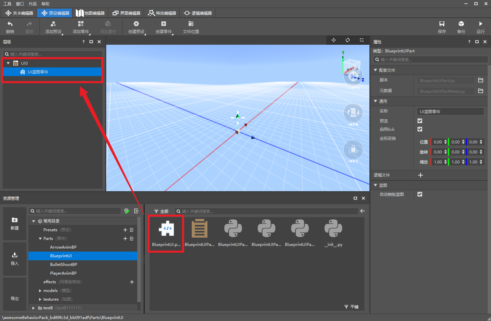
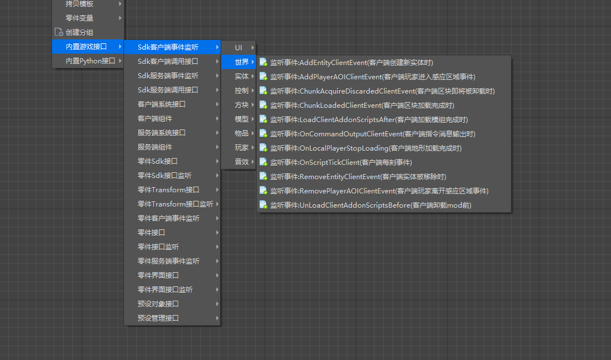
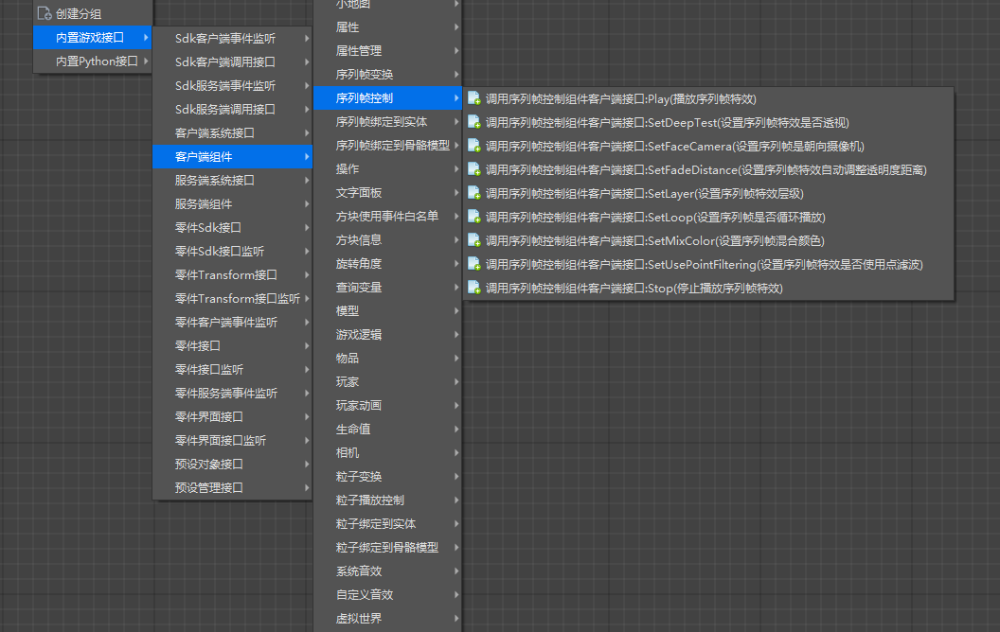
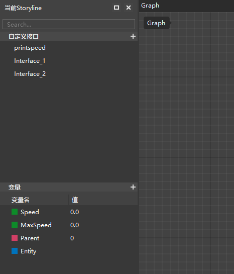
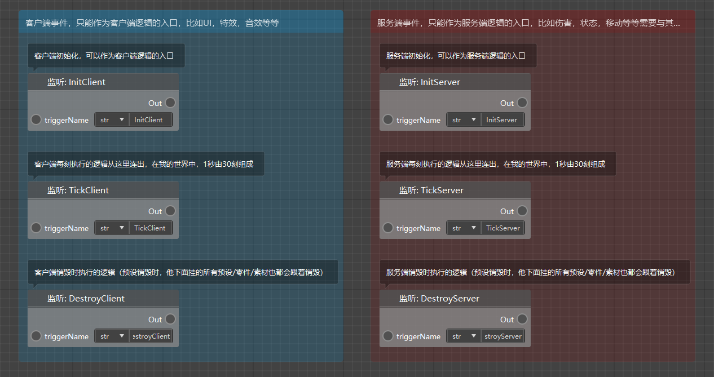
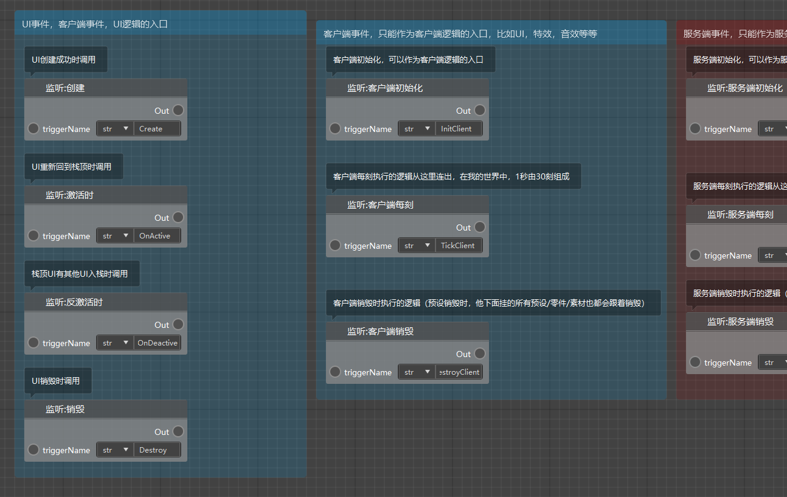
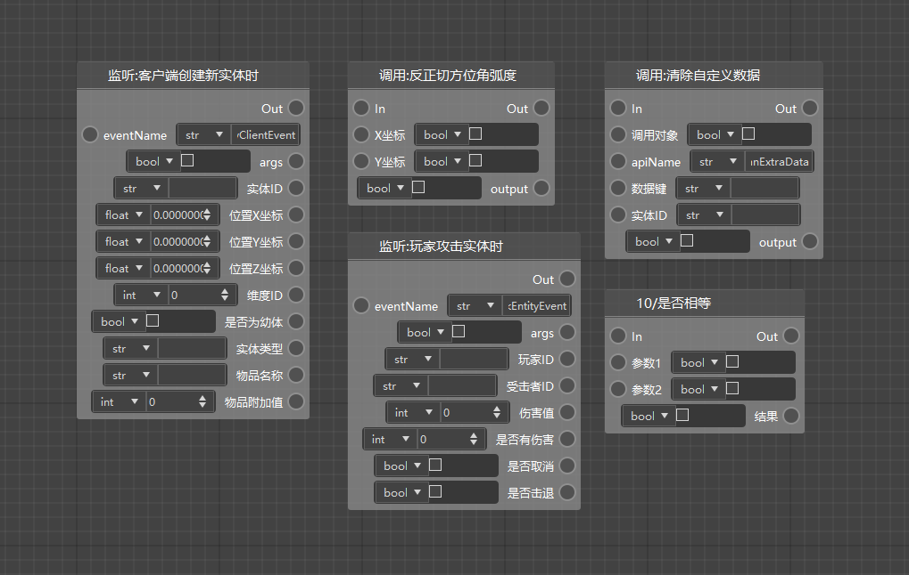

# 认识新版逻辑编辑器

在本次更新中，我们上线了新版逻辑编辑器。相比旧版逻辑编辑器，我们做出了一些重大的改进，主要包括：

1）图标的组织形式更新为节点式

2）逻辑文件现在更名为蓝图脚本，每个蓝图脚本都固定绑定到了一个蓝图零件上，将蓝图零件挂接到预设下即可使其中的逻辑生效

3）提供了模组SDK的所有接口，以及大幅扩展了对python原生接口的支持

4）支持编写客户端逻辑（特效，音效，模型，动画等）

5）独立的变量和自定义接口管理

6）更多的起始事件，完整的事件系统支持

7）支持了循环逻辑

8）支持编写UI蓝图

9）我们为绝大部分节点添加了汉化，尽力减少了语言壁垒给模组开发带来的不便

