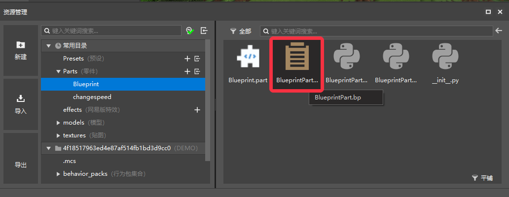
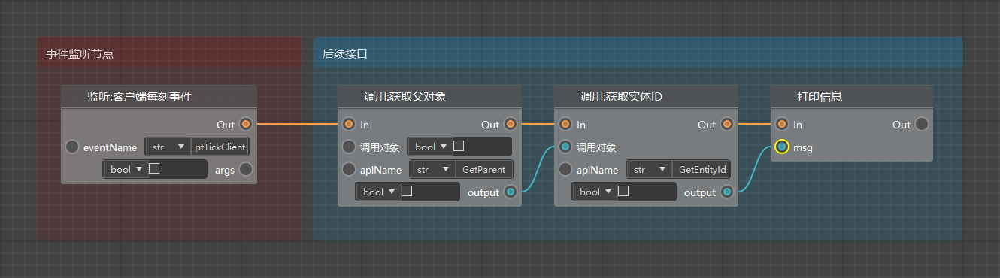
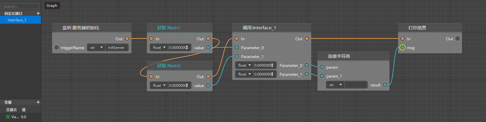
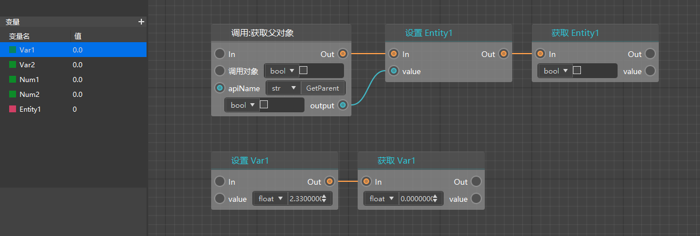

# 需要了解的基础概念

##  预设与实例

预设（Preset）就是预先设定的意思。即开发者们可以将方块、素材、实体、特效以及玩法逻辑拼装成一个预设。在使用时，一个预设作为一个整体被放置在游戏中，被放置到游戏中的预设被称为实例。

关于预设和实例的更多信息请访问[这篇文档](../../14-预设玩法编程/0-第一个预设Mod/1-新建预设并添加素材.md)。

##  零件

零件（Part）是预设架构下，一种可以挂接到预设下的玩法逻辑对象。当我们把逻辑写到零件代码里，再将零件挂接到一个生效的预设下时，零件的逻辑也会随之生效。

关于零件的更多信息请访问[这篇文档](../../14-预设玩法编程/0-第一个预设Mod/4-创建和挂接零件.md)。

## 蓝图

在新版逻辑编辑器中，我们通过节点式编程的形式，将不同的节点通过执行连线和数据连线相连构成节点网络，从而编写一套完整的逻辑。这些承载了节点与连线的图表，我们将其称为**蓝图**（Blueprint）。蓝图需要用新版逻辑编辑器进行编辑。

## 蓝图零件

蓝图零件（BlueprintPart），顾名思义，则是一种使用蓝图编写零件逻辑的特殊零件。与普通零件相比，蓝图文件在资源管理器的文件夹中多了一个.bp文件，即蓝图脚本文件。在资源管理器中双击.bp文件，即可在资源管理器中打开该蓝图零件的蓝图图表，进行编辑。

## 事件

事件（Event）是模组SDK架构的核心组成部分，也是编程的一类常用技术。模组SDK的事件系统可以参考这篇文档：[事件简介](../../../20-玩法开发/13-模组SDK编程/2-Python脚本开发/9-事件简介.md)。

简单来说，事件系统就是用于写明白在某种情况触发的时候应该执行什么逻辑。例如“当玩家点击潜行键时播放角色蹲下的动画”，那么“当玩家点击潜行键时”就是一个事件。当监听到这个事件后，系统就会执行“播放角色蹲下的动画”这个逻辑。

在蓝图中，事件监听节点是蓝图逻辑网络执行的起点，通过事件节点连出的执行引线连接一系列接口，那么系统监听到这个事件时，后续的一系列节点逻辑都会被按顺序执行。

## 接口

接口（Interface）在蓝图中是节点图表的一种，可以从其他蓝图图表中调用其内部逻辑。

我们将所有的SDK接口以及大量的python接口都制作成了内置接口，放在右键菜单中供开发者直接调用（开发者无法直接修改这些接口的逻辑）；同时，我们还允许开发者创建自定义接口，编写自己需要的节点逻辑。

**举个例子：**我们在下面这个自定义接口图表中编写好了Interface_1这个自定义接口的逻辑：

然后在跟图表中调用Interface_1，就可以直接复用其内部逻辑进行运算。

## 变量

变量（Variable）用于储存值或对象属性，可通过获取变量节点调用变量值，也可以通过设置变量节点为该变量设置新的值。

