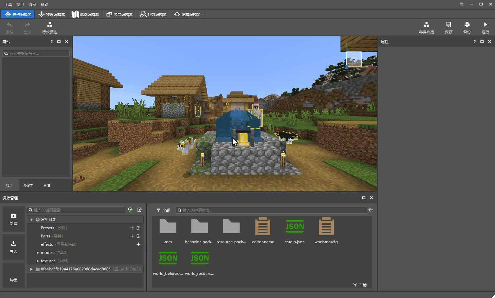
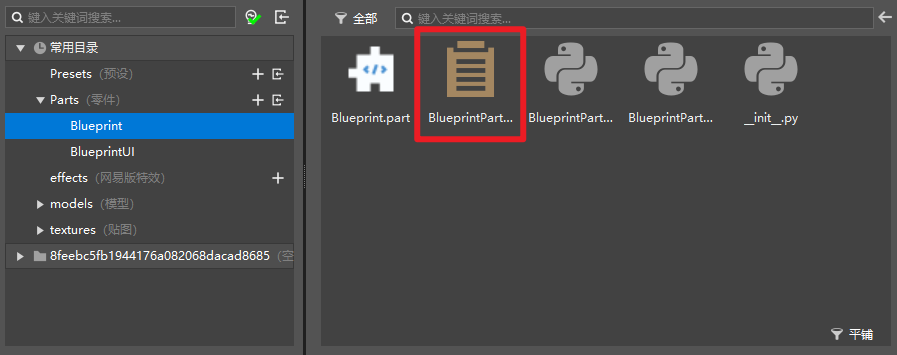

# 创建蓝图零件

## 创建一个蓝图零件

正如普通零件一样，蓝图零件也可以通过新建文件向导创建。点击资源管理器左侧的【新建】按钮打开新建文件向导，选择蓝图零件，创建一个空的蓝图零件。你可以为蓝图文件自定义名称（需注意，当前仅支持纯英文、数字命名）。创建新的蓝图零件后，下方资源管理器将自动跳转到新创建的零件目录。

## 两种蓝图零件

正如在新建文件向导的蓝图零件页面显示的那样，蓝图零件目前共有两种：

1）蓝图零件：即普通的用蓝图脚本撰写逻辑的零件；

2）UI蓝图零件：专门为UI控制而编写的蓝图零件，其中包含了部分专用于UI控制的事件、接口。

### 蓝图零件

蓝图零件的目录下会自动创建如下5个文件（以默认命名Blueprint为例）：

1）Blueprint.part

2）BlueprintPart.bp

3）BlueprintPart.py

4）BlueprintPartMeta.py

5）\_init_.py

相比与普通零件，这里新增了一个BlueprintPart.bp。这里的.bp文件即是我们的 **蓝图脚本** 文件，对其进行**双击**，即可在新版逻辑编辑器中打开对应的蓝图脚本，通过可视化的节点式编程进行逻辑编辑。

### UI蓝图零件

UI蓝图零件目录下会自动创建如下6个文件（以默认命名BlueprintUI为例）：

1）BlueprintUI.part

2）BlueprintUIPart.bp

3）BlueprintUIPart.py

4）BlueprintUIPartMeta.py

5）BlueprintUIPartUI.py

6）\_init_.py

与蓝图零件类似，该目录下我们可以编辑的是BlueprintUIPart.bp。对其进行**双击**，即可在新版逻辑编辑器中打开对应的UI蓝图脚本进行编辑。

