# 脚本元素

在新版逻辑编辑器中，我们的“脚本元素”通常指如下几类：

| 脚本元素 | 描述                                                         |
| :------- | ------------------------------------------------------------ |
| 事件     | 事件节点是节点网络的逻辑起点，当某个事件被触发后，即会执行该事件节点后连接的所有节点逻辑。 当前版本的逻辑编辑器，仅支持通过右键菜单创建编辑器自带的事件，暂时不支持开发者自定义事件 |
| 接口     | 接口是节点图表的一种，可以从其他蓝图图表中调用其内部逻辑     |
| 变量     | 用于储存值或对象属性，可通过获取变量节点调用变量值，也可以通过设置变量节点为该变量设置新的值 |

## 事件

事件是模组逻辑代码的起点，所以任何一条蓝图执行逻辑都必须要以一个事件监听节点为起点，这样整条执行连线串联起来的逻辑链才能够被执行。

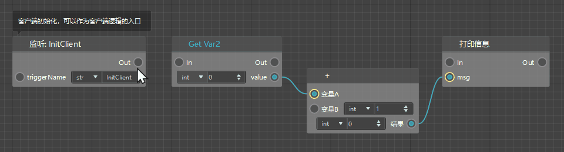

### 默认起始事件

以蓝图零件为例，其在新建时会默认自带6个起始事件监听节点，分别为：

**1、客户端默认起始事件**

| 事件名称     | 事件英文名    | 描述                                                         |
| :----------- | ------------- | ------------------------------------------------------------ |
| 客户端初始化 | InitClient    | 客户端初始化，可以作为客户端逻辑的入口                       |
| 客户端每刻   | TickClient    | 客户端每刻执行的逻辑从这里连出，在我的世界中，1秒由30刻组成  |
| 客户端销毁   | DestroyClient | 客户端销毁时执行的逻辑（预设销毁时，它下面挂的所有预设/零件/素材也都会跟着销毁） |

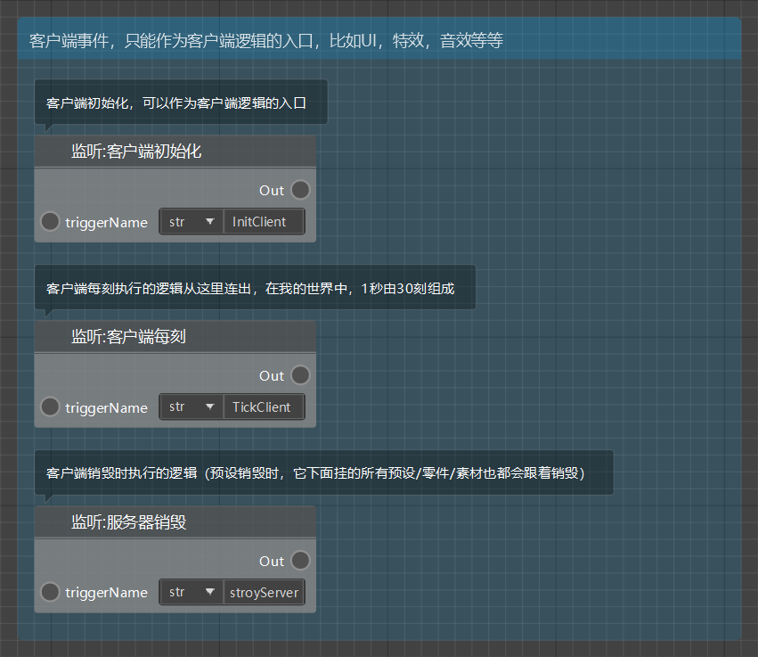

**2、服务端默认起始事件**

| 事件名称     | 事件英文名    | 描述                                                         |
| :----------- | ------------- | ------------------------------------------------------------ |
| 服务端初始化 | InitServer    | 服务端初始化，可以作为客户端逻辑的入口                       |
| 服务端每刻   | TickServer    | 服务端每刻执行的逻辑从这里连出，在我的世界中，1秒由30刻组成  |
| 服务端销毁   | DestroyServer | 服务端销毁时执行的逻辑（预设销毁时，它下面挂的所有预设/零件/素材也都会跟着销毁） |

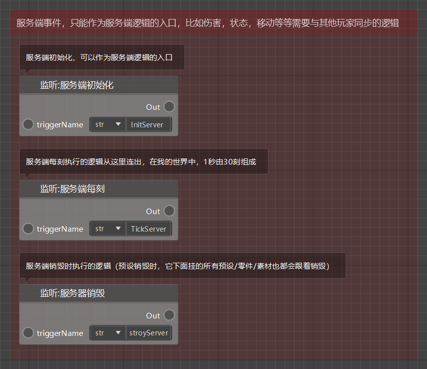

### 创建事件监听节点

除了创建蓝图时默认生成的初始事件监听节点，逻辑编辑器还有丰富的事件库供开发者选择。可以通过在图表空白处点击右键打开节点列表，直接在列表中选择需要添加的时间监听节点；如果知道事件的中文/英文名称，也可通过输入关键词的形式找到该事件监听节点。

## 接口 

新版逻辑编辑器为开发者提供了丰富的接口来实现你的创意。这些接口既包括现有中国版模组SDK里的全部接口，也包括一些Python自带接口和逻辑编辑器自带接口。

### 自带接口

自带接口指的是编辑器自带的内置游戏接口、Python接口以及一些辅助逻辑完成的基础接口。正如在“事件”部分中描述的那样，你可以通过在图表空白处右键的方式新建接口监听/调用节点；此外，你也可以在拖出执行或数据连线后松开鼠标左键，从自动弹出的节点菜单中选择/搜索你需要的接口监听/调用节点。

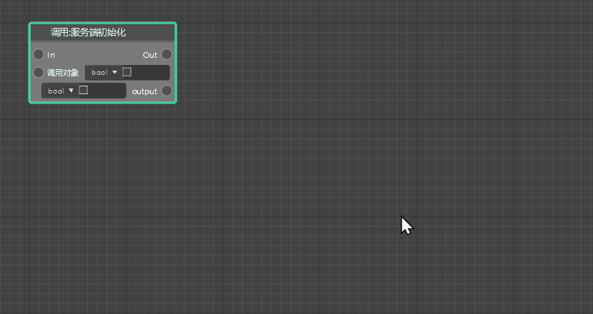

### 自定义接口

除了右键菜单中的这些编辑器内置接口，新版逻辑编辑器还支持开发者创建自定义接口。找到左侧脚本元素窗口中的【接口】选项卡，点击其右上角的”+“号，即可新建一个自定义接口。

> 创建时可为该自定义接口重命名，仅支持英文、数字和下划线（接口名只能以英文字母开始）。

自定义接口像其他接口一样，拥有一个调用调用节点，触发后即会执行该接口内的蓝图逻辑。

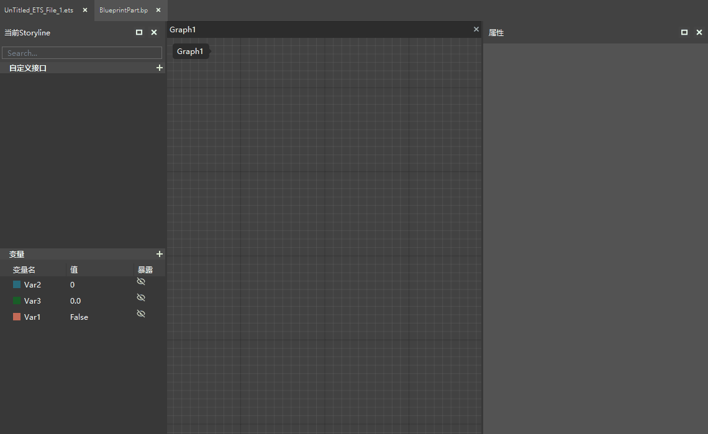

在左侧脚本元素窗口选中自定义接口后，可在右侧属性窗口修改该自定义接口的属性：

- 纯接口：可选项。勾选后该自定义接口将转为纯接口（无执行输入、输出引脚）
- 参数（inputParams）：点击“+”可为该自定义接口添加参数，支持编辑参数名和参数数据类型；点击垃圾桶按钮可以清除已添加的参数
- 返回值（outputParams）：点击“+”可为该自定义接口添加返回值，支持编辑返回值名和返回值数据类型；点击垃圾桶按钮可以清除已添加的返回值

自定义接口创建后，在左侧脚本元素窗口双击该自定义接口（或者直接在图表中双击该接口的调用节点），即可打开该自定义接口的 **接口图表**。接口图表用于编写接口的内部逻辑。每个接口图表都会自带一个输入（Input）和一个输出（Output）节点，输出节点是接口的逻辑起点，同时用于将参数传入接口内部逻辑；输出节点是接口逻辑的终点，同时用于将运算完的数据以返回值的形式传出接口。

正如在普通蓝图图表中使用节点编写逻辑一样，你可以在接口图表中使用各类节点，并用执行连线将他们构成一个完整的逻辑网络，但是整个接口的内部逻辑必须是以执行连线从输入节点，经过内部其他节点，能够顺利走向输出节点的。

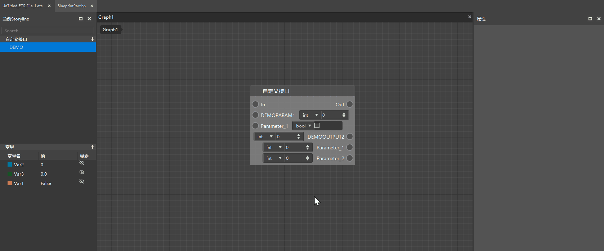

 ## 变量

**变量** 即 **蓝图零件变量**，用于储存值或对象属性，可以通过左侧脚本元素窗口的【蓝图零件变量】选项卡右上角的“+”按钮创建变量。变量在创建后可以自行重命名。

> 【**注意**】
> 1. 对蓝图零件变量做出的所有修改都必须【保存】蓝图之后才会生效。
> 2. 蓝图零件变量的命名只能包含**英文**、**数字**、**下划线**，不能超过20个字符，**且只能以'v_'开始**。

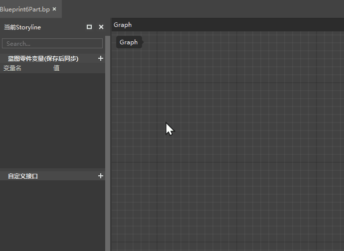

蓝图零件变量创建后，**如果开发者按下【保存】按钮**，则该变量会同步显示到该蓝图零件的 **.part** 文件的属性面板中，这样开发者在其他编辑器中就可以在不打开蓝图文件的情况下，直接修改该蓝图零件变量的默认值了。**注意必须先关闭蓝图，才能在其他编辑器修改蓝图零件变量的值，否则会发生冲突报错。**

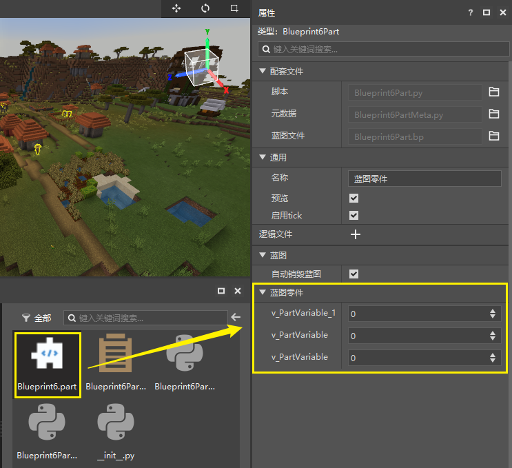

> 【**注意**】
>除了【蓝图零件变量】选项卡，早期蓝图还有一个【变量】选项卡，在后续版本会逐步淘汰。
>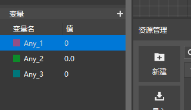

### 变量属性

在左侧脚本元素窗口单击选中变量，可以在右侧属性窗口浏览该变量的全部属性，并可以修改其中的一部分。主要包括：

- **变量名**：字符串，支持英文、数字、下划线。变量名暂不支持在右侧属性面板直接修改，可在左侧【蓝图零件变量】窗口选中需要修改的变量，右键选中【重命名】或直接按下F2键修改变量名。

- **变量显示文本**：即该变量在蓝图零件.part文件属性面板中显示的名称，可以支持中英文、数字、符号。注意需要保存之后，对显示文本的修改才会生效！

- **变量分组**：即定义该变量在蓝图零件.part文件属性面板中所在的分组。默认分组名为【蓝图零件】，开发者可任意修改。注意所有的修改都需要保存才能生效！
  如果改为当前属性窗口中不存在的分组名，则会在属性窗口中创建一个该名称的分组，并将这个变量放入其中；
  如果改为当前属性窗口中已经存在的分组名，则会直接将这个变量放入该分组。

- **变量类型**：通过下拉框可以选择该变量的数据类型。变量数据类型主要包括：

  1）布尔值（假false：0，真true：1）

  2）浮点型（有符号：1.234, -3.14）

  3）整型（有符号：1, 2, 3, 0, -1, -2, -3）

  4）字符串（由数字、字母、下划线组成的一串字符："abc", "123", "abc_123"）

- **默认值**：编辑该变量的默认值

### 获取变量

有两种途径可以在蓝图中获取（get）一个变量中存储的值：

1. 直接拖出右键节点菜单，并输入该变量的变量名关键词即可搜索到它的【获取】节点（你也可以在右键菜单中的【零件变量】子目录下找到它；
> 
2. 将变量从左侧脚本元素窗口中拖动到图表中，松开后从弹出的下拉列表中选择获取节点。

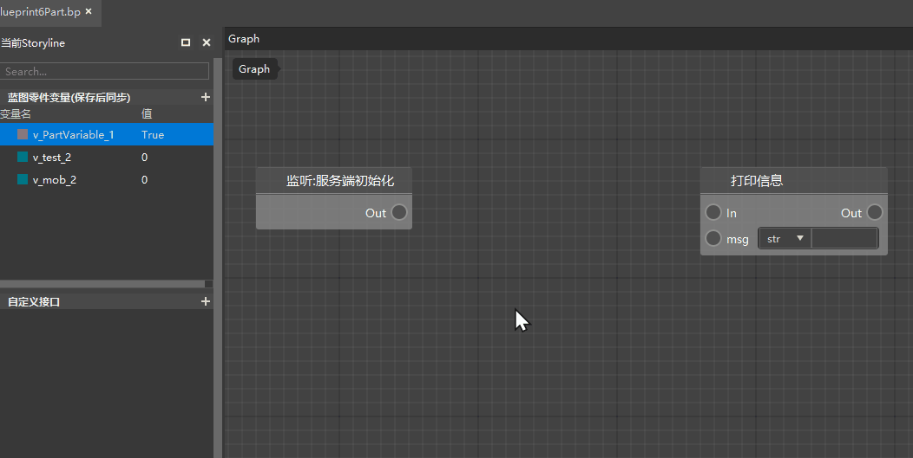

### 设置变量值

如果你想为现有的变量设置（set）一个新的值，那么有两种方式可以做到：

1. 直接在右键中搜索该变量名，创建该变量的【设置】节点，再为这个设置节点传入新的值；
2. 将变量从左侧脚本元素窗口中拖动到图表中，松开后从弹出的下拉列表中选择设置节点，再为这个设置节点传入新的值。

为变量传入新的值也有两种操作方式：

1. 通过数据连线连接到设置节点的参数引脚
2. 直接在设置节点的参数输入框中输入

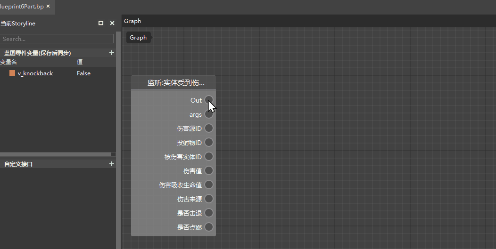
