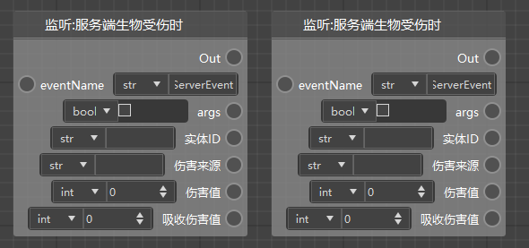
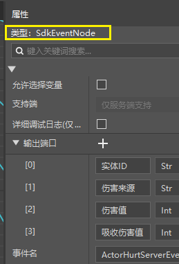
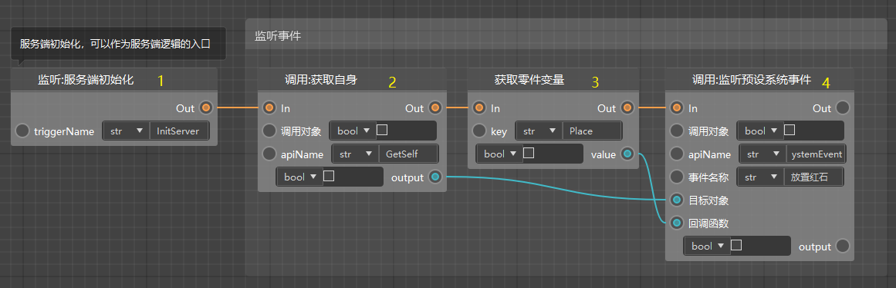
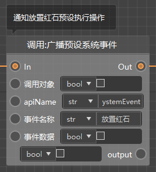
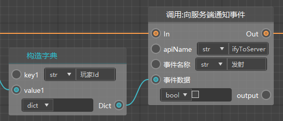
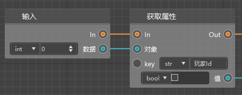
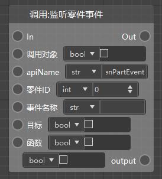

# 事件监听与广播

## 事件简介与引擎事件

事件是模组SDK架构的核心组成部分，也是编程的一类常用技术。模组SDK的事件系统可以参考这篇文档：[事件简介](../../../20-玩法开发/13-模组SDK编程/2-Python脚本开发/9-事件简介.md)。

在我的世界中国版的游戏进行的过程中，模组SDK会在各种时机广播一些事件，比如游戏开始时，玩家加入时等等，我们监听这些事件，然后在这些事件触发的时候执行相应的逻辑，即可对游戏产生影响。

模组SDK中有大量已经内置在我的世界中的事件，他们被称为引擎事件，可以参考技术手册的这篇文档：<a href="../../../../mcdocs/1-ModAPI/事件/世界.html" rel="noopenner"> 世界 </a>。

如果你使用Python编程的话，需要手动监听引擎事件，但是对于蓝图来说并不需要。

当你想要监听某个引擎事件时，你只需要添加一个对应的节点即可，比如希望在玩家发送聊天信息的时候执行某些逻辑。

如下图（你可以在新的指令模板里找到），当玩家发送聊天信息时，会走到这个节点，并且执行后面的打印信息节点，将信息内容打印出来。

## 模组SDK事件与零件事件

零件事件是预设架构的事件系统，在模组SDK事件的基础上进行了一些改进。可以参考这篇文档：[零件事件](../../../20-玩法开发/14-预设玩法编程/2-深入理解零件/0-零件开发.md#零件事件)。

我们以<a href="../../../../mcdocs/1-ModAPI/事件/实体.html#actorhurtserverevent" rel="noopenner"> 服务端生物受伤事件 </a>为例，他在技术手册中的文档如下：

当你在逻辑编辑器中使用这个节点时，你会发现两个版本：

- 监听事件……：这个是模组SDK的事件节点
- 监听零件事件……：这个是零件事件的节点

这两种节点目前看起来没有什么区别，你只能选中他们，在属性面板上查看。

如下图，模组SDK事件（“监听事件：”打头的节点）的类型为SdkEventNode，而零件事件（“监听零件事件：”打头的节点）的类型为PartEventNode。

对于生物受伤来说，如果你希望当前场景中的任何一个生物在受伤的时候，都会从监听节点开始执行一些逻辑，那么你应该使用模组SDK事件（“监听事件：”打头的节点）。当然后续你可以根据伤害来源，实体ID来判断到底是谁触发的这个事件。

零件事件只用于预设架构，如果你使用了实体预设/玩家预设，并且将你的蓝图零件挂接在了这个预设下，那么如果使用零件事件的话，只有实际受伤/造成伤害的生物（玩家），才会监听到这个事件并且执行后续的逻辑，在某些情况下，你可以省去判断ID的步骤。即如果你希望只有零件挂接的当事人触发这个事件，那么建议使用零件事件。

使用零件事件通常会拥有更好的性能，尤其是如果你把零件挂接在会生成大量实例的预设下的时候，比如覆盖原版的僵尸预设。

## 监听和广播自定义事件

除了自带的引擎事件外，你自己也可以使用这套事件系统。事件系统的主要目的是实现逻辑的解耦。

与旧版的逻辑编辑器相比，新版的基于预设架构的逻辑编辑器的bp文件往往比旧版的ets文件数量更多，如果有良好的代码习惯的话，你的逻辑应该被合适的解耦并写到不同的零件中，挂接到合适的预设下。

比如跟HUD相关的UI，写到界面蓝图零件里，并且挂接到界面预设下；跟玩家有关的逻辑，写到另外一个零件，挂接到玩家预设下。

在这种前提下，你就需要使用事件系统来进行不同零件（实例）之间的通讯（沟通）。

我们以跑酷模板为例。

如下图，这是在服务端进行事件监听的节点，节点4为“监听预设系统事件”节点，一般使用这个节点进行监听即可。这个事件有3个参数需要填写

- 事件名称：建议起一个表意清晰的名称，支持中文
- 目标对象：当触发这个事件的时候，希望谁（对象实例）做出反应，我们在这里是希望自身做出反应，所以使用节点2获取到自身然后把值传进去了
- 回调函数：当触发这个事件的时候，希望执行哪个函数，我们在这里希望执行自身的Place函数（自定义接口），所以使用节点3获取到自身的Place接口，并且把值传进去了

我们希望达到的最终效果是接收到“放置红石”的消息时，在零件的位置放置一块红石（表意精准，哈哈），这是个服务端的操作，所以我们需要在服务端初始化的时候进行监听，即节点1执行的时候进行监听。

在监听完成之前，是不会收到消息的，所以一般监听都是在最开始的时候，如果需要执行服务端的逻辑，就在服务端进行监听，否则在客户端。

除了监听之外，我们还需要在合适的时机发送事件，发送事件使用下面这个节点，需要注意两个参数：

- 事件名称：即我们定好的名称
- 事件数据：如果不需要传递数据的话，这个参数留空即可，如果需要传递数据的话，一般需要传递一个字典（由于我们的参数类型没有支持字典dict，可以先选择any代替）。然后在事件接收方执行的函数里通过获取属性的方式获取传过去的参数。

调用发送事件后，如果我们的零件可以接收到事件，就可以顺利的执行对应的逻辑了。

需要传递参数的发送事件，和执行接收事件对应的函数如下图（这里用的通知，和广播类似，参考[网络通讯（服务端客户端）](./48-网络通讯（服务端客户端）.md)）。

## 监听和广播零件事件

上一节的预设系统事件在不涉及具体的零件时比较适用，如果你希望只监听来自特定零件（实例）的事件，或者只通知到某些特定的零件（实例），你需要使用“监听零件事件”的接口。

这个接口有4个参数需要关注：

- 零件ID，即监听来自哪个零件的消息，只有这个零件发送的消息才会被监听到，这个是与上一节的“预设系统事件”的主要区别。
- 事件名称，目标，函数，与上一节的意义相同。

