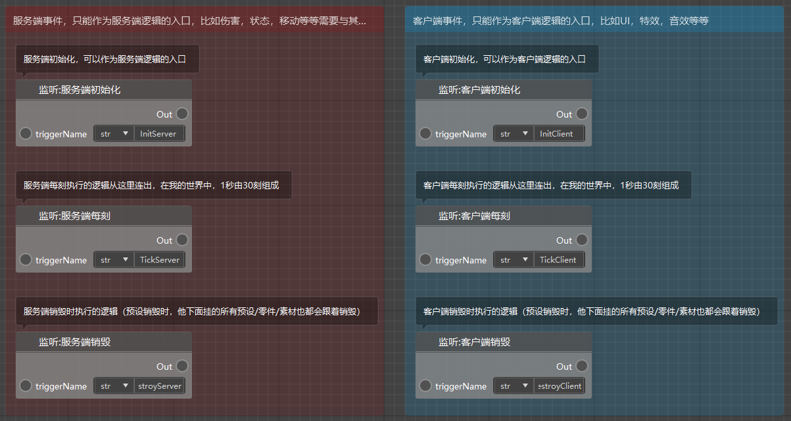
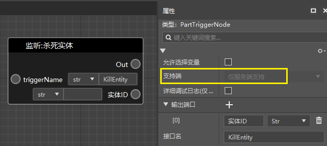
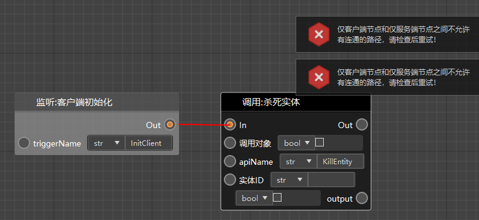
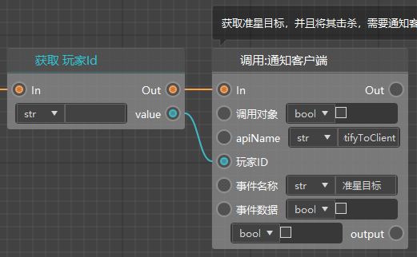
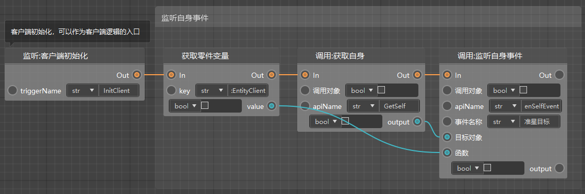
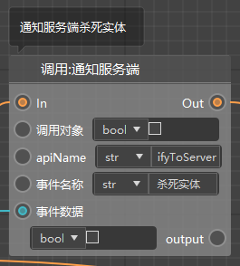
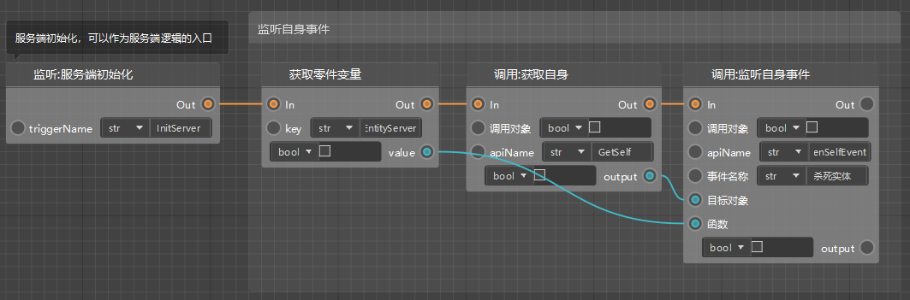
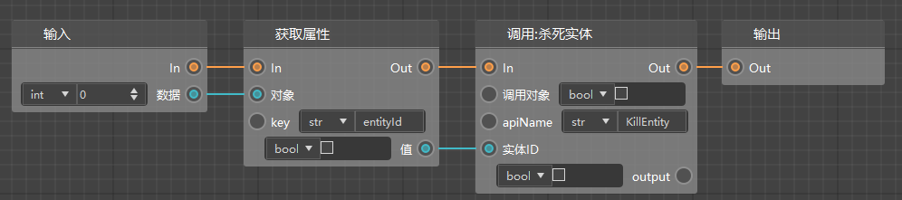
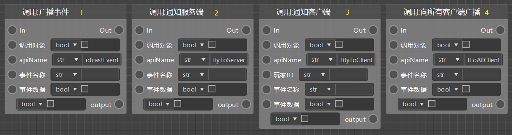
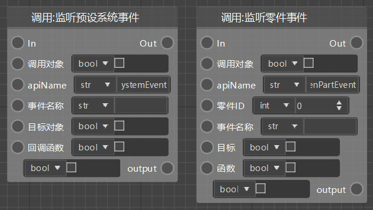

# 网络通讯（服务端客户端）

## 什么是服务端、客户端？

当你运行我的世界的时候，一部分逻辑是在服务端跑的，另一部分是在客户端跑的，两者之间有着较为严格的界限。

如果涉及到数据同步的逻辑，一般都是需要在服务端运行的，这样当你进行多人游戏的时候，每个玩家才会看到其他玩家的行为。

比如实体（或者）生物的移动/位置，攻击，血量计算，生成实体/方块等等等等。

如果无需数据同步，或者只是表现层的逻辑，一般在客户端运行即可。

比如使用自定义模型，动画，特效，音效等等，以及界面，按键等等交互内容。

客户端是运行在本地的，即你当前游玩我的世界使用的电脑或者手机，而服务端的逻辑视情况而定，如果你在进行单机游戏，那么服务端也是运行在本地设备上的，如果你进行联机游戏，那么所有玩家的服务端逻辑都是运行在房主的设备上的，如果你在玩服务器（比如租赁服或者网络游戏），那么服务端的逻辑是运行在服务器上的。

注意，由于客户端和服务端相对分割，所以在任何时候都不能在一端调用另外一端的逻辑！

## 服务端节点，客户端节点

所有的节点都被区分为3类：

- 仅服务端节点，他们只能运行在服务端
- 仅客户端节点，他们只能运行在客户端
- 双端节点，在服务端和客户端都能跑，会根据当前执行的环境改变逻辑

下图是创建一个蓝图零件时，默认写到蓝图里的节点，可以看到包含3个服务端的节点和3个客户端的节点，你需要根据上述的标准判断自己需要从哪个端的节点连出后续的逻辑。

如下图，你可以点击节点，在他的属性面板里查看他支持哪个端。

你自己创建的所有自定义接口都是双端支持的（无法修改这一属性，即使你没有做双端的支持）。

如下图，我们目前在节点连接的规则里添加了这样的规则：在一个互相联通的图表里，不能同时存在仅客户端和仅服务端的逻辑。

## 网络通讯

如上节所述，我们无法直接在一端直接调用另一端，如果我们需要此类的逻辑，可以通过事件监听和网络通讯来实现。

我们以蓝图的指令系统为例，里面有一个需求是当玩家输入“@击杀”时，我们需要获取到准星指向的目标，然后将其击杀（如果是实体的话）。我们拆分一下需求会发现：

- 判断聊天信息是服务端逻辑
- 获取准星指向的目标是客户端逻辑
- 击杀实体是服务端逻辑

这三个逻辑之间都是无法直接调用的，于是我们需要采取下面这种方式。

首先，在判断玩家输入的消息是“@击杀”后，向客户端发送一个叫做“准星目标”的事件（调用“通知客户端”接口），注意，因为我们只想要输入这条聊天信息的玩家获取他的准星目标，所以我们在这里需要把玩家id设置为该玩家的（在之前的逻辑里，此处不做展示）。

然后我们在客户端初始化的时候，监听“准星目标”这个事件，在收到该事件的时候，执行自定义的“PickEntityClient”接口（如下图第2个节点）。

在“PickEntityClient”接口里，我们获取到准星处的实体后，将该数据通过“通知服务端”接口发送到服务端，事件名为“杀死实体”。

同理，我们需要在服务端初始化的时候监听“杀死实体”事件，并在接收到事件的时候执行自定义接口“KillEntityServer”。

在这个接口中，我们最终获取到传过来的实体id数据，实现对这个id的实体的击杀。

## 事件与网络通讯总结

结合[事件监听与广播](./47-事件监听与广播.md)，我们可以总结一下此类节点的用法。

如果你需要通知到其他零件，或者自身执行一些逻辑，又不方便直接调用接口的时候，你需要使用下面这些节点：

- 广播事件：适用于在同一端的情况，比如服务端广播到服务端，客户端广播到客户端
- 通知服务端：适用于在客户端，通知服务端执行某些逻辑
- 通知客户端：适用于在服务端，通知某个（玩家的）客户端执行某些逻辑
- 向所有客户端广播：适用于需要所有（玩家的）客户端都执行的逻辑

然后事件的接收方，需要在服务端初始化，或者客户端初始化的时候（一般是在这个时候，有需要的话可以在任意时候）进行监听。

- 监听预设系统事件：常用的监听方式
- 监听零件事件：只希望监听来自某个零件的事件

