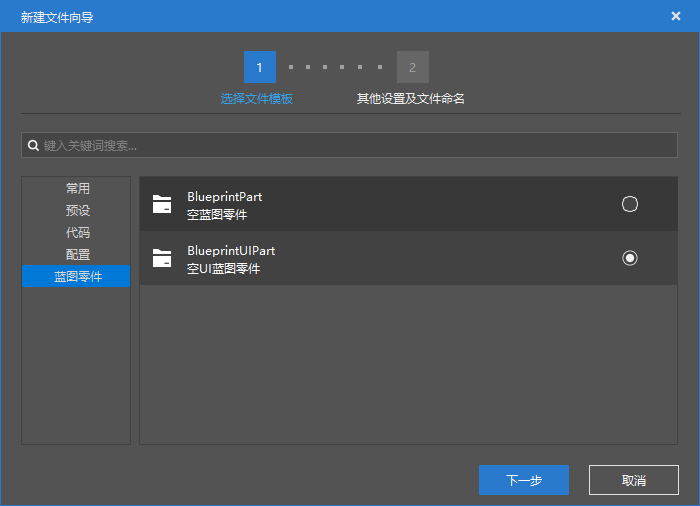
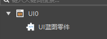
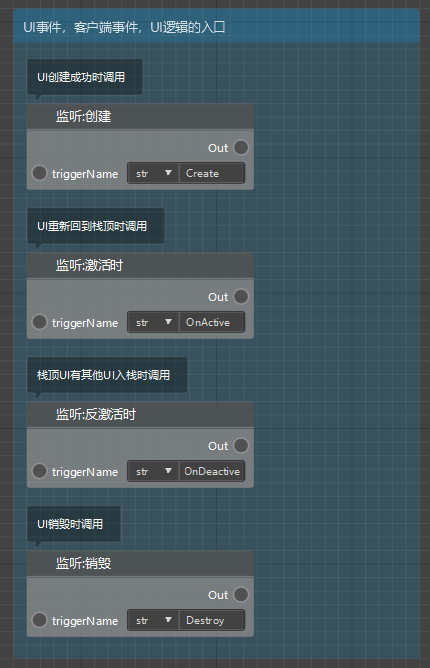
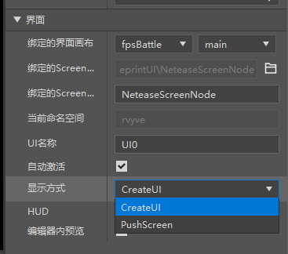
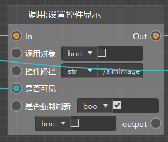
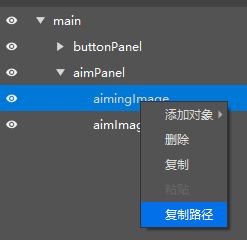

# 界面蓝图

此部分较难，推荐观看下列视频

- [更换模型和添加界面](../30-新版示例教程（视频）/07-制作简易射击附加包（视频）/01.md)
- [开关瞄准镜](../30-新版示例教程（视频）/07-制作简易射击附加包（视频）/02.md)

## 创建蓝图和组装预设

我们提供的蓝图简易射击模板里有界面蓝图的使用，可以参考他的写法进行学习。

新版逻辑编辑器支持制作界面，在制作前，你可能需要先了解一下[界面预设](../../11-组装简单玩法/10-预设/5-界面预设.md)。

在创建完UI预设之后，你可以通过新建文件向导创建一个UI蓝图。

注意，想要UI蓝图零件生效，你必须将其直接挂接到对应的UI蓝图下，类似下图。

## 起始事件

打开UI蓝图零件，除了蓝图零件自带的6个事件之外，你会发现他还有4个额外的UI相关的事件，如下图，分别是

- 创建：UI创建成功时，一般在这里进行UI逻辑的初始化
- 激活，反激活时：当你的UI被激活或者取消激活时
- 销毁：你的UI被销毁时

可以查看一下你的UI预设，如果你选择的CreateUI，那么你主要使用上述的“创建”节点，否则（选PushScreen），你主要使用“激活”和“反激活”节点。

## 调用接口

界面相关的接口主要分布在下图的菜单中。

我们以设置控件显示为例，下面这个节点是我们需要使用的节点

- 控件路径：希望对哪个控件调用
- 是否可见：希望控件显示还是隐藏
- 是否强制刷新：是否在调用接口后立刻刷新这个控件的显示状态

对于控件路径，我们可以在界面编辑器中获取，比如右键复制下面这个控件的路径，并粘贴到上图的节点中。

