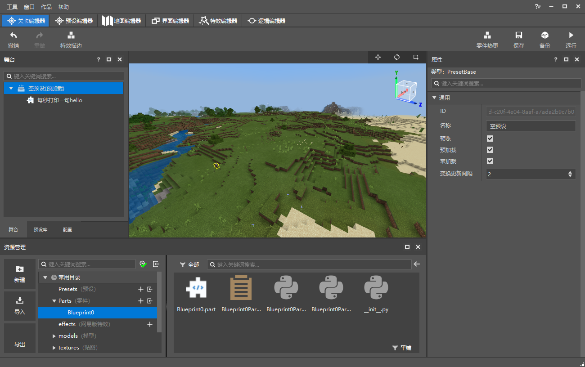
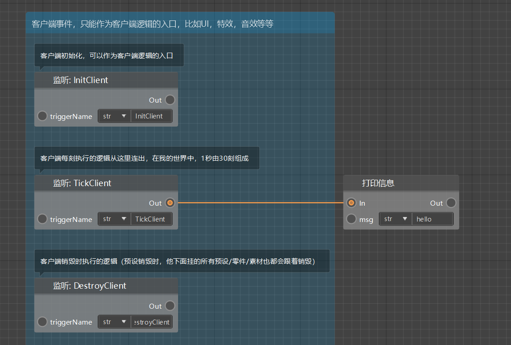
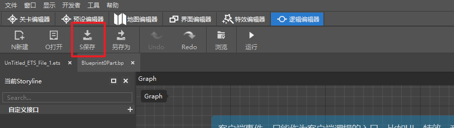
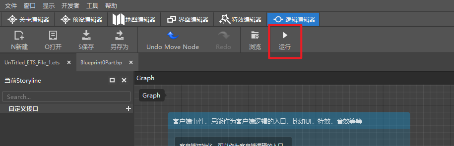
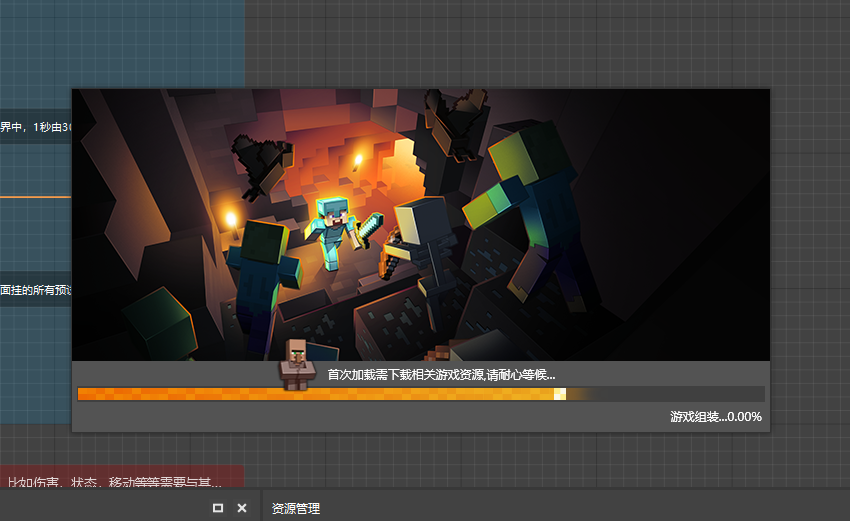
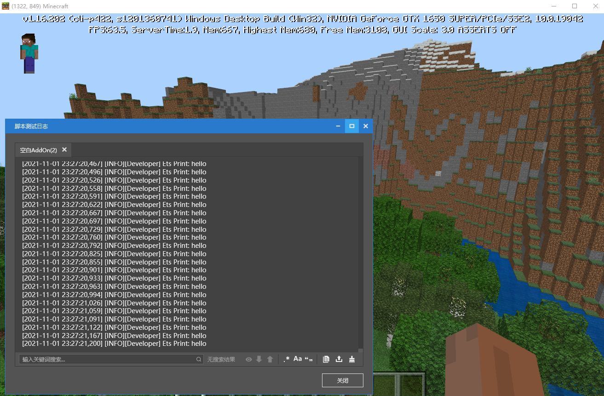

# 蓝图测试

下面我们将演示蓝图的测试：

我们以一个挂在预加载空预设下的蓝图零件为例，该蓝图的逻辑是每帧在日志窗口打印一句hello。

在.bp文件中编辑完蓝图的逻辑后，首先需要点击保存按钮保存蓝图。

保存蓝图之后，我们点击运行按钮，即可在开发包中测试我们的蓝图逻辑：

初次进入时，可能需要等待较长的时间以完成加载。

进入游戏后，我们打开日志窗口，即可看到每帧都会打印一句hello，证明该蓝图零件的逻辑已在游戏中生效。

