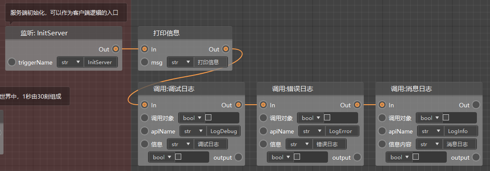
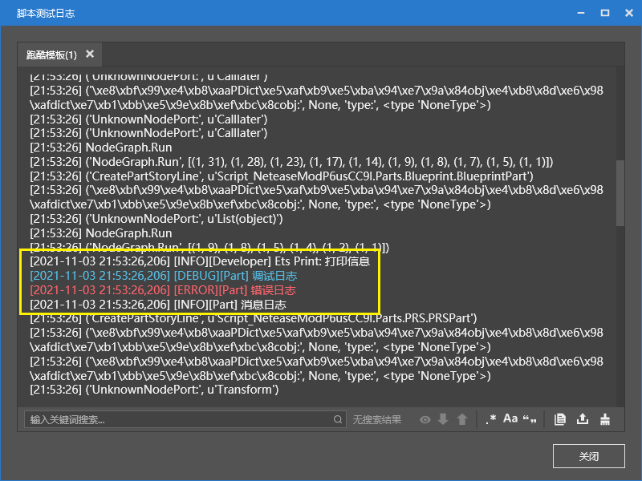
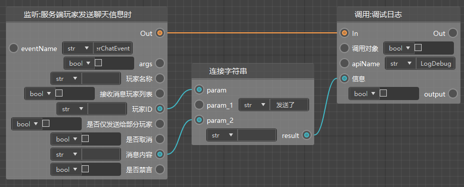
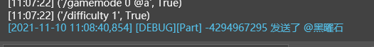
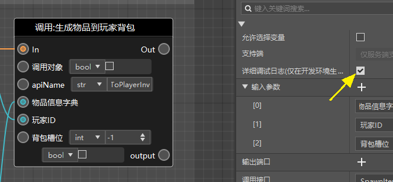
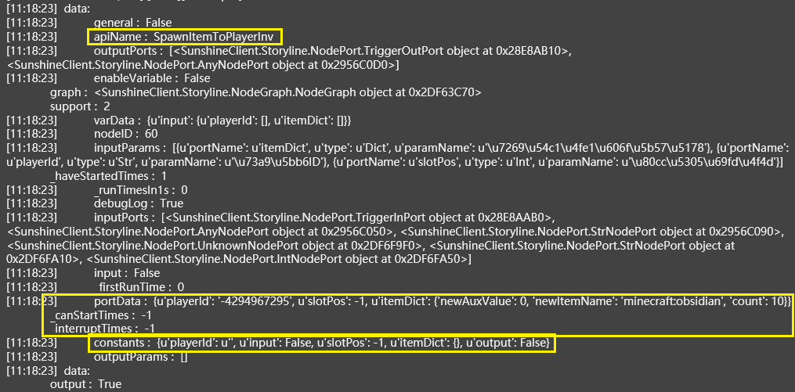

# 错误解决

一般情况下，由于我们对蓝图做出了诸多的连接限制，使用蓝图很少会出现语法错误，但是仍然可能出现一些逻辑上的错误，当出现错误（bug）的时候，你就需要用到一些简单的技巧，来排查和解决这些错误。

与模组SDK的代码编程类似，我们没有提供单步调试的功能，你只能通过观察日志的方式来解决bug。

## 打印信息

打印（print），在大部分情况下，都是你最好的伙伴，出现任何费解的问题，都可以通过打印看一下当前的情况。

目前我们支持一种简单的打印：打印信息，以及三种复杂的打印方式：调试，错误和消息日志。将这些节点如下图连接好，并且填上相应的信息，然后点击运行。

运行后，你可以在脚本测试日志里看到如下的信息。将你认为有问题的值连接到打印节点的信息处即可将他们打印出来。

如下图，我们可以将玩家发送的信息和玩家id同时打印出来。

下图即输入黑曜石之后的打印结果。

Python的大部分变量都是可以打印的，包括数字，字典，甚至是零件和预设对象，你可以直接打印“获取自身”的返回节点试一下。

## 详细调试日志

有时，如果懒得打印，或者没有特别的打印需求，可以直接点击觉得有问题的节点，并勾选详细调试日志，如果这个节点被正确的跑到了，那么会在日志里显示节点执行的详细信息。

下图就是这个节点的详细信息，我们只需要关注黄框内的基础信息：

- apiName：是哪个接口，与这个节点的英文名称对应，可以在节点的属性面板找到
- portData：字典，显示你传入的所有参数
- constants：也是参数，但只显示你在节点直接输入的参数

