# 旧版逻辑编辑器使用说明

> **【请注意】**
> 本篇内容仅适用于旧版逻辑编辑器。我们已经推出了功能更加强大的新版逻辑编辑器，您可[点击此处跳转新版逻辑编辑器文档](../10-新版逻辑编辑器使用说明/01-认识新版逻辑编辑器.md)。
> 旧版逻辑编辑器将不再进行功能更新，我们推荐开发者们使用新版逻辑编辑器进行开发。

## 基本介绍

逻辑编辑器用于编写Mod的关卡流程、物品使用效果、玩家和生物技能、生物AI等内容。当通过修改JSON和编辑器配置项无法达到目的时，就可以考虑用逻辑编辑器来实现自己想要的游戏功能了。需要说明的是，逻辑编辑器不要求有编程能力，适合于入门开发者，适用于逻辑不是特别复杂的组件。

**但如果有代码能力或者有较强的学习能力，我们还是建议学习Python，使用代码来制作逻辑，这是更为灵活、上限更高的方式。**

建议跟随下面的视频学习逻辑编辑器哦。

<video id="video" controls="" preload="none" width=800 height=450>
	<source id="mp4" src="https://mc.v.netease.com/2020/0316/45b4a2ee4c776e48cf778e482abf84c3qt.mp4" type="video/mp4">
</video>

进入逻辑编辑器的方式：

- 进入编辑器后，如果当前显示的为地图编辑器，那么点击左上角图标，会显示其他编辑器列表，选择其中的“关卡编辑器”，如下图：

    

- 选择“逻辑编辑”分页，进入逻辑编辑器，如下图：

    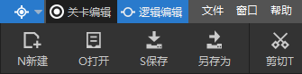

逻辑编辑器的界面构成如下：

下面简单介绍各个界面的作用：

-  **菜单栏**：我们编辑的逻辑保存成后缀为.ets的文件（**注意：文件名只能由英文字母和数字构成**）。“文件”菜单可以进行通用的文件操作；“窗口”可以设置编辑器不同窗口的可见性；“帮助”中可以查看示例。

- **快捷操作栏**：一些常见的文件操作、节点操作选项放置在这里。

- **节点编辑区域**：在这里放置和连接逻辑节点，是我们主要的操作区域。

- **节点属性**：在节点编辑区域单击选择某个节点时，会在这里显示该节点的属性（可编辑），部分节点没有编辑项。

- **查找节点**：当节点图非常庞大时，如果想快速定位到某个节点，可以输入节点名字进行搜索，单击搜索结果即可快速定位到目标节点。在初期我们暂时用不到这个功能。

- **宏**：宏可以用于封装一些可以重复使用的节点图，初期暂时用不到这个功能，在后面进阶知识里会对宏进行详细介绍。

逻辑编辑器中最基本的单位是“节点”，每个节点会实现一个功能，通过组合这些节点，就能够实现复杂的功能。

在节点编辑区域右键单击，就可以在弹出的菜单中选择不同的节点。如下图所示：

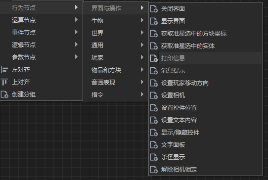

当把节点放入编辑区域后，有两种方式连接节点：

- 直接把节点拖到另外一个节点上，它们会自动咬合在一起（不适用于上一个节点有两个输出端口的情况）。如下图所示：

    

-  鼠标放在上一个节点的输出端口上，然后按住，拖到下一个节点的输入端口上，当连线变绿时，松开鼠标。如下面两张图所示：

  - 鼠标在上一个节点的输出端口按住：

    

  - 拖到下一个节点的输入端口，连线变绿后松开鼠标：

    

游戏逻辑会按照节点的连接顺序依次执行，下面我们制作一个最简单的逻辑节点图。

## 快速开始

在这里我们制作一个玩家一击必杀的功能，这个功能让玩家只需攻击生物一次就能杀死生物。

我们把这个功能拆解为这样的流程：当玩家攻击生物时->杀死这个生物。下面按这个流程逐步介绍。

在编辑区域，在右键菜单中依次选择 事件节点->生物事件->生物受伤。

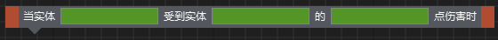

这个节点的意思是，当实体受到其他实体的伤害时（玩家也是一种实体），就会触发这个节点，并执行后续的逻辑。

其中绿色背景的方框表示这个地方会输出变量，这些变量可以在接下来的节点中用到。在方框内填入变量名，变量名可以随意填写，但在同一个ets文件内不可以重复，选择有意义的名称是一个好习惯。填入变量名后，节点变成下面这样：

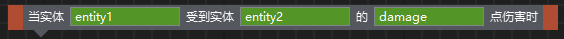

接下来在右键菜单中依次选择 行为节点->生物->杀死指定生物，并且把这个节点和前一个节点连接起来。

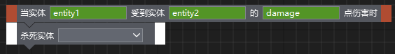

这个灰色带一个下拉箭头的方框表示这里需要指定一个变量：

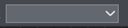

点击下拉按钮：

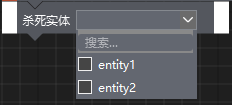

下拉列表中会显示当前已经有的实体变量名，选择“entity1”，节点图就变成了下面这样：

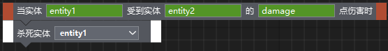

这样就完成了我们第一个简单的逻辑。

由于“entity2”、“damage”这两个变量名没有用到，所以在第一个事件节点里也可以不定义这两个变量名。

接下来把这个逻辑挂接到游戏里。

首先保存这个逻辑文件，命名为“test1.ets”，保存的路径采用默认路径即可。由于这个逻辑和玩家关联比较大，那么我们把这个逻辑挂接在玩家下面。在关卡编辑器的组件窗口中，在“玩家”上右键，添加“基础属性”组件：  
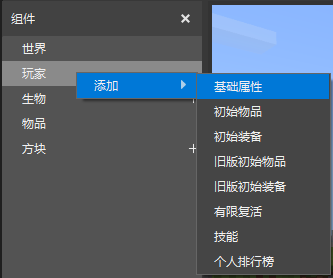

组件列表中点击“基础属性”组件，会在属性窗口中显示可配置的内容。在“逻辑文件”配置项中，点击替换逻辑文件按钮（下图中红色箭头指向的按钮），在弹出的窗口中点击按钮 “选择文件”，选择我们刚才保存的“test1.ets”。  
  
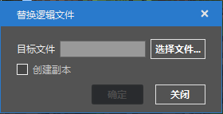

这样我们制作的逻辑在游戏运行时就能够生效了。点击关卡编辑器右上角的“运行”按钮，在游戏里实际测试一下。

下面我们让这个逻辑变得稍微复杂一点，攻击伤害大于0时才会杀死生物，当杀死生物后，给玩家一块面包。

将另外三个节点加入节点图：

- 逻辑节点->关系运算->是否大于；

- 逻辑节点->控制节点->条件节点；

- 行为节点->指令->输入指令；

然后按下面的方式连接：

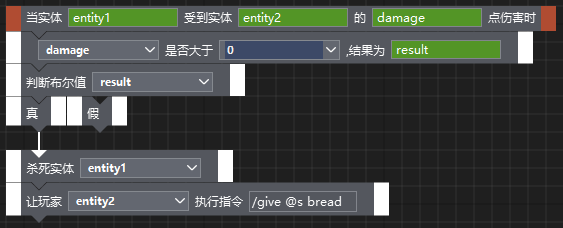

这个连接中比较特别的是靛蓝色背景的0。在输入框中直接键盘输入0，就得到了截图所示的结果。靛蓝色背景表示这是一个常量，常量的值就是输入的值（截图中就是0）。不过需要注意的是，数字和文本类型的输入框这样输入才会有效。

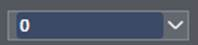

另外一个特别的输入框是下图这个：

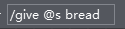

灰色背景的输入框且没有下拉按钮，表示这里需要一个常量，可以在右侧的属性面板中输入常量。

上面这个逻辑存在的问题是，如果玩家受伤了，那么也会被杀死，因为玩家也是一种实体，玩家受伤时也会触发这个事件。使用玩家攻击事件节点可以避免这个问题，这个节点中只有玩家对实体造成伤害时才会触发。

到目前为止，已经介绍了逻辑编辑器的基本概念和操作，后面的章节会更深入的介绍逻辑编辑器中的概念和细节。

## 详细说明

### 节点和连线模式

节点分为5大类：

- 事件节点：当某个事件发生时，会激活对应的事件节点，并顺序执行与事件节点相连的节点。

- 行为节点：这类型的节点最多，每个行为节点会对实体、方块、物品、界面等进行一定操作。

- 逻辑节点：关系判断、逻辑运算、流程控制相关的节点均放在这个大类下。

- 运算节点：目前支持简单的运算和三角函数。

- 参数节点：和常量、变量相关的节点均放在这个大类下。

熟悉节点后，可以通过右键菜单中的搜索快速获取节点。

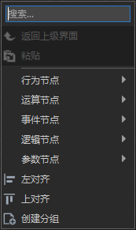

节点的连线模式为：起始节点必须为事件节点，事件节点后连接一系列的其他节点。事件节点没有输入端口，且节点两侧为棕红色块，其他类型节点两侧为白色色块。

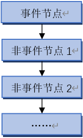

一个ets中可以有多个事件节点，他们之间互相独立。

事件节点中比较特别的一个节点是“世界定时刷新”，这个事件节点每秒均匀触发数次，需要定时执行的逻辑可以挂在这个事件节点下。**需注意的是，如非必要，尽量少使用该节点，避免带来游戏卡顿。**

### 数据类型

在前面的例子中，已经提到节点的输入框有三种类型：输出变量，输入变量，常量。这些输入框中的变量或者常量有着多种数据类型，除了常见的数字、字符串、布尔值等类型，还包含了《我的世界》中特有的类型，下面对这些数据类型进行介绍：

- 布尔值

    布尔值只有“真”“假”两种取值情况，关系判断、逻辑运算后产生的值都是布尔值。

- 整数

    如-2、0、100等都是整数。

- 浮点数

    非整数均用浮点数来表示（这是通俗的理解方式），大部分时候开发者无需关心游戏中的数字是整数还是浮点数。

- 字符串

    游戏中玩家在聊天频道的发言、文字提示等都是字符串。

- 二维坐标

    二维坐标的形式为(x, y)，其中x/y均为数字。编辑器中的“拆分二维坐标”、“合并二维坐标”两个节点可以操作二维坐标。

- 三维坐标

    三维坐标的形式为(x, y, z)，其中x/y/z均为数字。编辑器中的“拆分三维坐标”、“合并三维坐标”两个节点可以操作三维坐标。在游戏中，玩家的位置就是三维坐标，因此节点中涉及到位置的变量均为三维坐标。

- 实体ID

    实体（Entity）是《我的世界》中特有的概念，包括《我的世界》中所有动态的、移动中的对象。玩家、生物、船、经验球等都是实体。每个实体都有一个独一无二的ID。在节点中，涉及到玩家、生物、实体的变量，均是实体ID类型。

- 方块类型

    方块类型包含了方块ID、数据值两部分。如白色羊毛方块，方块ID是35，数据值是0；红色羊毛方块，方块ID是35，数据值是14。编辑器中的“拆分方块类型数据”“合并方块类型数据”两个节点可以操作方块类型数据。大部分情况下，开发者可以直接通过弹窗选择方块类型，不用去关心具体的ID和数据值是多少。

- 物品类型

    物品类型比较复杂，包含物品ID、数据值、数据版本3个值。《我的世界》原生物品的数据版本为0；对于Mod SDK第一版自定义物品，其数据值为自定义扩展值，数据版本为1；对于第二版自定义物品，其数据值为组件名字（ModID），数据版本为2。编辑器中的“拆分物品类型数据”“合并物品类型数据”两个节点可以操作物品类型数据。大部分情况下，开发者可以直接通过弹窗选择物品类型，不用去关心具体的ID和数据值、数据版本。

- 任意数据

    部分输入框不限制数据类型，以上任何数据类型均可。

对于输入变量框，只有符合数据类型要求的变量才会显示；对于常量框，如果输入的变量不符合要求的数据类型，会自动转为满足要求的数据类型。大部分情况下，开发者根据节点提示就可知晓数据类型。

### 逻辑文件挂接

ets文件编辑好之后，需要通过一定的途径挂接到游戏中。挂接途径主要影响运行时机，例如世界相关的逻辑要求在世界创建完成后就开始运行，就不应该挂在生物上。此外，即使不同的挂接途径运行时机相同，也建议按内容分别挂接，便于管理和后续维护。

目前编辑器支持如下几种ets文件挂接方式：

- 世界挂接ets文件

    挂接在世界中的逻辑会在世界加载完成后开始运行，和世界相关的逻辑适合挂接在这下面。挂接入口：关卡编辑器->组件窗口->世界->基础属性组件->属性窗口->逻辑文件。  
    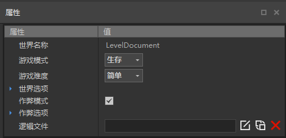

- 玩家挂接ets文件

    挂接在玩家中的逻辑会在世界加载完成后开始运行，和玩家相关的逻辑适合挂接在这下面。挂接入口：关卡编辑器->组件窗口->玩家->基础属性组件->属性窗口->逻辑文件。

- 生物挂接ets文件

    挂接在生物中的逻辑会在生物创建后开始运行，和该生物相关的逻辑适合挂接在这下面。挂接入口：关卡编辑器->组件窗口->生物->属性窗口->逻辑文件。

    需要注意的是每一个该类型的生物，都会执行挂接的逻辑。对于挂接在生物上的ets，可使用“获取当前实体ID”节点获取当前挂接的生物实体ID。

    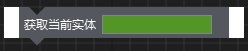

### 调试

挂接好节点图后，发现运行没反应或者效果和预期效果不同时，可以使用“打印信息”节点来定位问题。

在各个结点附近添加“打印信息”节点后，对应的信息会显示在脚本日志窗口中（运行时）。

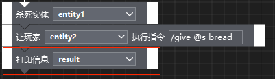

## 进阶知识

###  临时变量和永久变量

如果要保存和传递数据，那么就需要用到临时变量和永久变量。临时变量和永久变量的区别在于，重启游戏后，临时变量会被清空，且临时变量不能跨ets传递数据，而永久变量重启游戏不会被清空，且可以跨ets使用。所以临时变量适用于单ets内传递数据，而永久变量适用于保存玩家的胜场数这样的数据。除了这两个区别外，临时变量和永久变量的使用方式非常相似，下面以临时变量为例来说明。

临时变量以键值对（key-value）的形式存在，键（key）一般为字符串，通过键（key）可以读取和设置对应的值（value）。临时变量有三个相关节点：“添加临时变量”，“读取临时变量”，“设置临时变量”。在使用“读取临时变量”、“设置临时变量”之前，需要先使用“添加临时变量”，添加键值对，可以在ets刚开始运行的位置做这件事情。

### 宏

当节点图中有较多重复使用的功能时，可以把这部分功能做成宏，方便复用和修改。此外，如果是比较复杂的节点图，也可把每个功能块做成一个宏，这样主节点图的逻辑结构能够一目了然。下面截图中的“创建怪物”、“关卡进度判断”、“给予玩家奖励”都是宏。

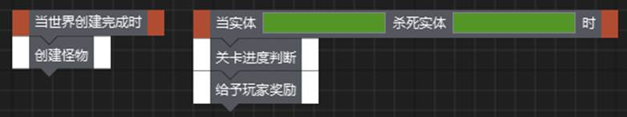

 

下面介绍如何创建一个宏，实现把两个坐标相减得到一个新坐标的功能。

点击宏界面的“+”就可新建一个宏，宏初始有两个节点“输入”“输出”。

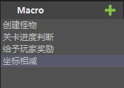 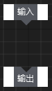

“输入”节点是宏的节点图的执行起点，连线必须从“输入”节点开始。在输入节点的属性面板中，点击蓝色加号可以配置宏需要的输入参数，这里我们设置两个需要相减的坐标点作为输入参数。

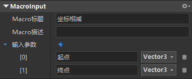

“输出”节点是宏的执行终点，连线必须终止于“输出”节点。点击蓝色加号设置宏的输出参数，这里我们设置相减后的坐标点作为输出参数。

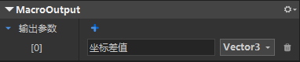

连接好的节点图如下：

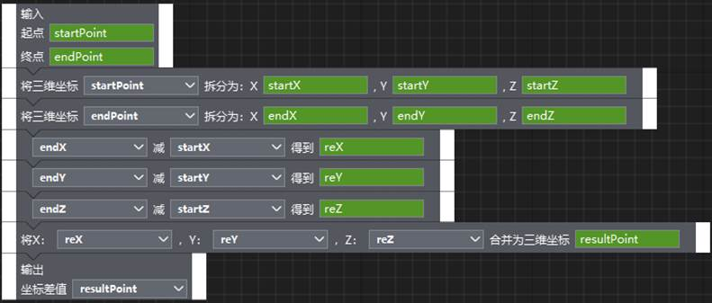

在其他的ets中，我们可以直接按住宏列表中的“坐标相减”拖到编辑区域，就可以生成一个宏节点。

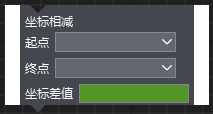

### 节点执行顺序

当节点是依次顺序连接时，执行顺序就是连接顺序。但是当节点的连接出现分叉和汇聚的情况时，执行顺序就和直观判断不一样了。

以下面这个连接方式为例：

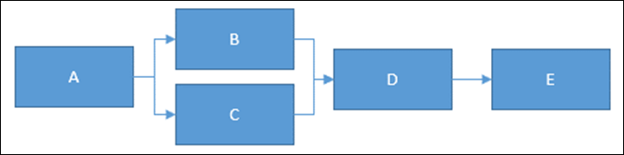

这个连接方式的实际执行顺序为：

A->B->D->E->A->C->D->E或者A->C->D->E->A->B->D->E。

和直观上的A->B\C并行执行->D->E的顺序有很大差异。这是因为节点图是按深度遍历的方式来确定执行顺序的。为了避免出现和预期执行顺序不符合的情况，建议都用顺序连接的方式来连接节点图，或者只出现连线分叉、不要出现连线汇聚。上面的例子可以修改为下面这样：

## 参考资料

有如下方式能够帮助更好的使用逻辑编辑器：

- 逻辑编辑器“帮助”菜单下的“查看逻辑示例”，可查看一些小功能的示例。

    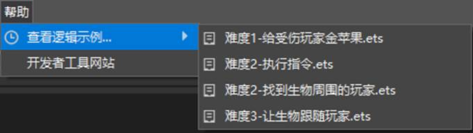

- 单击选中节点时（节点的底色会变为蓝色），底部会显示该节点的说明。

    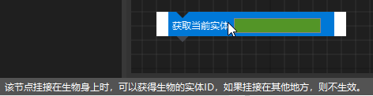

- 如果想了解具体的输入框、输出框的信息，可以点击输入框或输出框，底部会显示相应的提示信息。

    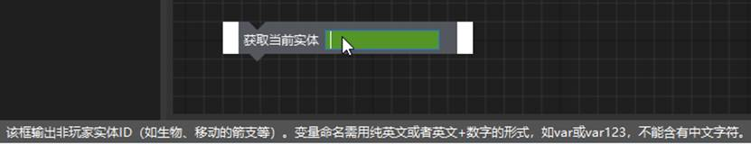

- [《我的世界》官方wiki](https://minecraft-zh.gamepedia.com/Minecraft_Wiki)

    在这里可以查询到我的世界中各种游戏元素的数据，如物品ID、实体类型等。