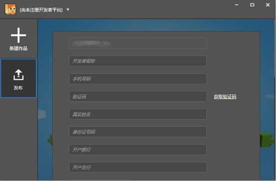
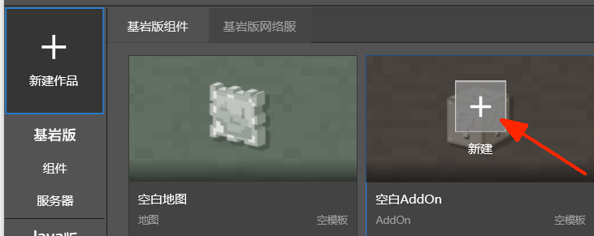
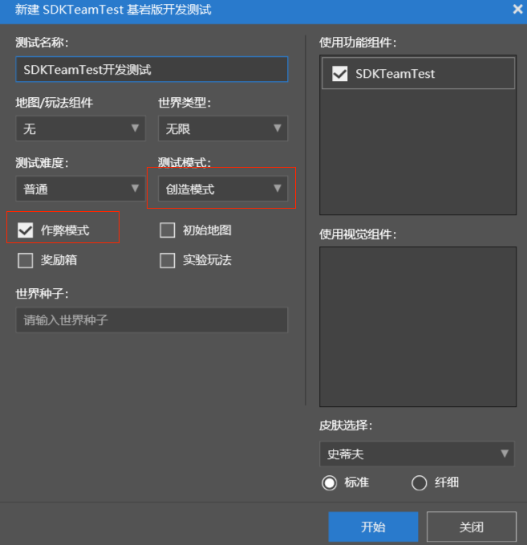
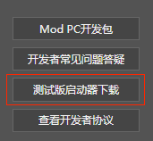

# 制作第一个附加包

## 下载安装MC Studio

从我的世界开发工具网站（http://mc.163.com/mcstudio/index.html）下载MC Studio

## 注册开发者账号

安装后，使用网易通行证账号登录，然后在“发布”页面注册成为我的世界中国版开发者，审核通过后就可以使用MC Studio的所有功能了。

## 新建一个空白AddOn

新建作品→基岩版组件→空白AddOn，点击新建

填写好地图名称后点启动编辑。然后studio会自动下载最新的mod开发包

## 添加一个自定义方块

1. 在关卡编辑器右键方块→添加→自定义方块

2. 选中新增的自定义方块1，然后在右侧的属性面板配置方块的贴图

   

3. 点击上面贴图的按钮，会弹出一个选择文件的界面，这时候的路径一般情况是在

   `你安装studio的盘符:\MCStudioDownload\MCEditor`

   我们在此基础上定位到`Game\data\resource_packs\vanilla\textures\blocks`

   这里我们可以找到原版方块的贴图，我们选择barrel_bottom.png

   然后下面贴图与侧面贴图也选择这张贴图

   

4. 然后我们找到“射线碰撞盒”，把“右上角”的数值都设置为1

   
   
5. 右上角点击保存并退出

   

## 测试我的作品

1. 在开发者启动器选中基岩版组件→AddOn→你刚才新加的AddOn→开发测试

​		选择创造模式与作弊模式，然后点开始。这时启动器会下载《Mod PC开发包》

2. 下载完成进入游戏后，我们打开物品栏，就可以看到我们新加的自定义方块，可以拿出来并进行放置

   

   

## 进阶

以上我们制作了一个非常简单的mod，但实际测试的过程中我们会发现一些问题，例如方块可以穿过。

这是因为我们只配置了方块的贴图，而没有配置方块的碰撞箱，如何制作一个完善的自定义方块则需要我们阅读相关模块的文档。

此外仅仅添加一个方块无法构成一个有趣的玩法。一个有意思的玩法通常可以允许玩家对方块进行交互，或者采集方块合成其他有趣的物品。这需要我们学习其他自定义游戏内容，以及python脚本。

## 导出发布

假设我们已经制作好了一个很棒的玩法的mod，测试完毕后，我们需要把我们的Mod上传到开发者平台，这样其他玩家才能玩到我们的Mod。

回到开发者启动器，在我们的AddOn选择更多→导出，然后选择一个位置，启动器会把AddOn导出为一个zip文件。

然后选择“发布”页面，上传刚才导出的zip文件，遵循说明和指引一步步填写即可。

## 在移动端测试我的作品

为了测试和体验Mod在手机上的效果，确保最终发布后没有问题，我们需要在手机上进行测试Mod（目前仅支持**安卓手机**测试）。按下面的步骤进行：

- 按前面的介绍，将需要测试的组件，在“发布”页面上传，并提交审核，使组件处于“审核中”的状态。
    
- 安装我的世界手机测试APP：在“发布”页面中，点击左下角的“测试版启动器下载”，下载手机测试APP并安装。
    
- 使用开发者账号登录手机测试APP。
- 在资源中心搜索，找到刚刚提审的组件，即可进行测试。