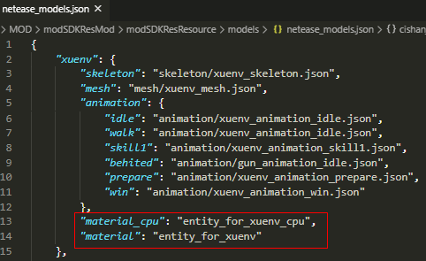
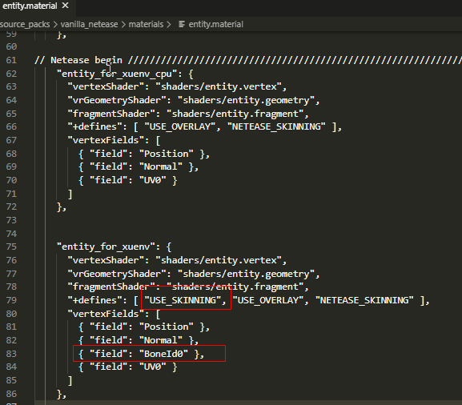
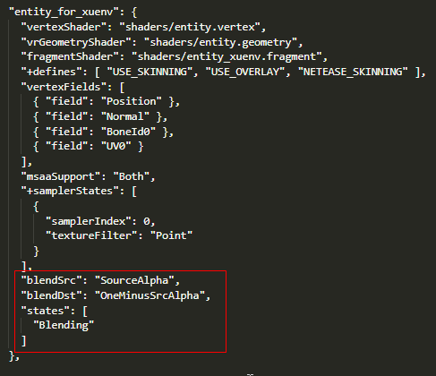
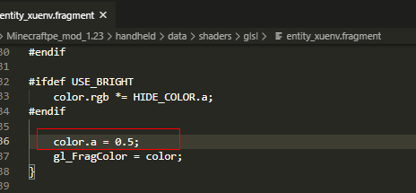
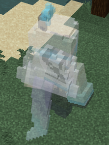

# 骨骼模型使用自定义材质

## 使用自定义的材质

若我们想要实现更为复杂的渲染效果，则可能会需要使用特殊的shader，这时候我们需要修改材质，并配置为使用我们的shader。我们可以在netease_models.json中为模型指定material_cpu和material字段，则骨骼模型将使用指定材质进行渲染。

material_cpu为传统的渲染形式，顶点着色器中每个顶点存储自己的变换矩阵；
material则为骨骼渲染的形式，会全局存储所有骨骼的变换矩阵列表，顶点着色器中每个顶点只存储对应的骨骼下标，在执行过程中用通过该下标从列表中查询得出变换矩阵，因为会有不同的顶点共用相同的骨骼，相比于前者传统的渲染形式，使用此方式能更为节省GPU带宽。目前引擎只会在安卓平台且设备顶点着色器支持使用较多Uniform时才会使用material骨骼的渲染，其它情况下则使用material_cpu传统的渲染形式。

在材质的定义中，material材质相比于material_cpu材质，需要定义USE_SKINNING，另外还需要在vertexFields中添加BoneId0字段。USE_SKINNING与BoneId0在shader中的具体使用方式可参考data/shaders/glsl/entity.vertex。

## 支持半透明渲染的材质

骨骼模型在默认情况下使用不透明材质进行渲染。片段着色器输出中gl_FragColor的第四个参数alpha在不透明渲染中并没有效果，即gl_FragColor.a无论是什么值都不影响最终渲染效果。
开启半透明渲染之后，gl_FragColor.a代表透明度，范围为[0.0, 1.0], 1.0代表完全不透明，0.0代表完全透明看不见。开启方式如下，只需要在材质的定义中声明如下部份即可：

Blending代表使用混合模式进行渲染，blendSrc代表使用SourceAlpha作为混合源因子, blendDst代表使用OneMinusSrcAlpha作为目标混合因子。

混合因子总共有如下可供配置：

接下来，我们尝试修改gl_FragColor.a进行测试，修改为透明度0.5：

修改完成后游戏中该骨骼模型即会出现半透明效果：

注意：因为半透明材质无法通过深度检测优化性能，所以尽量不要过多使用，不然会造成一定渲染压力。