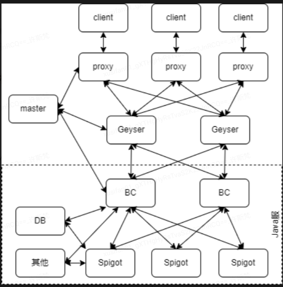
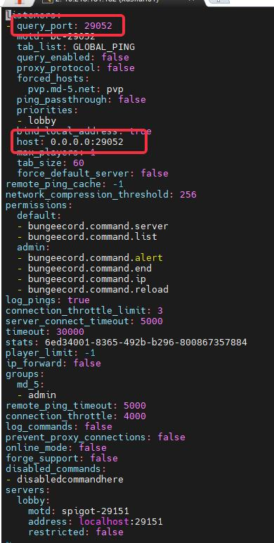
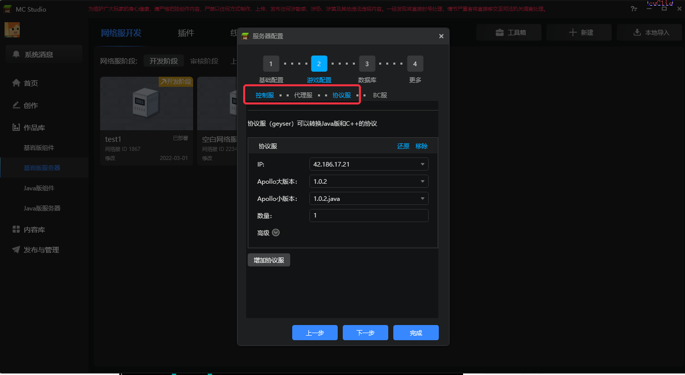
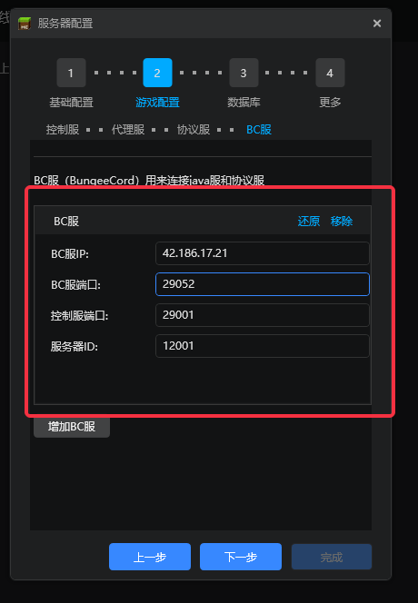

# 支持基岩版客户端的Java版网络游戏概述

## 目的

- 本文档旨在阐述通过Apollo工具，搭建并部署Java版网络游戏的流程

- 玩家能够通过基岩版手机客户端进入Java版网络游戏中进行游玩

- 开发者可以使用基岩版已有的模组SDK和附加包Json制作客户端的玩法逻辑和表现，需要的技术与中国版基岩版组件开发相似。部分功能可能无法生效

## 前置知识

### 名词介绍
- Spigot、Spigot服
  
	> Spigot是一个开源的、高效的Java版MC服务器，并且提供了丰富的api可以编写插件。他是由第三方提供的，并非官方提供，是由官方的minecraft server反编译后，打进去一些patch后而来

- BC、BungeeCord、BC服
  
	> BungeeCord（后面简称BC）是一个代理，提供了切服、数据包转发、插件编写、BC指令等等

- Geyser、Geyser服、协议服
  
	> Geyser是第三方开源的MC协议转换工具，它能把MC-Bedrock版本协议转换为MC-java版本协议，也就是说通过Geyser，我们能实现基岩版客户端进入Java版服务器游玩的效果

- Master服、Proxy服

	> 见[名词解释](../课程2：Apollo基础知识/第2节：Apollo框架.md)

## 框架示例和讲解

如框架图所示，为了尽可能地兼容不同服主Spigot服框架，我们把整体的Java版网络游戏分为两部分：

- 负载/协议转换部分(上半部分)

- Java服部分(下半部分)

接着阐述每个部分的具体作用

- 负载/协议转换部分
    - 这一部分包括了Master服、Proxy服、Geyser服
    - Master和Proxy服作用和基岩版网络游戏一致
    - 由于基岩版和Java版的游戏数据协议包格式并不相同，因此，Geyser服则扮演着协议转换者的角色，它负责把基岩版的协议转换为Java版的协议

- Java服部分
    - 这一部分为Java游戏服，它的作用相当于基岩版网络游戏中，Lobby服和Game服的结合体，是存储玩家实际游玩数据以及世界数据的服务器
    - 它主要由两部分组成，BC服和Spigot服
    - 架构图中的DB则指额外数据库（可选）、其他则是指用于进一步管理BC、Spigot或者其他更多功能的第三方应用程序（可选）

为了可扩展地连接起上下两部分，框架中，我们会把Java服视为黑盒，并为BC服提供名为**BungeeMaster**的插件，这个插件安装在BC服上，负责建立起BC服和Master服的通信连接。

## 搭建流程

### 准备阶段

在进行Java版网络游戏搭建和部署流程前，首先需要注册成为我的世界开发者，并完成入驻申请，申请开发阶段服务器。具体步骤，请详细阅读如下文档：

1. [开发准备阶段概述](../课程1：成为Apollo服主及相关准备/第2节：开发准备阶段概述.md)
   
2. [入驻申请](../课程1：成为Apollo服主及相关准备/第3节：入驻申请.md)
   
3. [申请开发阶段服务器](../课程1：成为Apollo服主及相关准备/第4节：申请开发阶段服务器.md)
   
4. [使用数据库前端连接数据库](../课程1：成为Apollo服主及相关准备/第5节（拓展）：使用数据库前端连接数据库.md)
   
5. [连接开发机](../课程1：成为Apollo服主及相关准备/第5节：连接开发机.md)

### 特别提示

1. 拿到机器后，要先访问添加白名单，之后才可以正常登入
2. spigot机器的java环境对应的操作命令，分别是**java8**和**java18**，其中运行Spigot请使用java8(具体原因详见[常见问题合集](./90-常见问题合集.md))

### JAVA服部署流程
- 在准备好开发机后，连接上开发机
- 通过服主各自的Java服框架，部署各自的Java服(必须存在BC服)
- 经过初步的调研，确定目前使用的Spigot版本为1.12.2，因此为了兼容基岩版1.18客户端，需要在**Spigot服**使用**ViaVersion**插件
- 下载[**ViaVersion插件**](https://www.spigotmc.org/resources/viaversion.19254/)，并放置于 **Spigot服目录/plugins/** 目录下。
- 下载[**BungeeMaster插件**](./99-下载内容.md#bungeemaster插件)，并放置于 **BC服目录/plugins/** 目录下。
- 在 **BC服目录/plugins/** 下，新建文件夹 **BungeeMaster**，并在 **BungeeMaster** 文件夹下新建文件 **config.yml**（此为BungeeMaster插件配置）

    

    

    

- 然后填入如下内容,其中
    - server_id 取值区间在[12000, 14000)内，并且保持单次部署唯一即可

    - master_port端口范围要求[29000,31000)

    - 填写完毕后，请记下相关参数，后面需要在studio中填写

    

- 打开**BC服目录/config.yml**文件(此为bc服配置)，查看bc服监听的端口，并记下端口参数，后面需要在studio中填写
    - 注意，此处的**query_port**和**host中冒号后面的端口值**，请保持一致
    - 该处的端口，均为**BC服**用于监听来自**Geyser**服相关连接的端口

    

- 配置完成后，可使用Java版客户端连接BC，测试Java服部署是否成功

### 负载/协议转换部分部署流程

- 打开MCStudio，选择基岩版服务器，并选择右上角新建选项，打开后，选择空白Spigot服
  
    

- 选择更多后，点击服务器配置，开始配置

    

- 其中，控制服、代理服、协议服的配置不再赘述，和基岩版网络服务器相似

    

- BC服的配置则根据Java服部署中，BC服的数量和配置来决定。如，根据上个步骤截图数据，则最终配置为：

    

- 配置完成后，点击部署

- 查看日志，若部署成功，则可以通过工具箱打开ModPC开发包，进入游戏开始测试

    

## 常见部署问题合集

[常见部署问题合集](./90-常见问题合集.md)

## 常见问题

Q：如何申请使用Spigot开服
A：在开发者平台提交入驻申请，选择作品管理-上架与资源管理-网络游戏-基岩版开服工具游戏-入驻申请，使用框架勾选spigot，认真填写入驻申请。

Q：服务端可以使用Spigot插件么？
A：理论上可以使用来自Spigot插件市场的插件，目前已有一批广泛使用的插件经过了测试。

Q：我什么时候可以上架使用Spigot的基岩版服务器？
A：目前暂时无法上架此类游戏，您可以先进行服务器的开发，我们会在近期支持上架操作。

Q：我需要使用哪个版本的Spigot？是否支持Paper-Spigot？
A：使用的是1.12版本的Spigot；暂时不支持Paper，未来会考虑支持。

Q：是否支持手机和电脑同服？
A：目前仅支持手机端，如果您需要双端同服，可以选择使用Apollo进行开服。

Q：使用的客户端是什么？支持forge么？
A：使用的客户端是中国版的《我的世界》基岩版，目前是1.18；很遗憾，基岩版客户端不支持forge，推荐使用官方推出的模组SDK替代。

Q：我是否可以将Spigot PC服移植到PE？
A：可以，我们欢迎您这么做。但是对于客户端逻辑来说，您需要重写逻辑。