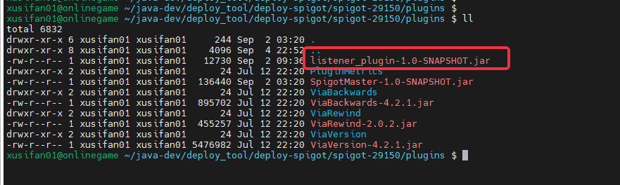
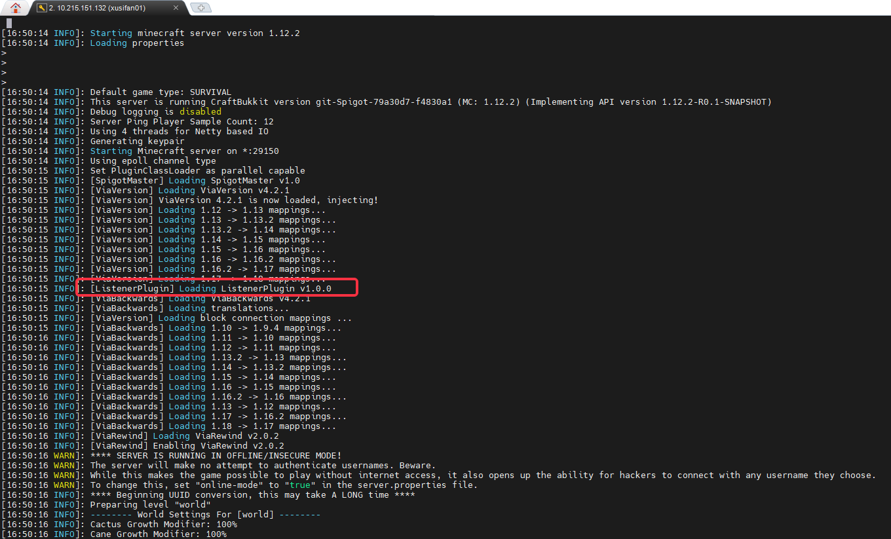

# Spigot服务器Mod简介

## 名词释义

- **SpigotMaster插件**
  为实现Spigot服务端和客户端进行自定义事件通信实现的Spigot服务器收发信息的官方插件

- **客户端Mod**
  客户端通过**ModSdk**接口实现的，仅包含客户端逻辑的自定义模组

- **Spigot插件**
  服主基于**SpigotMaster插件**、Spigot原生插件接口实现的Spigot插件
  [Spigot原生插件开发文档](https://www.spigotmc.org/wiki/spigot-plugin-development/)

- **游戏服Mod**
  指服主实现的玩法mod，它一般包括**客户端Mod**和**Spigot插件**

## 游戏服Mod的组成结构
目前Spigot的Mod主要由两部分组成：

- Spigot插件：服主自行实现逻辑并修改Spigot配置，加载对应的插件，用以实现服务端相关逻辑

- 客户端Mod：通过目前提供的ModSdk客户端接口，编写客户端相关逻辑，用以实现客户端相关逻辑，主要包含：
  - behavior_packs用来控制客户端行为逻辑 
  - resource_packs存放客户端资源

## 客户端Mod的目录结构样例

我们以demoMod为示例介绍游戏服Mod目录结构：

	demoMod
		behavior_packs
	            behavior_pack_geyser_demo_mod
	                    geyserDemoMod
	                        geyserDemoModScript
	                            modClient
	                            modCommon
	                            modMain.py
	                            __init__.py
	                    entities
	                    pack_manifest.json
		resource_packs
			resource_pack_geyser_demo_mod
	                    pack_manifest.json

| 文件/文件夹               | 解释                                                         |
| -------------------------              | ------------------------------------------------------------ |
| demoMod                                | 游戏服Mod根目录                                              |
| behavior_packs                         | 存放客户端行为包，可以包含多个行为包                           |
| behavior_pack_geyser_demo_mod          | 行为包                                                       |
| geyserDemoMod                          | python脚本的根目录，该目录的脚本会被加到python运行环境下，可以从该路径开始import脚本文件，例如from geyserDemoMod import modMain |
| modClient                              | pytho客户端行为逻辑，包含GeyserDemoModClientSystem|
| modCommon                              | 通用数据，包含Modname、自定义事件等定义 |
| resource_packs                         | 存放客户端资源，可以包含多个资源包                           |
| resource_pack_geyser_demo_mod          | 资源包                                                       |
| pack_manifest.json          | mod资源版本信息                                                     |

更多模组SDK内容详见:
<a href="../../20-玩法开发/13-模组SDK编程/2-Python脚本开发/0-脚本开发入门.html#modmain-py是什么" target="_blank">mod开发简介</a>

### Spigot插件目录结构样例

	listen_plugin
		main
	        java\com\netease
	            command
	                ServerCommand.java
	                ToClientCommand.java
	            App.java
	            ClientListener.java
	            GlobalVar.java
	            ServerOriginalListen.java
	        resouces
	            plugin.yml

| 文件/文件夹               | 解释                                                         |
| -------------------------              | ------------------------------------------------------------ |
| java\com\netease                | 插件逻辑代码目录                                              |
| command                         | 指令处理类目录                          |
| App.java                        | 插件入口                                                       |
| ClientListener.java             | 客户端事件监听处理函数 |
| GlobalVar                       | 通用数据储存类 |
| ServerOriginalListen            | Spigot原生事件监听处理函数 |
| resouces                        | 插件资源版本信息                                                     |
| plugin.yml                      | mod资源版本信息                                                     |

## 客户端Mod上传加载流程
- 如图所示
  - mod目录结构

  - studio配置

- Geyser读取客户端Mod后，会有如下输出

## Spigot插件加载流程
- 如图所示，把mvn clean install编译出的xxx.jar放入Spigot的Plugin文件夹

  
- Spigot加载插件后，会有输出，具体命名由plugin.yml决定

  
## DemoMod样例详细刨析

- 游戏服Mod相关的开发和样例请参见如下示例：

    [游戏服Mod详解](./21-Spigot服与客户端python通信.md)

