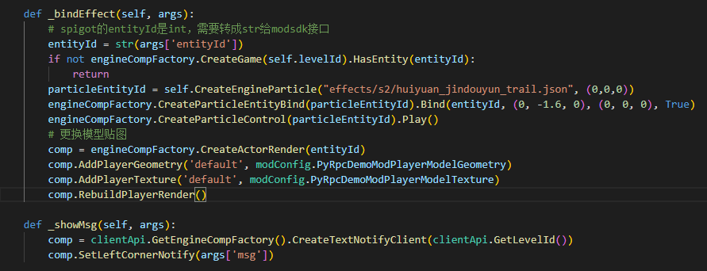
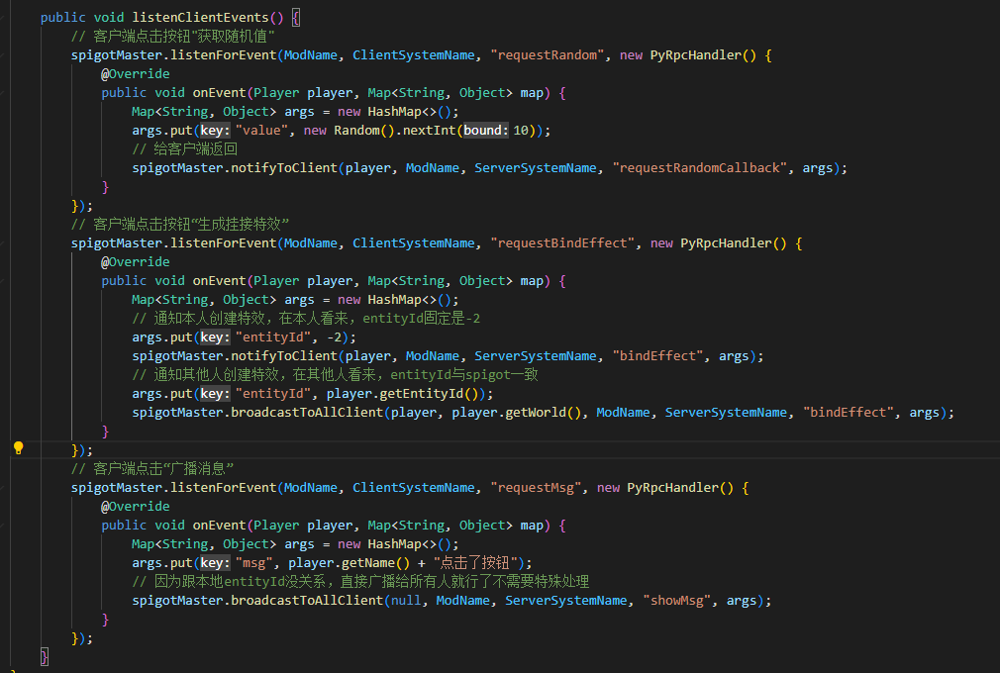

# Spigot服与客户端python通信

## 使用方法

1. spigot服需要安装SpigotMaster插件，插件api文档见[SpigotMasterAPI文档](./81-SpigotMasterAPI文档.html)

2. 客户端到spigot

   - 在spigot使用spigotMaster.listenForEvent监听事件。

   - 在客户端使用<a href="../../../mcdocs/1-ModAPI/接口/通用/事件.html#notifytoserver" rel="noopenner">NotifyToServer</a>发送事件

3. spigot到客户端

   - 在客户端使用<a href="../../../mcdocs/1-ModAPI/接口/通用/事件.html#listenforevent" rel="noopenner">ListenForEvent</a>监听事件

   - 在spigot使用spigotMaster.notifyToClient或其他多播接口发送事件

示例：

- spigot侧

  ```java
  public void onEnable() {
  	SpigotMaster spigotMaster = (SpigotMaster) Bukkit.getPluginManager().getPlugin("SpigotMaster");
      if (spigotMaster != null){
          // 监听事件，然后原封不动发回去
          spigotMaster.listenForEvent("MyMod", "MySystemClient", "clientEvent", new PyRpcHandler() {
              @Override
              public void onEvent(Player player, Map<String, Object> map) {
                  spigotMaster.notifyToClient(player, "MyMod", "MySystemServer", "serverEvent", map);
              }
          });
      }
  }
  ```

- python侧

  ```python
  # modMain.py
  @Mod.InitClient()
  def InitClient(self):
      clientApi.RegisterSystem("MyMod", "MySystemClient", client_system_class_path)
      
  # clientSystem
  class MySystemClient(ClientSystem):
      def __init__(self, namespace, systemName):
          ClientSystem.__init__(self, namespace, systemName)
          # 注册事件，在回调函数中打印参数
          self.ListenForEvent("MyMod", "MySystemServer", "serverEvent", self, self.onEvent)
          # 给spigot发一个事件
          self.NotifyToServer("clientEvent", {'a': 1})
         
      def onEvent(self, data):
          # 可以在客户端日志中看到onEvent {"a": 1}
          print 'onEvent', data
  ```


## 事件支持的参数类型及映射关系

### Java发送给Python

| Java类型                 | Python类型 |
| ------------------------ | ---------- |
| null                     | None       |
| boolean                  | bool       |
| int                      | int        |
| long                     | long       |
| BigInteger(2^63到2^64-1) | long       |
| float                    | float      |
| double                   | float      |
| String                   | str        |
| List\<Object\>           | list       |
| Map<String, Object>      | dict       |

### Python发送给Java

| Python类型                               | Java类型   |
| ---------------------------------------- | ---------- |
| None                                     | null       |
| bool                                     | Boolean    |
| int/long（-2^31到2^31-1）                | Integer    |
| int/long（-2^63到-2^31-1，2^31到2^63-1） | Long       |
| int/long（2^63到2^64-1）                 | BigInteger |
| float                 | Double |
| str                   | String  |
| list                  | List\<Object\> |
| dict（key必须为str）       | Map<String, Object> |


## 关于entityId的注意事项

- 客户端侧的**非玩家实体**的entityId与spigot侧org.bukkit.entity.Entity.getEntityId()获取的实体id相同

- 请注意spigot获取的实体id类型为**int**，而客户端modsdk接口需要的实体id类型为**str**

- 但客户端侧会存在一些负数的实体id，会geyser做协议转换时生成的虚拟实体，在spigot侧没有对应的实体

- 在**每个客户端**视角来看，**本地玩家的entityId永远为-2**，其他玩家的entityId与spigot侧getEntityId相同，也就是说：

  - 客户端使用GetLocalPlayerId永远返回-2。如果将他发给spigot，那spigot是不能直接根据这个id获取到玩家的，需要做一些特殊处理

    ```java
    spigotMaster.listenForEvent("MyMod", "MySystemClient", "clientEvent", new PyRpcHandler() {
        @Override
        public void onEvent(Player player, Map<String, Object> map) {
            Player eventPlayer;
            String entityId = (String) map.get("entityId");
            if (entityId.equals("-2")) {
                eventPlayer = player;
            }
            else {
                // 将entityId转成int然后去获取对应player
            }
            // 处理eventPlayer的逻辑
        }
    });
    ```

  - 如果在spigot侧使用getEntityId的返回值发给该玩家，那玩家客户端无法根据这个id获取到本地玩家，需要做一些特殊处理

    ```java
    int entityId;
    if (sendPlayer == player) {
    	entityId = -2;
    }
    else {
    	entityId = player.getEntityId()
    }
    map.put("entityId", entityId)
    spigotMaster.notifyToClient(sendPlayer, "MyMod", "MySystemServer", "serverEvent", map);
    ```

  

## DEMO详解

[示例Demo](./99-下载内容.html#示例demo)中的PyRpcDemo包含了客户端mod及spigot插件。

进入游戏后会在右侧显示3个按钮

* 点击“打开窗口”会弹出一个UI，再点击“获取随机数”会从spigot获取一个0-9的随机数并显示在ui上。点击x关闭
* 点击“绑定特效”会通知当前world内所有玩家，给发起玩家替换模型并挂接一个特效

* 点击”广播消息“会在spigot内所有玩家的聊天栏显示一条消息

  

### 客户端部分

1. 在客户端初始化时注册UiInitFinished事件，并在UiInitFinished事件中创建三个按钮的ui，注册后续将要使用的弹出窗口ui

   注册两个自定义事件：

   - bindEffect：给entityId参数对应实体更换模型以及创建特效
   - showMsg：在本地显示聊天栏消息




2. 在为三个按钮注册回调函数

   ”打开窗口“按钮抬起时弹出随机数的ui

   ”绑定特效“和”广播消息“按钮抬起时给spigot发送自定义消息

   

3. 在随机数的ui创建时监听获取随机数的回调事件，将参数中的值显示到label控件上

   注册按钮回调：”获取随机数“按钮抬起时向spigot发送一个自定义消息，关闭按钮抬起时弹出界面

   界面销毁时反监听获取随机数的回调事件


### spigot部分

- 初始化时注册自定义事件，分别为：
  - requestRandom：给玩家返回随机数获取回调
  - requestBindEffect：给本人返回-2的entityId，给world内其他人返回spigot的entityId
  - requestMsg：给spigot内所有人返回消息

