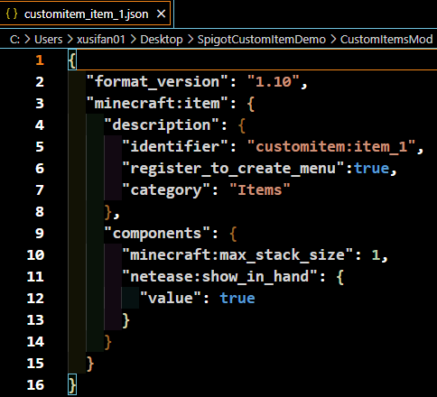
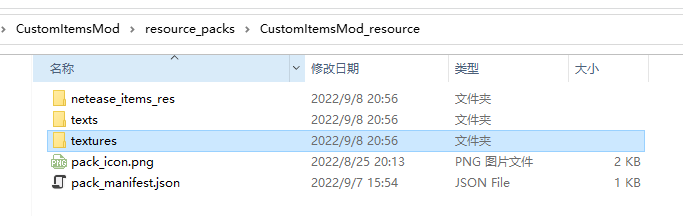
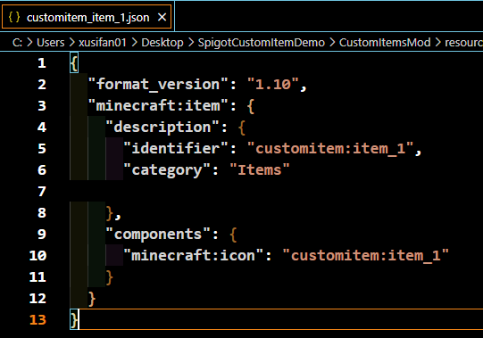
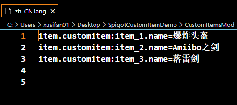
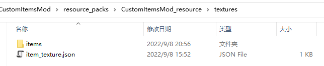
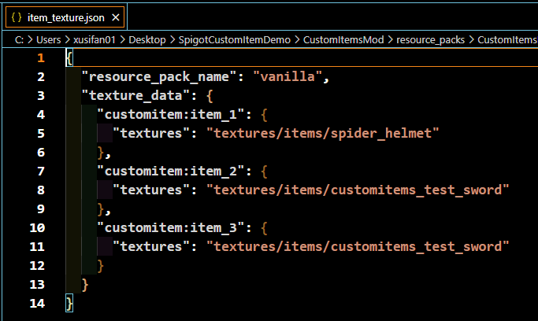
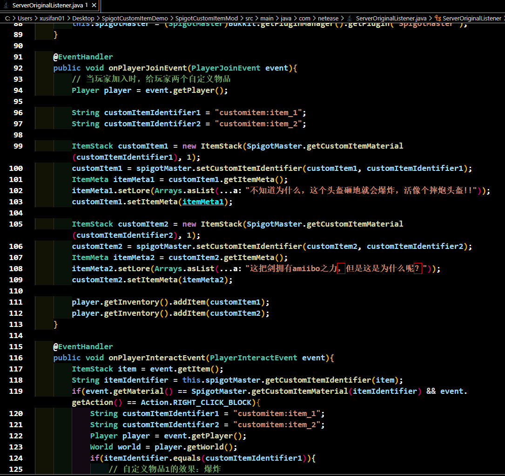
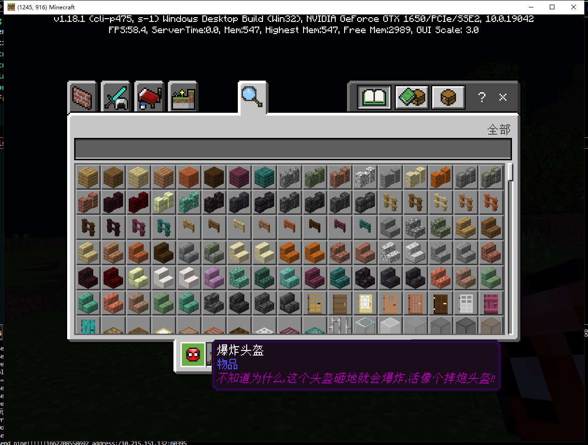

# Spigot自定义物品

## 使用方法

1. spigot服需要安装SpigotMaster插件，插件api文档见[SpigotMasterAPI文档](./81-SpigotMasterAPI文档.html)

2. 客户端Mod编写json、python逻辑，详见[自定义物品](../../20-玩法开发/15-自定义游戏内容/1-自定义物品/1-自定义基础物品.html)

3. spigot构造物品、发放给玩家，并编写物品具体使用逻辑

## 注意事项

- 目前版本中的自定义物品，在Java服务端实际上是木剑的换皮物品，基岩客户端通过物品不同的命名空间，显示不同的贴图icon

- 目前的局限性：
    - 由于目前Mod由Geyser进行分发、预加载，因此通过相同Geyser连接的玩家加载的Mod都相同，加载到的自定义物品也相同
    - 由于配置中的**Components**有一部分为双端逻辑，因此此类**Components**的逻辑需要由Spigot插件实现，直接在Json中配置无法生效或效果异常。目前已知<font color="red" size=4>不可用</font>**Components**如下：
      - 基岩版自定义物品中用于物品防火的组件
      ```
      设置物品是否防火
      "netease:fire_resistant"{ "value" : true}
      ```
      - 基岩版自定义物品中用于物品是否可做燃料的组件
      ```
      设置物品是否可作为燃料
      "netease:fuel" { "value" : true}
      ```
      - 基岩版自定义物品中用于物品的使用间隔
      ```
      设置物品使用间隔
      "netease:cooldown" : { "duration" : 5}
      ```
      - 基岩版自定义物品中用于物品武器属性的组件
        - 当**type**值为sword时，能达到客户端玩家模型手持物品的效果
        - 其他**type**类型以及字段暂时不可用
      ```
      设置物品作为物品时的各类属性
      "netease:weapon" : { "type" : "pickaxe", "level" : 3}
      ```
    - 由于目前物品在Spigot服中实际上为木剑换皮，下述组件为固定值
      ```
        **"minecraft:max_damage" : 59** 
      ```
      - 当使用这个组件时，客户端可显示出自定义物品耐久条
        - 当值为**非59**时，会导致客户端物品耐久异常
        - 当值为 **59**时，客户端耐久条会随服务端设置的物品耐久变化而变化
      - 当不使用这个组件时，客户端不显示出自定义物品耐久条

## Demo详解

Demo实现了三个不同的自定义物品：
- 爆炸头盔
    当鼠标右键方块时，方块所在位置发生半径为1.5格的爆炸
- Amiibo之剑
    当鼠标右键方块时，方块所在位置出现落雷效果，并随机生成物品，必定掉落**落雷剑**
- 落雷剑
    当鼠标右键方块时，方块所在位置生成落雷，效果和打雷效果一致，对附近生物造成伤害

### 开发流程

#### 客户端Mod编写
##### 目的
    为了让Geyser能加载新增的自定义物品，我们需要编写客户端Mod
##### 流程

- 在behavior文件夹中新建**netease_item_beh**目录，如下图所示


- 在**netease_item_beh**目录下新增三个物品Json，样例如下：



- 在**resource**文件夹中新建**netease_item_res**、**texts**、**textures**目录，如下图所示
这三个目录的作用分别如下：
    - **netease_item_res**用于存放自定义物品客户端贴图表现Json
    - **texts**用于存放自定义内容的中文命名
    - **textures**用于存放自定义内容的贴图文件




- 在**netease_item_res**目录下新增三个物品Json，样例如下：
   样例中，我们通过**minecraft:icon**这个**Component**为物品设置贴图



- 在**texts**目录下新增**zh_CN.lang**文件，设置自定义物品的名称，样例如下：



- 在**textures**目录下新增**item_texture.json**文件，设置物品贴图对应的贴图路径，样例如下：




- 至此，客户端Mod中自定义物品完成
  
#### Spigot插件编写

##### 目的
    为了让自定义物品能有不同的效果、功能，我们还需要编写Spigot插件，实现不同物品的不同效果逻辑
##### 流程

- 插件编写

1. 在plugin.yml中添加依赖

   ```yml
   depend:
     - SpigotMaster
   ```

2. 如App.java所示，实例ServerOriginalListener监听了Spigot原生事件
   
    通过下述接口实现
    ```
    getServer().getPluginManager().registerEvents(new ServerOriginalListener(), this);
    ```

3. 实例**ServerOriginalListener**监听了Spigot原生的事件，**ServerOriginalListener**监听方法如图：
示例中，**ServerOriginalListener**一共监听了两个事件，如下:
   - 玩家加入事件(PlayerJoinEvent), 效果为玩家加入游戏时，给玩家自动发放两个物品
   - 玩家交互事件(PlayerInteractEvent)，效果为玩家和方块右键交互时，根据不同自定义物品，触发不同的效果


4. 创建物品
- 通过Spigot提供的Api，创建物品ItemStack
    ```
    @Param material 物品material(自定义物品的material通过下一步获取)
    @Param amount 物品数量
    ItemStack customItem1 = new ItemStack(material, amount);
    ```
- 在创建ItemStack时，通过下述接口获取自定义物品中的Material
    ```
    @Param itemIdentifier 自定义物品Identifier,需要和客户端Mod中定义一致
    @Return Material 自定义物品在Spigot中对应的Material
    SpigotMaster.getCustomItemMaterial(itemIdentifier)
    ```
- 同时，通过下述接口，为物品设置基岩版中对应的Identifier
    **PS: 这一步为必须步骤，缺少这一步时，会导致客户端无法正常生成自定义物品**
    ```
    @Param itemStack 通过Spigot接口生成的ItemStack
    @Param itemIdentifier 自定义物品Identifier,需要和客户端Mod中定义一致
    SpigotMaster.setCustomItemIdentifier(itemStack, itenIdentifier)
    ```
- 根据需要，再进一步修改ItemStack的其他属性，如样例中的lore

5. 使用物品
- 通过事件参数获取ItemStack：
    ```
    ItemStack item = event.getItem();
    ```
- 通过接口获取物品的Material:
    ```
    @Param itemIdentifier 自定义物品Identifier,需要和客户端Mod中定义一致
    @Return Material 自定义物品在Spigot中对应的Material
    SpigotMaster.getCustomItemMaterial(itemIdentifier)
    ```
- 当事件物品的Material和自定义物品的Material一致时，判定为使用自定义物品，具体物品效果、逻辑还需进一步区分

- 通过接口获取物品的Identifier:
    ```
    @Param itemStack 通过Spigot接口生成的ItemStack
    @Return String itemIdentifier，非自定义物品返回null
    SpigotMaster.getCustomItemIdentifier(itemStack)
    ```
    根据获取到的Identifier实现不同的逻辑,如图所示


6.运行mvn clean install，会在插件target下生成插件.jar,把生成的jar放置于Spigot服的plugin文件夹下

7.最终实现的效果如下：
- 玩家进入游戏即可获取两个自定义物品


- 使用自定义物品1时发生爆炸
- 使用自定义物品2时有打雷效果，并生成物品，其中物品必掉落自定义物品3
- 使用自定义物品3时生成闪电

