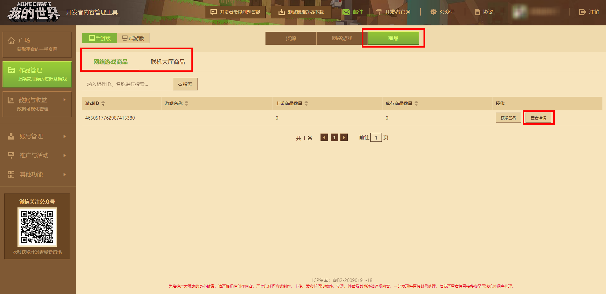
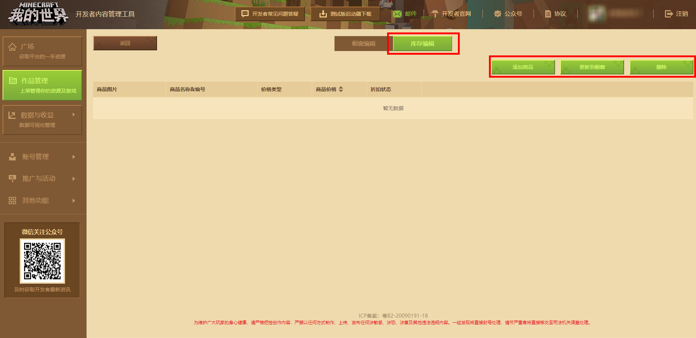
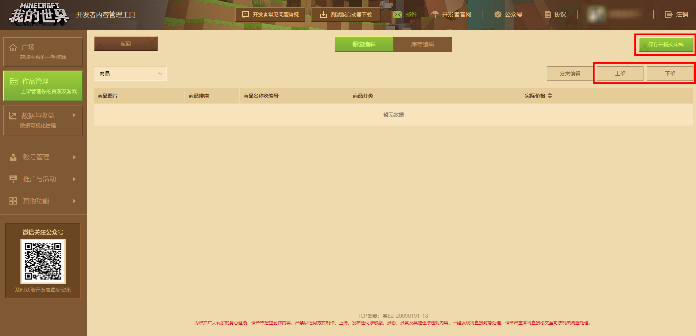
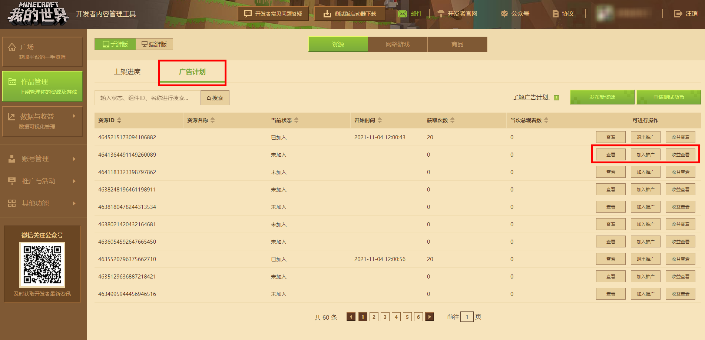
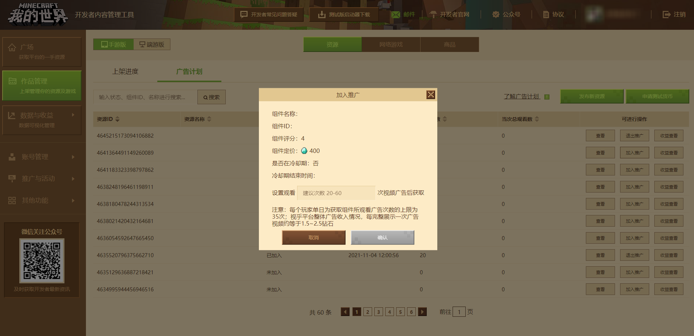

# 作品管理模块

开发者登入[开发者平台](https://mcdev.webapp.163.com/#/login)后，如需进行上传操作，则需要在平台左侧的【作品管理】中进行。

目前投稿平台分为手游版以及端游版平台；其中，端游版又分为C++(基岩)版和JAVA版。可以发布的作品类型也有两种：资源和网络游戏。

- 资源：玩法地图、附加包、模组等可以下载，供玩家随意游玩的组件
- 网络游戏：服务器，所有玩家可以加入其中一同游玩

## 上传资源作品

在作品管理页点击 **【发布新资源】** 按钮即可跳转至发布资源页面。需要注意的是，不同的投稿平台发布资源的位置是不一样的，在页面左上角可以切换平台为手游版或端游版。

- 手游版可以发布的资源类型有：玩法地图、附加包、资源包、皮肤、联机大厅
- 端游版可以发布的资源类型有：功能组件、地图组件、形象组件、玩法组件(仅JAVA版)、联机大厅、视觉组件

手游版和端游版的类型名称有一些不同，不过其内容是差不多的，比如端游版的地图组件与手游版的地图一致，形象组件与皮肤一致。

## 上传网络游戏

在作品管理页面上方更换为网络游戏，就可以申请并上传网络游戏，与资源作品一样，网络游戏也分为手游版和端游版，需要进行区分，点击【入驻申请】按钮即可申请上传网络游戏。

而在资源和网络游戏后面还有 **商品** ，网络游戏和资源中的联机大厅类型作品可以使用此功能，在游戏内设置商品供玩家购买。

选择某个作品点击 **【查看详情】** 按钮，打开该作品的商品编辑页面，在库存编辑中可以添加、删除商品或更新到橱窗。添加新的商品并审核成功后就可以更新到橱窗并上架到游戏中供玩家购买。

## 广告计划

广告计划面向付费组件进行征集，开发者参与计划并设置观看次数后，冒险家可通过观看指定次数的广告免费下载参与计划的组件，同时开发者将通过广告的观看次数获取经济收益。该功能面向上架超过180天，评分4分以上的付费组件列表，在“广告计划”页面中将自动获取开发者账号下，符合条件的组件列表，并直接从列表中选择参与的组件，简单几步，即可完成设置。

进入我的世界开发者平台，通过【作品管理】-【广告计划】进入到“广告计划”页面。

接下来，只需点击页面筛选过后显示的资源右侧的【加入推广】，通过【设置观看次数限制】输入兑换组件所需观看广告次数并点击【确认】后，即可在“付费内容看广告免费兑换专区”中展示参与计划的组件。

官方将根据一定周期，汇总全平台所有广告收益，计算出单次广告的收益值，根据玩家观看开发者组件的广告总次数，计算对应的分成给予开发者。此外，开发者还可以在“广告计划”页面中，点击页面筛选过后显示的资源右侧的【收益查看】了解组件的广告收益。

### 广告计划注意事项：

1. 开发者可以申请将已上架超过180天评分4分以上的组件，加入到广告计划中；
2. 开发者可以设置对应需要获取该组件需要观看广告的次数；
3. 官方每个月统计上个月玩家观看开发者组件的广告总次数，并统计确认上个月广告展示收益，因此开发者在实际广告展示月份后两月可结算广告分成；
4. 试运行阶段每位开发者同一时间只能选择1个组件参与广告计划；
5. 试运行阶段单个组件参与广告计划有效期为1个月（30天），到期后组件自动退出广告计划；
6. 试运行阶段单个组件退出广告计划后，存在30天冷却期，无法再次加入广告计划；
7. 组件观看获取的次数设置不支持线上修改；

