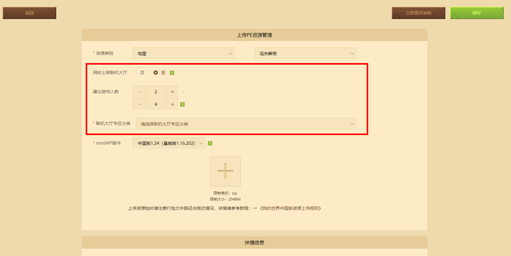
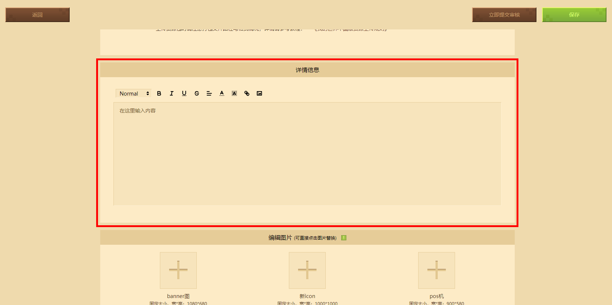
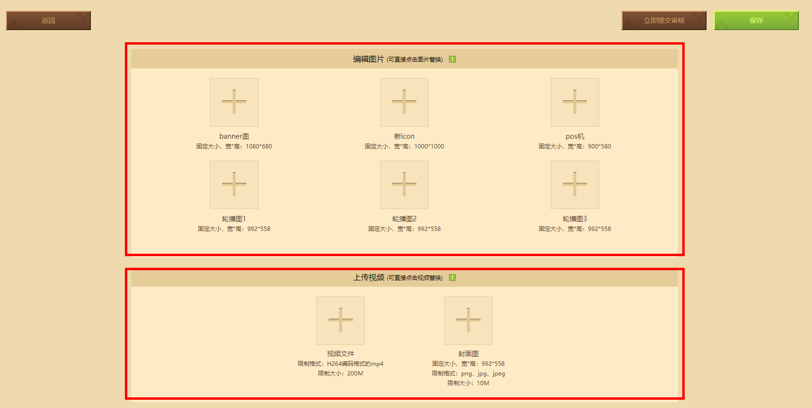
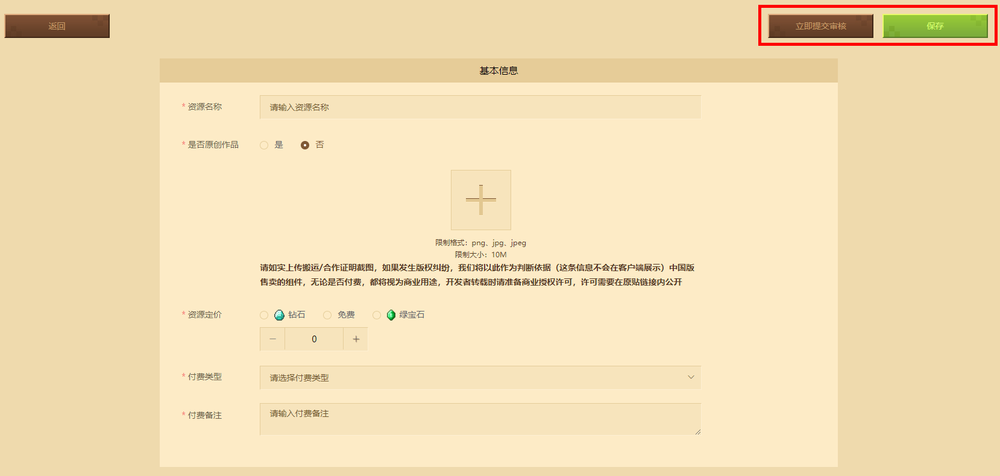
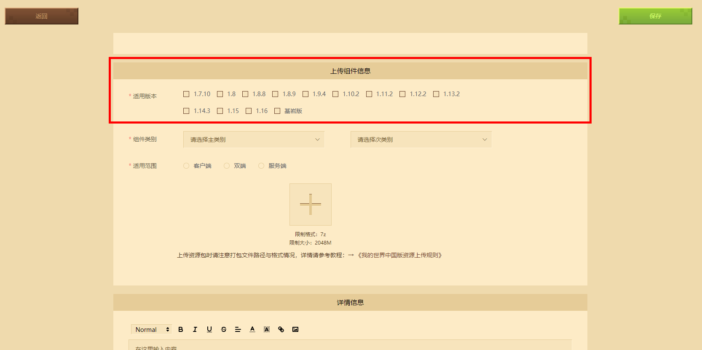
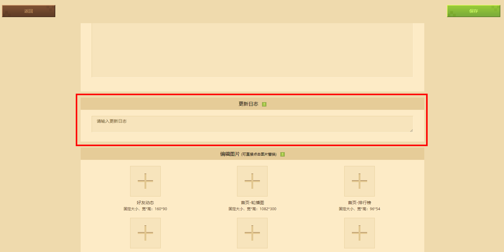

# 正确上传资源的方式及途径

第一种方式：通过[网页版开发者平台](https://mcdev.webapp.163.com/)上传作品；

第二种方式：通过开发者工具 **我的世界开发工作台** 上传作品；

在开发者页面左侧点击【作品管理】，然后点击右上方的【发布新资源】，即可进入作品上传页。发布时需注意区分发布平台。

在发布作品时需注意一些“规则”：

-  **资源名称必须唯一：** 资源作品的名称不能重复，所以要避免一些过于大众化的名称；

-  **确保资源的著作来源：** 如果是搬运，需要如实上传相关依据用于判断，以免发生版权纠纷

-  **资源售价有限制：** 

  玩法地图、皮肤、联机大厅：普通折扣与会员折扣后限制大于等于50钻石

  材质包、附加包：普通折扣与会员折扣后限制大于等于100钻石

-  **不能出现表情等特殊字符：** 在资源介绍页不能含有“特殊字符/表情”等

## 编辑手游版资源

进入手游资源发布页面后，按照表单要求根据自身的设定填写组件信息即可。

按照要求由上至下对应填写作品名称、售价，“付费类型”根据实际上传的组件资源进行选择，“付费备注”根据自己需求填写，没有则写“无”，“资源类别”按照“付费类型”对应选择即可。 **如果付费类型为钻石，则该资源必须上传视频。** 

选择正确的分类后，点击上传作品文件包的加号，注意文件命名必须是“非中文且不能有空格和特殊字符”的zip压缩包，否则将会上传失败。如果仍然对作品打包格式有疑问，请下载【上传规则】文档查看具体打包文件的格式。

如果希望地图能在联机大厅中使用，则在“同时上架联机大厅”选“是”，填写“建议游戏人数”，然后在“联机大厅专区分类”选择对应分类即可，若玩法不支持联机，则选否。

“详细信息”这里填写组件资源的相关介绍，注意介绍文字控制在1000个字符以内。如果介绍文字过多，建议用图片介绍的形式上传（图片不能超过10张，建议分辨率不超过1024 x 1024像素）

接下来根据要求依次上传编辑资源作品的图片。“新icon”指作品封面，“pos机”指在购买“付费组件”时弹出显示的图片，“轮播图”指组件资源详情页显示的宣传图，如下图所示：

付费内容除“皮肤”外，均须上传视频介绍。视频内容可包含：组件内容介绍、玩法介绍、特色内容、制作过程等【视频的内容对审核过程或结果有影响】。

所有信息填写完毕后，找到右上角的“保存”按钮，点击后保存该组件的信息，或者直接点击立即提交审核。

## 编辑端游版资源

进入端游资源发布页面后，与手游一致，按照表单要求根据自身的设定填写组件信息即可。

基本信息中与手游版不一样的是，端游版有一个前置组件：如果需要设置“前置组件”，“前置组件”必须是“已上架”状态才能被设置，输入前置组件的名称（区分大小写）或组件ID进行设置。

端游版的上传组件信息中适用版本分为JAVA版和基岩版(C++)，选择对应版本勾选即可，“联机大厅”分类目前仅支持基岩版地图。

“功能组件”目前支持添加MCMod百科词条，“组件名称”需要与MCMod百科网站收录的Mod名称一致才能被添加成功。适用范围根据组件可支持的端进行选择即可。

点击上传组件作品文件包的加号，文件命名必须是“非中文”，否则会上传失败，如果不知道打包格式请下载“上传规则”文档查看。Java版本判断：组件版本>=1.10.2则勾选Java8；组件版本<1.10.2则为Java 7。

“详细信息”与手游版一致。

如果组件资源有更新，则可以填写更新内容日志，更新日志的长度需要控制在1000个字符以内，更新日志不会对玩家进行显示，主要用于记录资源的更新情况。

图片与视频和手游版一致，根据要求依次上传编辑资源作品的图片和视频即可。

## 审核资源方式

在编辑完资源作品的各项信息后保存资源，在待提交审核状态下点击【提交审核】按钮即可开始对作品进行审核，审核会有两个阶段：

- 机器审核：主要保证资源在玩家客户端上能正常解压、运行与游玩
- 人工审核：主要保证资源不会破坏开发者生态、符合正能量、意识形态和基本的游戏品质

组件审核日期一般在3个工作日，若上架或更新时间紧迫可以 **【申请加急】** 。

审核成功后，玩家可在作品管理页面上架作品，若审核失败开发者可以通过平台内邮件和手机短信两种途径得到通知。

