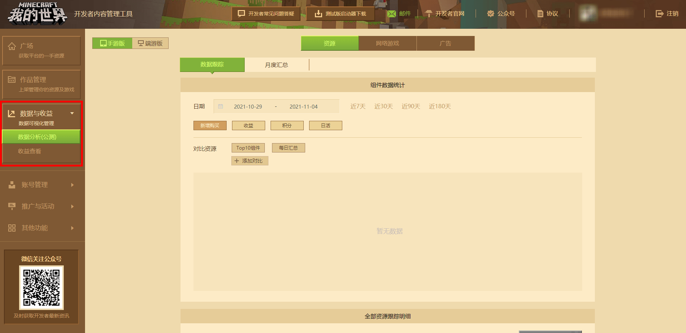
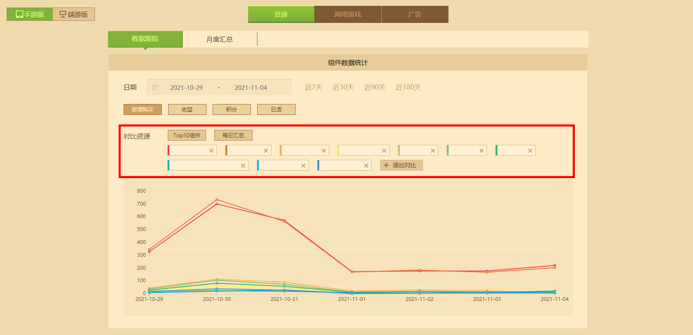
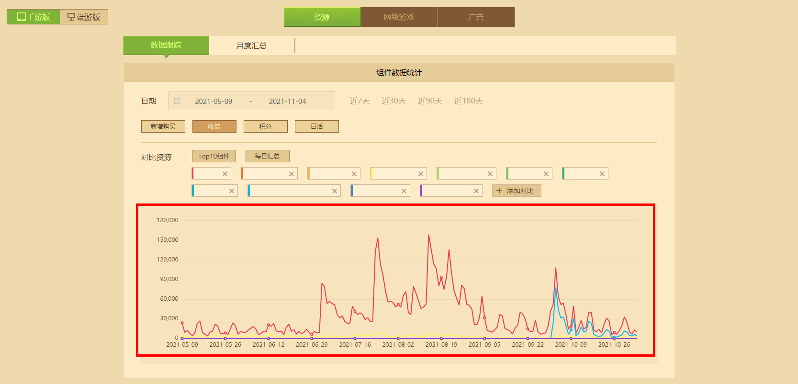
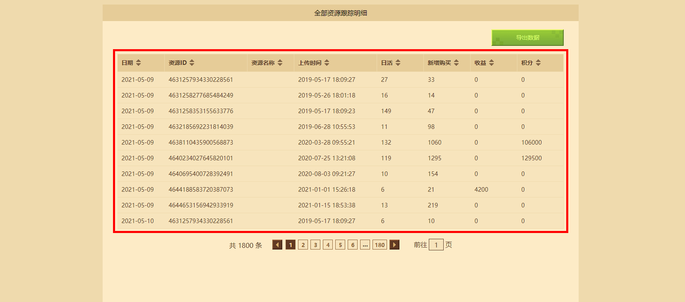
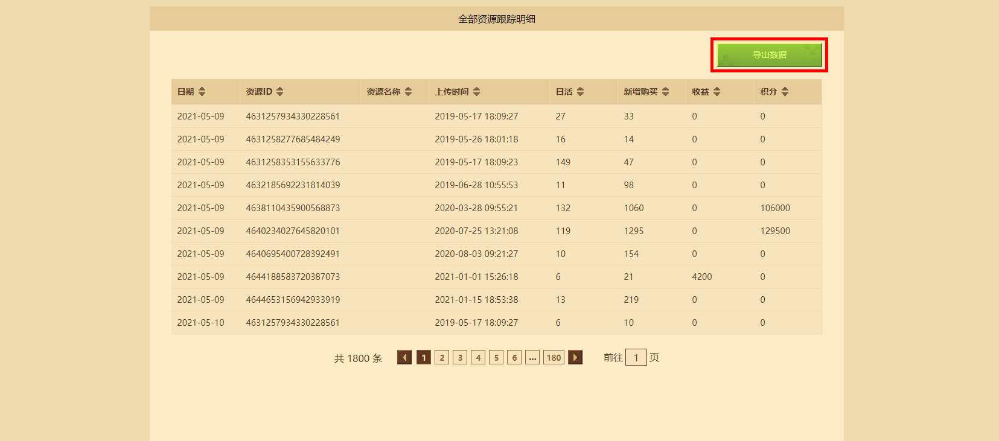
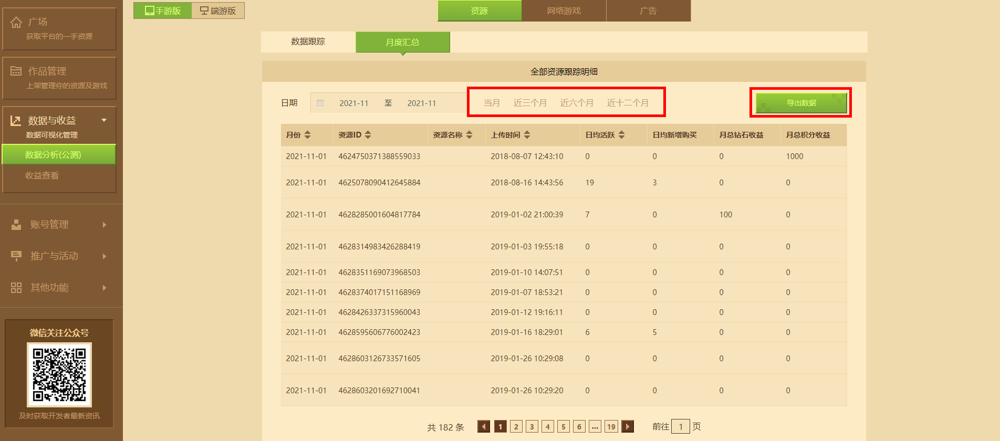

# 利用数据分析跟踪资源

在开发者平台左侧的 **【数据与收益】** 中，可以跳转至数据分析页面。数据分析功能的最终目的是更好的帮助开发者了解玩家的购买行为，以便更好地推广其作品和服务。数据分析对于开发者来说非常重要！

开发者可以利用图表和筛选功能了解最受欢迎的作品是哪些，明白新用户向忠实用户转化的资源题材是什么，根据相关数据来做出更好的资源开发方向和销售决策。判断用户会分阶段购买商品，如假期、时事等各种外部环境。

## 学会使用数据跟踪功能

数据追踪可以分为两大主要功能板块： **折线图表** 和 **跟踪明细表** 。需要注意的是，这两大板块的功能均可以用于资源作品、网络游戏和广告，同时也分为手游版和端游版。

### 折线图表

进入数据分析页面，默认就可以看到折线图表，同时会将 **TOP10组件** 默认显示在折线图表上，当然也可以自己添加任意作品或是每日汇总用于对比。

在添加需要分析的作品后，可以选择相应的维度进行对比： **时间维度** 、 **新增购买维度** 、 **收益维度** 、 **日活维度** 、 **积分维度** 。其中时间维度是主维度，在数据分析中，必须存在日期长度和至少一个对比资源，才能从平台后端抓取到数据源。然后可以任意选择一个副维度搭配时间分析消费者的购买行为。

除此之外，折线图表允许拖拉和放大，以便在较长的时间跨度中，既能看到大局，也能放大细节。

### 跟踪明细表

在数据分析页面向下拉，可以看到 **【全部资源跟踪明细】** ，这里会出现折线图中选择作品的各种数据信息，如：日活、收益、积分等。表格会累积所有对照资源的统计数据，根据某一维度的升序&降序从前往后看。

默认以时间维度排序，点击表格头上不同维度的排序按钮，可以切换到其他维度。

右上角的导出数据功能会将表格数据打包为 **CSV格式** ，大部分表单软件都可以打开这个格式。

## 学会使用月度汇总功能

点击 **【月度汇总】** 按钮，从数据跟踪页面转至月度汇总，与数据跟踪功能的全部资源跟踪明细表相比，只是在时间跨度上将时间单位 **从天变为月** 。因此某一资源的新增购买变为该月日均新增购买，收益变为月度资源总收益。

右上角的导出数据功能会将表格数据打包为 **CSV格式** ，大部分表单软件都可以打开这个格式。

