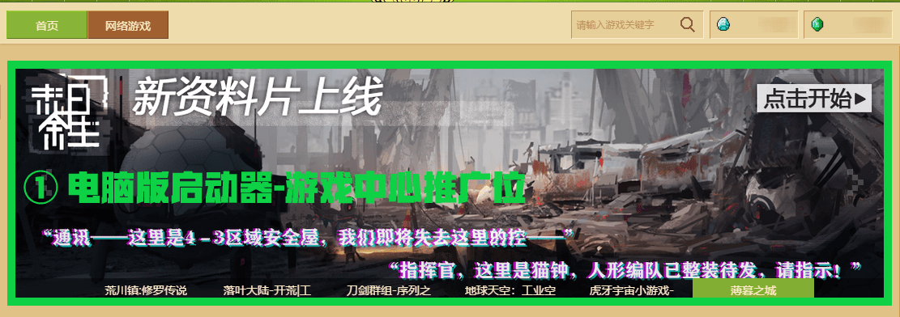
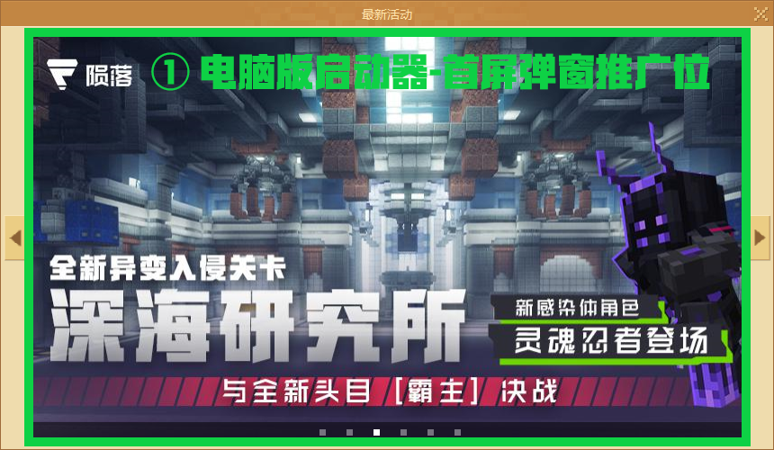

# 推广位申请与竞拍试运行指南

***最后一次更新于：2022/9/28，新增手机版网络游戏轮播图申请内容。***

为了使更多的开发者拥有展示自己作品的平台和机会，现在开发者平台可以直接申请与竞拍手机版和电脑版的推广位。

通过在开发者平台上的 **【推广与活动】** 模块上提供入口，结合自助式流程，开发者可以更加清楚、便利和及时地收到推广位申请与竞拍的结果。此次迭代后，手机版资源中心首页的顶部轮播图将提供4个申请位，手机版网络游戏首页的顶部轮播图将提供3个申请位。电脑版的 **精彩世界** 与 **游戏中心** 将分别提供5个申请位与1个竞拍位，电脑版的 **首屏弹窗** 将提供4个申请位与1个竞拍位。不同平台渠道的推广类型略有不同，想要更详细直观地了解调整内容，请查看下方表格：

| 游戏平台 | 推广位是否支持竞拍 | 推广位是否支持申请 | 可申请推广位个数 | 可竞拍推广位 | 推广位置       | 推广类型            |
| -------- | ------------------ | ------------------ | ---------------- | ------------ | -------------- | ------------------- |
| 手机版   | ➖                  | ✔️                  | 4                | 0            | 资源中心轮播图 | 网络游戏 & 资源组件 |
| 手机版   | ➖                  | ✔️                  | 3                | 0            | 网络游戏轮播图 | 网络游戏            |
| 电脑版   | ✔️                  | ✔️                  | 5                | 1            | 精彩世界轮播图 | 网络游戏 & 资源组件 |
| 电脑版   | ✔️                  | ✔️                  | 5                | 1            | 游戏中心轮播图 | 网络游戏            |
| 电脑版   | ✔️                  | ✔️                  | 4                | 1            | 启动器首屏弹窗 | 网络游戏            |

以下展示位为电脑版推广位资源位置：

- 
- 
- 

以下展示位为手机版推广位资源位置：

- 

- 

**注： 推广位申请与竞拍功能正在试运行中，具体使用指南不代表功能最终的呈现效果。我们将持续收集广大开发者的建议和试用反馈，您可以通过开发者平台左上方的【开发者常见问题答疑】- 【反馈其他问题】与我们取得联系。**

## 申请手机版轮播图推广位

进入《我的世界》开发者平台，点击 **【推广与活动】** 模块，选择 **【手机版推广位申请/竞拍】**。目前可选标签为 **【手机版资源中心】** 和 **【手机版网络游戏】** 。 **【手机版网络游戏】** 可以申请网络游戏作品的推广位，而 **【手机版资源中心】** 可以申请网络游戏作与资源中心作品的推广位。

接着点击 **【返回可申请月】** ，日期列表将自动切换至可申请推广位的第一个申请月。

接着点击 **【申请】**，出现轮播图推广位申请表单。确定好推广类型，申请内容内可以选择 **已上架** 的作品名称。**（注：开发者账号信用分必须保持9分方可申请推广位。）**

详细填写 **【展示周内外联动或活动情况】** 、 **【组件/网络特色情况】** 和 **【展示周内是否有更新内容】** 有助于提高推广位申请成功的概率，三者将作为官方下放推广资源的 **重要参考指标**  。

<table style="border-collapse: collapse; width: 100%;" border="0" width="1091" cellspacing="0" cellpadding="0">
<tbody>
<tr style="height: 16.50pt;">
<td class="et2" style="height: 16.50pt; width: 123.75pt;" width="165" height="22">类型</td>
<td class="et2" style="width: 288.00pt;" width="384">分级</td>
<td class="et2" style="width: 54.00pt;" width="72">评分</td>
</tr>
<tr style="height: 16.50pt;">
<td class="et3" style="height: 49.50pt; width: 123.75pt;" rowspan="3" width="165" height="66">展示周内外联动或活动情况</td>
<td class="et2">跨组件、跨开发者或跨平台联动与活动</td>
<td class="et2">3</td>
</tr>
<tr style="height: 16.50pt;">
<td class="et2">签到/玩法小活动</td>
<td class="et2">2</td>
</tr>
<tr style="height: 16.50pt;">
<td class="et2">无明显联动或活动</td>
<td class="et2">1</td>
</tr>
<tr style="height: 16.50pt;">
<td class="et3" style="height: 49.50pt; width: 123.75pt;" rowspan="3" width="165" height="66">组件/网络游戏特色情况</td>
<td class="et2">明显创新特色、或是通过新的sdk功能实现特色玩法</td>
<td class="et2">3</td>
</tr>
<tr style="height: 16.50pt;">
<td class="et2">小量创新</td>
<td class="et2">2</td>
</tr>
<tr style="height: 16.50pt;">
<td class="et2">特色不明显，或无明显特色</td>
<td class="et2">1</td>
</tr>
<tr style="height: 16.50pt;">
<td class="et3" style="height: 49.50pt; width: 123.75pt;" rowspan="3" width="165" height="66">展示周是否有更新内容</td>
<td class="et2">基础玩法或框架扩展</td>
<td class="et2">3</td>
</tr>
<tr style="height: 16.50pt;">
<td class="et2">原有玩法</td>
<td class="et2">2</td>
</tr>
<tr style="height: 16.50pt;">
<td class="et2">小型维护与debug，或无更新</td>
<td class="et2">1</td>
</tr>
</tbody>
</table>
注明申请的作品是新组件、新服，官方会在 **【展示周是否有更新内容】**上酌情加分，同时能很好阐述特色的，在收到申请提交时有更大概率成功。

若存在其他诉求，可以在 **【其他申请情况说明】** 栏目下补充说明。

最后准备一张940宽*280高的轮播图素材， 点击 **【上传轮播图素材】**  后方可提交申请。将鼠标悬浮在轮播图素材上传入口，可查看到素材在客户端内实际预览的效果。

## 申请电脑版轮播图推广位

进入《我的世界》开发者平台，点击 **【推广与活动】** 模块，选择 **【电脑版推广位申请/竞拍】** 。接着选择 **【电脑版精彩世界轮播】** 或 **【电脑版游戏中心轮播】**。在下方的标签分类上，选择 **【申请】** 标签。

接着点击 **【返回可申请月】** ，日期列表将自动切换至可申请推广位的第一个申请月。

紧接着点击 **【申请】**，出现轮播图推广位申请表单。确定好推广类型，申请内容内可以选择 **已上架** 的作品名称。**（注：开发者账号信用分必须保持9分方可申请推广位。）**

详细填写 **【展示周内外联动或活动情况】** 、 **【组件/网络特色情况】** 和 **【展示周内是否有更新内容】** 有助于提高推广位申请成功的概率，三者将作为官方下放推广资源的 **重要参考指标**  。

<table style="border-collapse: collapse; width: 100%;" border="0" width="1091" cellspacing="0" cellpadding="0">
<tbody>
<tr style="height: 16.50pt;">
<td class="et2" style="height: 16.50pt; width: 123.75pt;" width="165" height="22">类型</td>
<td class="et2" style="width: 288.00pt;" width="384">分级</td>
<td class="et2" style="width: 54.00pt;" width="72">评分</td>
</tr>
<tr style="height: 16.50pt;">
<td class="et3" style="height: 49.50pt; width: 123.75pt;" rowspan="3" width="165" height="66">展示周内外联动或活动情况</td>
<td class="et2">跨组件、跨开发者或跨平台联动与活动</td>
<td class="et2">3</td>
</tr>
<tr style="height: 16.50pt;">
<td class="et2">签到/玩法小活动</td>
<td class="et2">2</td>
</tr>
<tr style="height: 16.50pt;">
<td class="et2">无明显联动或活动</td>
<td class="et2">1</td>
</tr>
<tr style="height: 16.50pt;">
<td class="et3" style="height: 49.50pt; width: 123.75pt;" rowspan="3" width="165" height="66">组件/网络游戏特色情况</td>
<td class="et2">明显创新特色、或是通过新的sdk功能实现特色玩法</td>
<td class="et2">3</td>
</tr>
<tr style="height: 16.50pt;">
<td class="et2">小量创新</td>
<td class="et2">2</td>
</tr>
<tr style="height: 16.50pt;">
<td class="et2">特色不明显，或无明显特色</td>
<td class="et2">1</td>
</tr>
<tr style="height: 16.50pt;">
<td class="et3" style="height: 49.50pt; width: 123.75pt;" rowspan="3" width="165" height="66">展示周是否有更新内容</td>
<td class="et2">基础玩法或框架扩展</td>
<td class="et2">3</td>
</tr>
<tr style="height: 16.50pt;">
<td class="et2">原有玩法</td>
<td class="et2">2</td>
</tr>
<tr style="height: 16.50pt;">
<td class="et2">小型维护与debug，或无更新</td>
<td class="et2">1</td>
</tr>
</tbody>
</table>
注明申请的作品是新组件、新服，官方会在 **【展示周是否有更新内容】**上酌情加分，同时能很好阐述特色的，在收到申请提交时有更大概率成功。

若存在其他诉求，可以在 **【其他申请情况说明】** 栏目下补充说明。

最后准备一张1082宽*300高的轮播图素材， 点击 **【上传轮播图素材】** 后方可提交申请。将鼠标悬浮在轮播图素材上传入口，可查看到素材在客户端内实际预览的效果。

## 申请电脑版首屏弹窗推广位

进入《我的世界》开发者平台，点击 **【推广与活动】** 模块，选择 **【电脑版推广位申请/竞拍】** 。接着选择 **【电脑版首屏弹窗】** 。在下方的标签分类上，选择 **【申请】** 标签。

接着点击 **【返回可申请月】** ，日期列表将自动切换至可申请推广位的第一个申请月。

紧接着点击 **【申请】**，出现轮播图推广位申请表单。确定好推广类型，申请内容内可以选择 **已上架** 的作品名称。**（注：开发者账号信用分必须保持9分方可申请推广位。）**

详细填写 **【展示周内外联动或活动情况】** 、 **【组件/网络特色情况】** 和 **【展示周内是否有更新内容】** 有助于提高推广位申请成功的概率，三者将作为官方下放推广资源的 **重要参考指标**  。

<table style="border-collapse: collapse; width: 100%;" border="0" width="1091" cellspacing="0" cellpadding="0">
<tbody>
<tr style="height: 16.50pt;">
<td class="et2" style="height: 16.50pt; width: 123.75pt;" width="165" height="22">类型</td>
<td class="et2" style="width: 288.00pt;" width="384">分级</td>
<td class="et2" style="width: 54.00pt;" width="72">评分</td>
</tr>
<tr style="height: 16.50pt;">
<td class="et3" style="height: 49.50pt; width: 123.75pt;" rowspan="3" width="165" height="66">展示周内外联动或活动情况</td>
<td class="et2">跨组件、跨开发者或跨平台联动与活动</td>
<td class="et2">3</td>
</tr>
<tr style="height: 16.50pt;">
<td class="et2">签到/玩法小活动</td>
<td class="et2">2</td>
</tr>
<tr style="height: 16.50pt;">
<td class="et2">无明显联动或活动</td>
<td class="et2">1</td>
</tr>
<tr style="height: 16.50pt;">
<td class="et3" style="height: 49.50pt; width: 123.75pt;" rowspan="3" width="165" height="66">组件/网络游戏特色情况</td>
<td class="et2">明显创新特色、或是通过新的sdk功能实现特色玩法</td>
<td class="et2">3</td>
</tr>
<tr style="height: 16.50pt;">
<td class="et2">小量创新</td>
<td class="et2">2</td>
</tr>
<tr style="height: 16.50pt;">
<td class="et2">特色不明显，或无明显特色</td>
<td class="et2">1</td>
</tr>
<tr style="height: 16.50pt;">
<td class="et3" style="height: 49.50pt; width: 123.75pt;" rowspan="3" width="165" height="66">展示周是否有更新内容</td>
<td class="et2">基础玩法或框架扩展</td>
<td class="et2">3</td>
</tr>
<tr style="height: 16.50pt;">
<td class="et2">原有玩法</td>
<td class="et2">2</td>
</tr>
<tr style="height: 16.50pt;">
<td class="et2">小型维护与debug，或无更新</td>
<td class="et2">1</td>
</tr>
</tbody>
</table>
**注：电脑版首屏弹窗推广位申请门槛略高于电脑版轮播图推广位，目前暂不支持对新上线的网络游戏倾斜。** 

若存在其他诉求，可以在 **【其他申请情况说明】** 栏目下补充说明。

最后准备一张800宽*451高的轮播图素材， 点击 **【上传轮播图素材】** 后方可提交申请。将鼠标悬浮在轮播图素材上传入口，可查看到素材在客户端内实际预览的效果。

## 竞拍电脑版轮播图推广位

进入《我的世界》开发者平台，点击 **【推广与活动】** 模块，选择 **【电脑版推广位申请/竞拍】** 。选择 **【电脑版精彩世界轮播】** 或 **【电脑版游戏中心轮播】**。在下方的标签分类上，选择 **【竞拍】** 标签。

接着**在竞拍前需要缴纳竞拍保证金500元**，该规定是为了保证竞拍参与者能够按照契约精神如数支付竞拍成交价。**（注：竞拍 【试运行】 期间，开发者账号信用分必须保持6分，能力贡献度等级在【奋斗老铁】以上才可支付竞拍保证金，获得竞拍资格。）**

接着点击 **【返回可申请月】** ，日期列表将自动切换至可申请推广位的第一个申请月。

紧接着点击 **【申请】**，出现轮播图申请表单。选择申请  **【组件】** 或  **【网络游戏】** 的推广位。申请内容内只能选择 **已上架** 的作品名称。

若存在其他诉求，可以在 **【其他申请情况说明】** 栏目下补充说明。

最后准备一张1082宽*300高的轮播图素材， 点击 **【上传轮播图素材】** 后，跳转至出价竞拍页出价推广位，输入价格并提交竞拍结果。

## 竞拍电脑版首屏弹窗推广位

进入《我的世界》开发者平台，点击 **【推广与活动】** 模块，选择 **【电脑版推广位申请/竞拍】** 。接着选择 **【电脑版首屏弹窗】** 。在下方的标签分类上，选择 **【竞拍】** 标签。

接着**在竞拍前需要缴纳竞拍保证金500元**，该规定是为了保证竞拍参与者能够按照契约精神如数支付竞拍成交价。**（注：竞拍 【试运行】 期间，开发者账号信用分必须保持6分，能力贡献度等级在【奋斗老铁】以上才可支付竞拍保证金，获得竞拍资格。）**

接着点击 **【返回可申请月】** ，日期列表将自动切换至可申请推广位的第一个申请月。

紧接着点击 **【申请】**，出现轮播图申请表单。选择申请 **【网络游戏】** 的推广位。申请内容内只能选择 **已上架** 的作品名称。

若存在其他诉求，可以在 **【其他申请情况说明】** 栏目下补充说明。

最后准备一张800宽*451高的轮播图素材， 点击 **【上传轮播图素材】** 后，跳转至出价竞拍页出价推广位，输入价格并提交竞拍结果。

## 自助修改申请信息

若申请的推广位在申请周期间需要更换轮播图或申请描述，可以在 **【我的申请】** 标签里找到 **【修改申请】** 入口以重新提交更新信息。

若申请信息当前状态变为 **“待更正修改”** ，可根据 **【查看详情】** 内的具体原因在审核周期间前点击 **【更正修改】** 重新提交申请信息。

## 申请&竞拍次数规则

每个推广周期间，视开发者取得推广位类型的不同，申请与竞拍的次数也略有不同：

- **申请：** 一个推广周期中，一位开发者至多可以提交5个推广位的申请，不限作品类型和提交位置。
  - 为了让更多的开发者有展示作品的机会，从第二次提交的申请开始，申请成功率会降低。
- **竞拍：** 一个推广周期中，一位开发者对推广位的竞拍数量没有限制，也不限作品类型和提交位置。

- **其他说明：** 一位开发者在单个推广周期可以同时进行推广位的申请和竞拍，若同一个组件在同一个推广位上同时入选申请和竞拍，将优先进入申请流程。

## 查看申请&竞拍结果

在 **【我的申请】** 标签里，可以看到推广位的 **【申请记录】** 和 **【竞拍记录】** 。

下方表格将显示申请&竞拍的 **【发起时间】** 、 **【资源时间段】（推广位展示时间段）** 、 **【资源位置】（推广位在客户端内的位置）** 、 **【当前状态】** 与 **【操作】** 。

点击 **【操作】** ，可以回顾之前申请与竞拍推广位所提交的资料。并且在推广位审核结束后，查看 **申请结果** 。若结果出局，可以在 **【操作】** 页面下看到具体结果。

若想要看到当此申请与竞拍的全部结果，了解自己的作品在申请推广位作品下的竞争力，可以在 **【申请】** 或 **【竞拍】** 标签下，点击 **【查看详情】** 查看参与其他参与作品与最终入围作品。

提交推广位申请&竞拍申请提交后，后续完整的流程可以参考下图：

## 申请竞拍发票

在开发者竞拍的推广位展示完成之后，点击查看详情弹窗，会出现 **【申请发票】** 按钮。

点击 **【申请发票】**  按钮，根据自己的开发者类型，个人开发者请选择 **【个人】** ，企业开发者请选择 **【单位】** 。

个人纳税人识别号可在个人所得税APP里查询。企业纳税人识别号可在企业的营业执照上找到。也可以进入 [国家企业信用信息公示](http://fj.gsxt.gov.cn/index.html)平台，在【导航】上选择公司所在地区域并输入公司名称查询到。

确认各类填表资料无误后，点击 **【提交】** 按钮寄出发票申请。

## 推广位申请与竞拍常见问题答疑

### 为什么在【申请内容】里检索不到想推广的作品名称？

答： 目前平台对申请的推广作品存在评分门槛，不满足门槛的作品将无法申请推广。评分门槛请查看下方表格：

| 平台   | 作品类型        | 评分标准                                |
| ------ | --------------- | --------------------------------------- |
| 手机版 | 网络游戏 & 组件 | 平均评分4分以上，评分数量至少在50个以上 |
| 电脑版 | 网络游戏 & 组件 | 点赞数量超过100个                       |

### 为什么作品已符合评分门槛，但还是无法在【申请内容】里找到对应名字？

答：开发者必须保证作品状态为 **【已上线】** 才能在 **【申请内容】** 里显示对应的作品名字。

### 对于新上线的网络游戏、组件，该如何参与推广位申请与竞拍功能？

答：新上线的组件与网络游戏作品在30天内将不受到 **【评分门槛】** 的限制，开发者可以随时为新作品申请或竞拍推广位资源。当作品上线时间超过30天后，将纳入 **【评分门槛】** 标准考核。注明申请的作品是新组件、新服，并能很好阐述特色的，官方会在收到申请提交时优先考虑。

### 单个推广周期里是否可以同时参加推广位申请与竞拍？

答：可以的，开发者可以在一个推广周期内同时参加推广位申请与竞拍两个流程。若同一个组件在同一个推广位置上同时入选申请和竞拍，将优先进入申请流程。

### 单个推广周期里最多可以参加几次推广位申请或竞拍？

答：一个推广周期中，一位开发者可以累计申请至多5个组件与网络游戏的推广位，竞拍推广位不受次数限制。

### 单个推广周期里最多可以提交多少个组件与网络游戏？

答：推广位竞拍与申请功能不对提交的作品类型做二次限制，因此只要作品满足 **【评分门槛】** 或 **上线小于30天** ，可自由搭配组合提交。

### 在推广位申请结果公示后，是否还可以马上申请后面的推广位？

答：按照新版推广位申请流程，开发者可连续申请多个展示周的推广资源。但为了让推广位能够普惠到更多开发者，近两周曾获得推广资源的开发者，连续申请通过的概率将大大降低，请自行把握。

### 为何在参加竞拍前需要收取竞拍保证金？

答：为了保证参与竞拍的开发者在竞拍成功后，能够如约支付竞拍成交价，参与竞拍需要预先缴付500元的竞拍保证金，提交后30天后能够申请退回，30天内没进行过任何竞拍相关的动作也会自动触发退回申请。 **退回申请提交后，竞拍保证金将在14个工作日内原路退回。** 如竞拍开发者没有在竞拍成功后如约支付成交价，将会扣除保证金，竞拍结果同时作废，严重者将会由官方会永久取消流量位置竞拍、申请等资格，并依照情况扣除开发者信用分。

### 为何无法支付竞拍保证金？

答：开发者账号信用分必须保持 **6** 分，能力贡献度等级在 **【奋斗老铁】** 以上才可支付竞拍保证金，获得竞拍资格。

