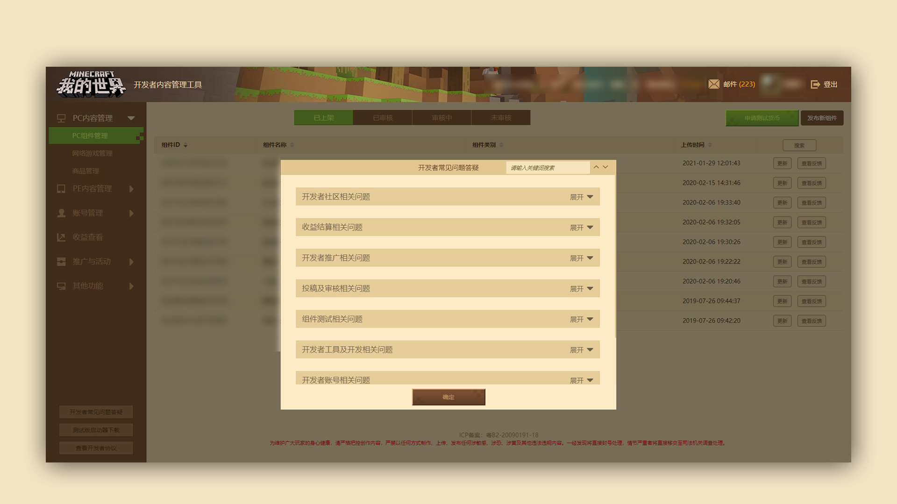

# 活用开发者常见问题答疑

### 活用开发者常见问题答疑

#### TAG：开发者常见问题 FAQ

#### 第一阶段：找到【开发者常见问题答疑】按钮 

#### 第二阶段：学会使用【关键词搜索】

 

在开发者平台的左下方，点击【开发者常见问题答疑】按钮，即可查看开发者FAQ。

在【开发者常见问题答疑】中，包含如组件版权相关、账号相关、开发者工具相关、组件测试、推广、收益结算、社区等一系列常见问题，可通过弹窗中的【关键词搜索】搜索问题相关关键词。

如FAQ中没有包含查找的对应问题，可以通过发送邮件至开发者邮箱：[minecraftstarter@163.com](mailto:minecraftstarter@163.com)并在邮件中需要注明开发者昵称。

[也可点击此此链接](https://qun.qq.com/qqweb/qunpro/share?_wv=3&_wwv=128&inviteCode=1VX5Hn&from=181074&biz=ka&shareSource=5#/pc)加入我的世界开发者QQ小站咨询管理员。

