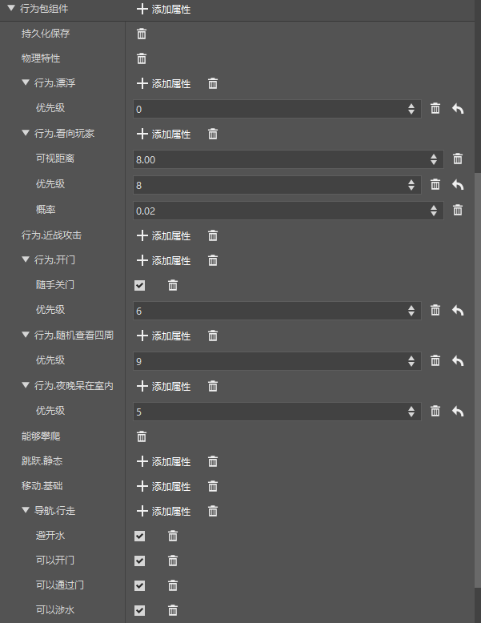
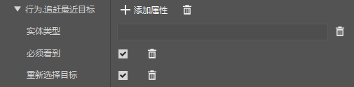
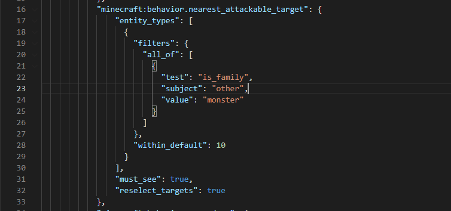
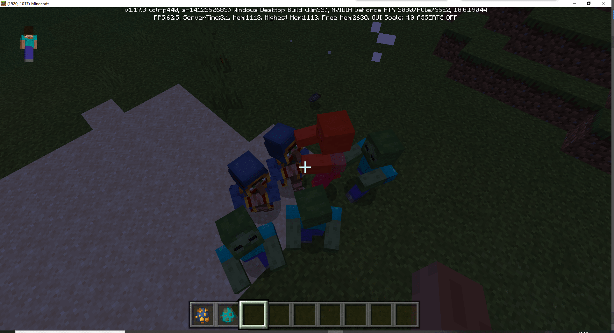

# 功能玩法课后作业

在学习了实体编辑的基本功能之后，我们来尝试做一个新的流浪商人，具有自我保护的能力！

首先新建一个空的实体，并给它命名，这里我们起名叫`merchant`。

创建完成后，由于编辑器目前没有流浪商人的模板，所以我们需要找到这个实体所对应的json文件，并手动编辑，从原版游戏文件中找到流浪商人的文件并将模板替换过来。


首先编辑资源文件，点击这个实体的资源包Json后面的打开文件按钮，使用文本编辑器打开这个文件。

然后将下方内容复制到文件中替换并保存。需要注意的是，要将下方的`afhui:merchant`换成你替换前的名字。

```json
{
  "format_version": "1.8.0",
  "minecraft:client_entity": {
    "description": {
      "identifier": "afhui:merchant",
      "materials": {
        "default": "wandering_trader"
      },
      "textures": {
        "default": "textures/entity/wandering_trader"
      },
      "geometry": {
        "default": "geometry.villager_v2"
      },
      "scripts": {
        "scale": "0.9375"
      },
      "animations": {
        "general": "animation.villager.general",
        "look_at_target": "animation.common.look_at_target",
        "move": "animation.villager.move"
      },
      "animation_controllers": [
        { "general": "controller.animation.villager.general" },
        { "move": "controller.animation.villager.move" }
      ],
      "render_controllers": [ "controller.render.wandering_trader" ],
      "spawn_egg": {
        "texture": "spawn_egg_wandering_trader"
      }
    }
  }
}
```

接下来，我们给这个实体添加一些基本的属性



随后我们可以给他设置一下攻击力，添加一个攻击的属性，设置伤害为10。


但是这样配置，它并不会进行自我保护，所以我们还需要添加一个`行为.追赶最近目标`的行为，并按照图片进行配置。其中实体类型编辑器暂不支持编辑，我们需要手动打开json进行编辑。



我们在配置文件栏中，找到行为包Json，点击打开文件，将`entity_types`这一项改为下方的内容。

> 这段实体类型的意思是选择所有 实体种族 为 monster 的实体
>
> 在这里我们只做了解，想要学习具体语法可以参考[基岩版Wiki](https://bedrock.dev/zh/docs/stable/Entities#Filters)或者原版文件
>
> 原版文件可以在`MCStudioDownload\game\MinecraftPE_Netease\版本\data\`文件中找到
>
> MCStudioDownload文件夹在电脑上某个硬盘的根目录内，可自行查找。

```
				"entity_types": [
                    {
                        "filters": {
                          "all_of": [
                            {
                              "test": "is_family",
                              "subject": "other",
                              "value": "monster"
                            }
                          ]
                        },
                        "within_default": 10
                      }
                ],
```

修改后的json文件是这样的



接下来保存后，点击运行进入游戏，进行测试。



可以看到，我们放出的流浪商人，已经可以主动攻击所有敌对生物了。
