# 为玩法设计内购商品

<iframe src="https://cc.163.com/act/m/daily/iframeplayer/?id=6346815ac6dfd1bb76f2bfac" width="800" height="600" allow="fullscreen"/>

**Demo可在此处下载：[链接](https://g79.gdl.netease.com/in_game_purchases_demo.zip)。**


## 商品的类型

谈到根据玩法设计商品，策划同学应该就不困了。开发者可以根据自己手上的作品，具体问题具体分析，针对性的设计。在此期间，可能会脑洞出很多可能和提案，为了方便思考和整理，可以从两个维度区分商品：

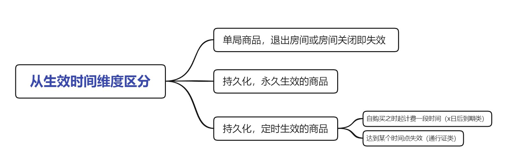

- 单局商品

  就是说这个商品只在当前这一个联机大厅房间有效，而若玩法设计了重复开局，那么新的一局是否清除商品的效用则开发者自行决定。

  若玩家退出房间并再次进入，只要逻辑系统尚未卸载，理论上商品可以继续生效，也可以选择在玩家退出时让商品失效。

  但无论如何，一旦房间关闭，内存将会丢失，单局商品将彻底失效。开发者仍然可以通过接口查询到玩家曾经购买单局商品的历史记录。

- 持久化，永久生效的商品

  持久化是指将玩家购买此商品记入云端数据库，以达到玩家即使换房间，或隔几天又来玩这个地图，逻辑系统始终可以知道玩家（曾经）购买了此商品。

- 持久化，定时生效的商品

  定时生效有别于上面的永久生效，当然也和持久化意思不冲突，是指逻辑系统知道玩家购买了，但并不是永久提供某项服务。又可以分为例如某权限，自购买日起生效10天，到期后失去权限；或s10赛季对应的通行证从9月1号运行到9月30号，那么无论玩家何时购买此商品， 都会在9月30号失去权限。

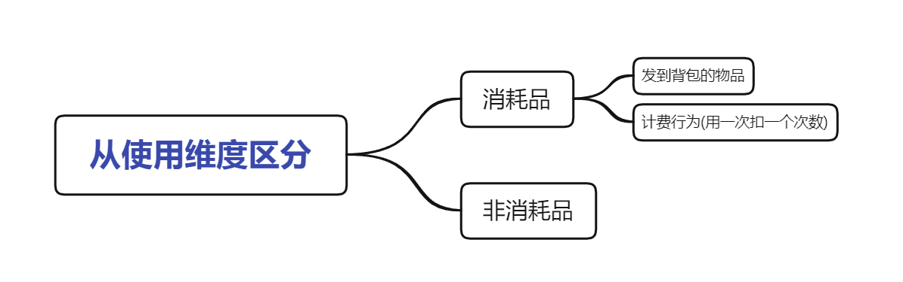

- 消耗品

  一般有食物、药水、盔甲、各种道具这些物品形式的，由于玩法一般是生存或冒险模式，用了就没了，相当于是原版逻辑帮我们完成计费。

  若是一些别的形式，例如释放一次某个技能，这种由逻辑系统实现的行为，可以用云数据库来记录消费次数。

- 非消耗品

  一些常在的权限，不需要计次，例如某种外观、称号、VIP身份，由云数据库记录，使用时判断玩家是否拥有权限。

## 合理定价

我们知道，《我的世界》客户端中玩家有两种货币可供消费——钻石、绿宝石。

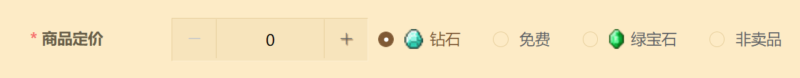

- **钻石**一般是玩家用人民币购买的，也在开平中作为收益结算的来源。因此建议将价值高的商品用钻石定价。
- **绿宝石**是玩家在客户端和游戏中通过各种行为积攒的免费积分，绿宝石收入在开平中作为开发者积分、等级的重要依据，若想提升开发者等级，绿宝石收入不可或缺。因此建议将一般价值的商品，特别是单局或消耗品商品用绿宝石定价。

有时候，我们想要让玩家通过一些额外渠道获得高价值等价物，例如参与某活动赠送10钻石，但显然你不能扩展玩家的钻石来源，于是可以考虑设计一种新的中间货币——金币，玩家用钻石兑换金币，再用金币兑换商品，而你管控金币，有权赠送玩家金币。

关于金币如何实现，本教程受限于篇幅不能详细讲到，建议参考<a href="../../../mcguide/20-玩法开发/13-模组SDK编程/60-Demo示例.html">lobbyGoodsMod2.0</a>这个官方示例demo。

## 实战-设计demo商品

有了上面的理论支撑，让我们为这个来自[第一期创造营的玩法地图教程](../玩法地图基础教程/1-玩法地图是追求完整游戏体验的不二选择.html)的职业战争demo设计和实现如下几个内购商品。

职业战争（KitPVP）的玩法很简单，选择一个职业然后尽可能多击杀其他玩家。这个demo提供了三个职业：坦克、弓箭手、战士。

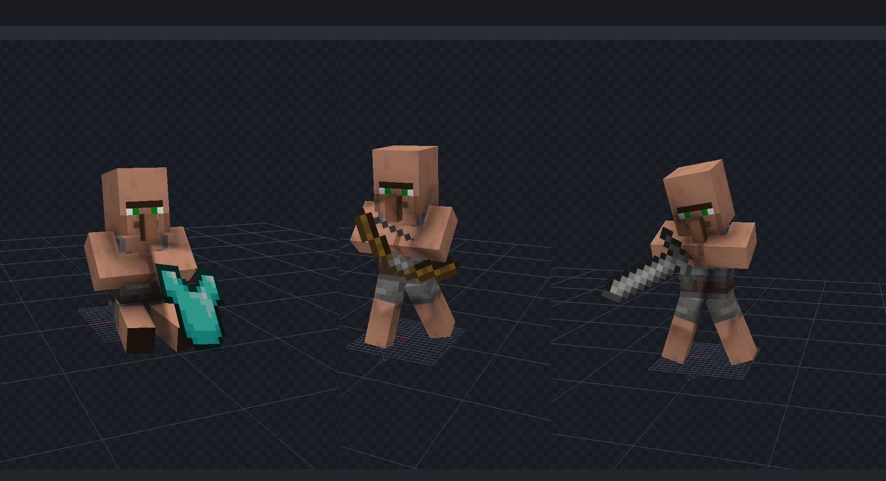

这三个互相制衡的基础职业是较为经典合理的，不适合作为内购商品。所以我们新设一个职业：治疗师，模型就用原版的女巫作为商品。设计信息如下：

- 治疗师（Healer）
- 定位：辅助
- 护甲：铁胸甲，铁护腿，铁靴子
- 武器：木剑
- 物品：喷溅型伤害药水x3，喷溅型治疗药水x3，喷溅型生命恢复x1
- 售价：100钻石，不可重复购买
- 类型：购买后持久化，永久生效


仅有增值职业还不够，我们还可以售卖一些单局消耗品，最简单的当然是原版的物品，我们这里使用demo自带的一个补给类物品吧：

- 美味鲜菇（testmap:testitem1）
- 售价：10绿宝石，可重复购买
- 类型：单局消耗品

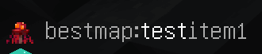

有了永久商品、单局消耗品，我们再设计一个带有效期的定时商品吧。特效是个不错的选择，因为特效不会影响PVP中的平衡性，维持良好的作品评分，又可以为付费玩家提供很好的游戏体验。

- 脚底光圈
- 售价：30钻石/1天，可重复购买以叠加时长
- 类型：持久化，定期商品


## 实战-制作新职业

由于该demo原本没有治疗师职业，所以我们要简单制作一下，首先创建一个实体预设。


选择女巫模板，因为我们要借用它的模型，遵循原作者命名规则，命名为testPresetEntity4。

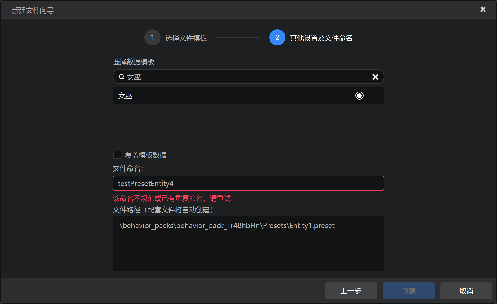

在属性栏勾选免疫伤害，取消勾选保留AI，再清理掉不需要的行为组件，这样让女巫成为一个NPC，站着不会动作为摆设也不会攻击玩家。

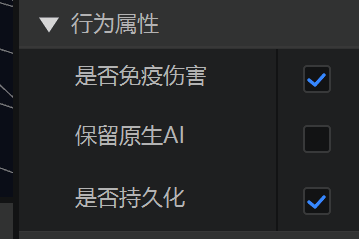


我们看到testPresetEntity1到3的头顶都有粒子特效，所以入乡随俗，将粒子预设挂载到testPresetEntity4预设下，并调整位置，让女巫模型头顶有一个粒子特效。

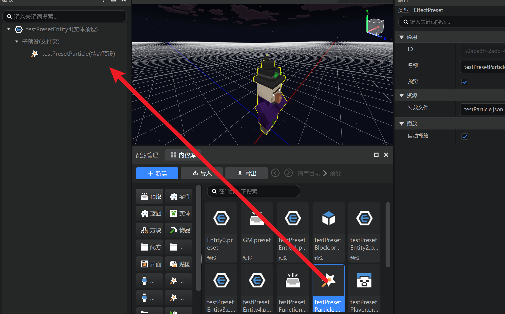

进入地图编辑器，造一个放模型的方块，原本demo地图里只有三个，放置第四个。


在关卡编辑器里把testPresetEntity4预设放置到舞台，并调整位置和旋转。

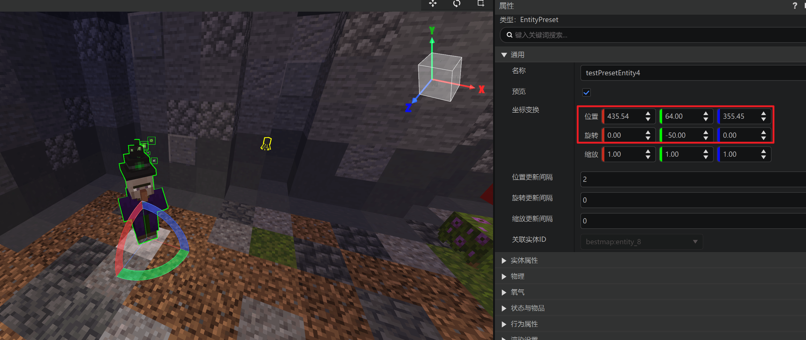

好了，到这里外观就已经完成，进入游戏就可以看到治疗师的模型正确的出现在第四个职业的位置。


接下来要开始实现功能，原本三个职业是用命令方块来实现，走进职业的模型就会被传送到游戏区域内、给予缓降特效和职业物品。

由于内购逻辑需要涉及modsdk编码，这里使用预设零件来实现。首先创建一个新的空零件，命名为Healer，继承触发器（TriggerPart）

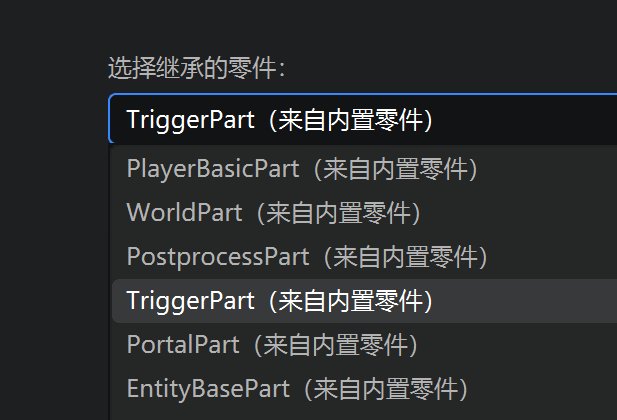

**触发器不难理解，就是我们框定一个区域，然后有任何实体进入、停留、退出这个区域都会被触发器检测到。**

点击新建的零件，属性面板，修改下面的参数

- 区域。参数如图，触发器挂载在实体预设下时，坐标将会使用相对于预设的坐标。
- 监听。由于我们只需要检测玩家进入（即为玩家意图选择此职业），离开和停留都不需要，所以只勾选进入。
- 监听间隔。由于原demo使用命令方块做出来的效果是反应非常迅速的，为了不造成割裂感，设置此参数为1，将会比默认的30快很多。

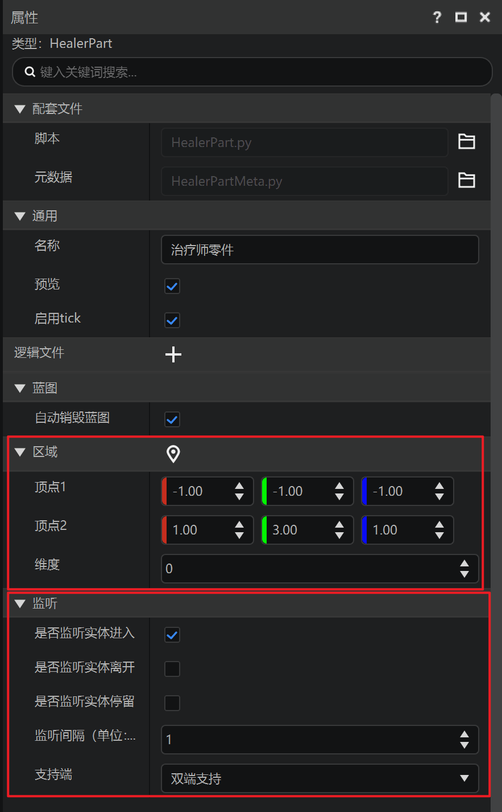

将Healer零件挂载到testPresetEntity4预设下。

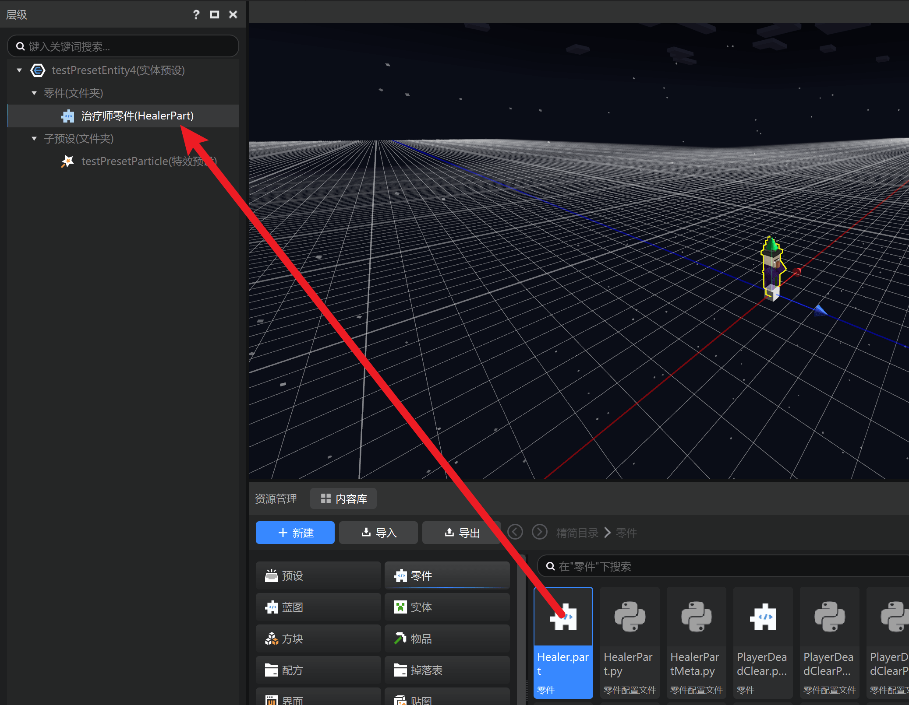

******点击属性面板👉区域👉定位按钮******，浏览我们刚才设置的框框，就可以看到效果——玩家走进这个框框将会被检测到。

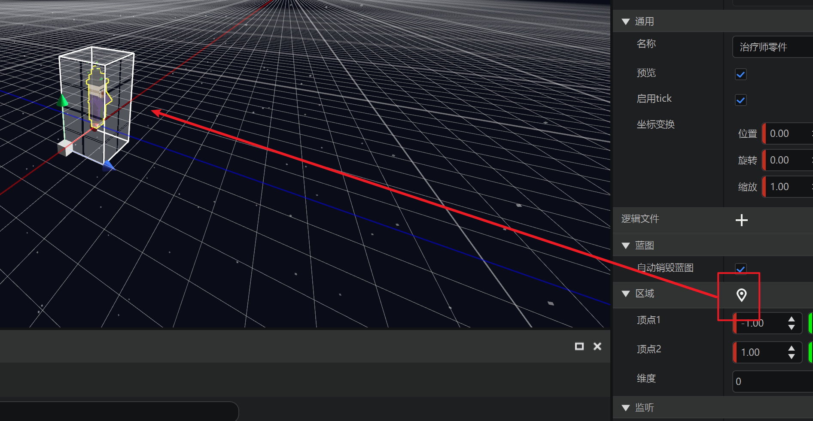

点击属性面板👉配套文件👉脚本👉编辑文件按钮，打开零件的代码文件，编写接受检测结果的代码：

```python
def InitServer(self):
    TriggerPart.InitServer(self)
    self.ListenSelfEvent('OnTriggerEntityEnter', self, self.OnTriggerEntityEnter)

def OnTriggerEntityEnter(self, e):
    for entityId in e['EnterEntityIds']:
        if entityId in self.GetLoadedPlayers():
            self.NotifyOneMessage(entityId, '你尝试选择治疗师职业')
```

进入游戏，测试效果：


继续编写传送和给予buff、物品的逻辑：

```python
def OnTriggerEntityEnter(self, e):
	for entityId in e['EnterEntityIds']:
		if entityId in self.GetLoadedPlayers():
			self.NotifyOneMessage(entityId, '你尝试选择治疗师职业')
			self.TurnHealer(entityId)

def TurnHealer(self, playerId):
	self.NotifyOneMessage(playerId, '你变成了治疗师')
	for itemDict in self.healerItem:
		self.SpawnItemToPlayerInv(itemDict, playerId)
	dim = self.GetEntityDimensionId(playerId)
	self.ChangePlayerDimension(playerId, dim, (352, 83, 442))
	self.AddEffectToEntity(playerId, 'slow_falling', 5, 0, False)
```

进入游戏，测试效果：


那么整个零件源码是这样：

```python
# -*- coding: utf-8 -*-
from Preset.Parts.TriggerPart import TriggerPart
from Preset.Model.GameObject import registerGenericClass

@registerGenericClass("HealerPart")
class HealerPart(TriggerPart):
	def __init__(self):
		TriggerPart.__init__(self)
		# 零件名称
		self.name = "治疗师零件"
		self.area = {'min': (-1.0, -1.0, -1.0), 'max': (1.0, 3.0, 1.0), 'dimensionId': 0}
		self.isTriggerExit = False
		self.healerItem = [
			{
				'newItemName': 'minecraft:iron_leggings',
				'newAuxValue': 0,
				'count': 1
			},
			{
				'newItemName': 'minecraft:iron_boots',
				'newAuxValue': 0,
				'count': 1
			},
			{
				'newItemName': 'minecraft:iron_chestplate',
				'newAuxValue': 0,
				'count': 1
			},
			{
				'newItemName': 'minecraft:wooden_sword',
				'newAuxValue': 0,
				'count': 1
			},
			{
				'newItemName': 'minecraft:splash_potion',
				'newAuxValue': 21,
				'count': 3
			},
			{
				'newItemName': 'minecraft:splash_potion',
				'newAuxValue': 23,
				'count': 3
			},
			{
				'newItemName': 'minecraft:splash_potion',
				'newAuxValue': 28,
				'count': 1
			}
		]
		self.intervalTick = 1
		
	def InitServer(self):
		TriggerPart.InitServer(self)
		self.ListenSelfEvent('OnTriggerEntityEnter', self, self.OnTriggerEntityEnter)

	def OnTriggerEntityEnter(self, e):
		for entityId in e['EnterEntityIds']:
			if entityId in self.GetLoadedPlayers():
				self.NotifyOneMessage(entityId, '你尝试选择治疗师职业')
				self.TurnHealer(entityId)

	def TurnHealer(self, playerId):
		self.NotifyOneMessage(playerId, '你变成了治疗师')
		for itemDict in self.healerItem:
			self.SpawnItemToPlayerInv(itemDict, playerId)
		dim = self.GetEntityDimensionId(playerId)
		self.ChangePlayerDimension(playerId, dim, (352, 83, 442))
		self.AddEffectToEntity(playerId, 'slow_falling', 5, 0, False)

```

但是目前我们将坐标、buff、给予物品等内容硬编码在了代码里，现在零件的自定义属性功能让我们有了更好的做法。想要让这个零件有更多可扩展性，编辑零件元数据文件：

```python
# -*- coding: utf-8 -*-
from Meta.ClassMetaManager import sunshine_class_meta
from Meta.TypeMeta import PBool, PStr, PInt, PCustom, PVector3, PVector3TF, PEnum, PDict, PFloat, PArray, PVector2, \
    PColor
from Preset.Parts.TriggerPart import TriggerPartMeta

@sunshine_class_meta
class HealerPartMeta(TriggerPartMeta):
    CLASS_NAME = "HealerPart"
    PROPERTIES = {
        "gamePos": PVector3(text="传送到", sort=12, group="职业设置"),
        "effectList": PArray(sort=13, text="给予状态效果列表", group="职业设置", childAttribute=PDict(children={
            "effectName": PStr(text="状态原版名称", sort=1, default="speed"),
            "duration": PInt(text="持续时间", sort=2, default=1),
            "amplifier": PInt(text="状态等级", sort=3, default=0),
            "showParticles": PBool(text="显示粒子效果", sort=4, default=True)
        })),
        "itemList": PArray(text="给予物品列表", group="职业设置", sort=14, childAttribute=PDict(children={
            "itemDict": PCustom(
                sort=0,
                text="物品选择",
                editAttribute="MCItems",
                default=("minecraft:wooden_sword", 0),
                withNamespace=True,
                withAuxValue=True,
                isBlock=None,
            ),
            "count": PInt(sort=1, text="物品数量", default=1)
        })),
    }

```

这样，治疗师零件的属性面板就出现了如下设置选项：

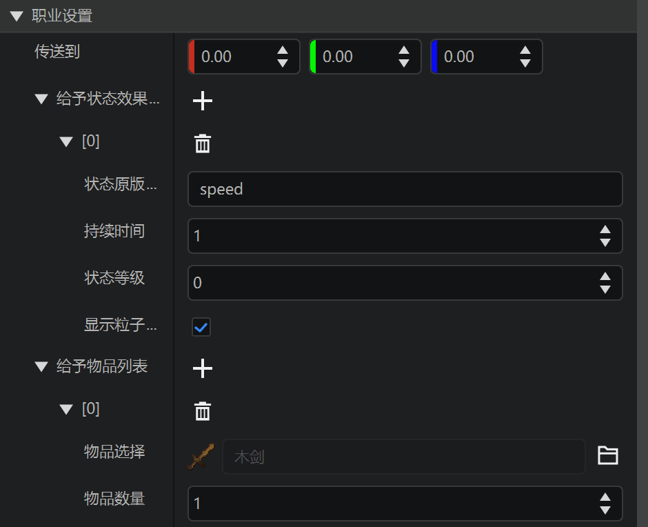

把我们刚才硬编码在代码里的配置应用上去：

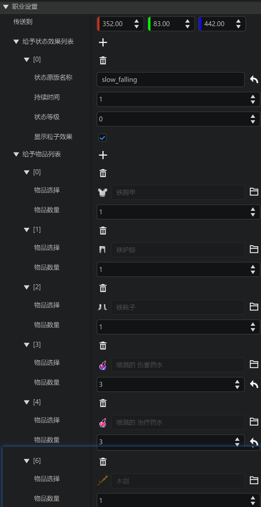

这样将属性暴露出来，无论是后续我们要制作更多其他职业，或是其他团队成员想要修改，都会更加方便，而不用再去面对源代码。

最后，简单修改刚才的硬编码，让属性面板的配置实际生效即可。

```python
def TurnHealer(self, playerId):
	self.NotifyOneMessage(playerId, '你变成了治疗师')
	for item in self.itemList:
		self.SpawnItemToPlayerInv({
			'newItemName': item['itemDict'][0],
			'newAuxValue': item['itemDict'][1],
			'count': item['count']
		}, playerId)
	dim = self.GetEntityDimensionId(playerId)
	self.ChangePlayerDimension(playerId, dim, tuple(self.gamePos))
	for effect in self.effectList:
		self.AddEffectToEntity(playerId, effect['effectName'], effect['duration'], effect['amplifier'], effect['showParticles'])
```

## 实战-制作会员特效

除了购买职业权限，我们当然还可以售卖一些特殊外观服务，下面简单做一个绑定在玩家骨骼上的特效。为了减少工作量，进入**开发者工具台**的内容库，下载一个特效包。

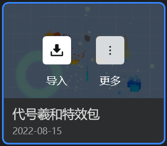

在编辑器打开时，点击导入此特效包。


进入特效编辑器。

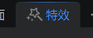

在资源管理，点击中国版特效，挑选一个特效文件：

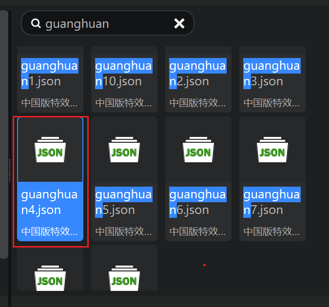

我们要浏览这个特效，将其拖拽至模型挂接栏，挂接到bottom骨骼下：


挂接好后，点击时间轴的播放按钮


可以看到特效播放出来了：


但是我们希望这个光环在玩家脚底下，所以在右侧属性栏找到渲染👉粒子朝向模式，选择水平

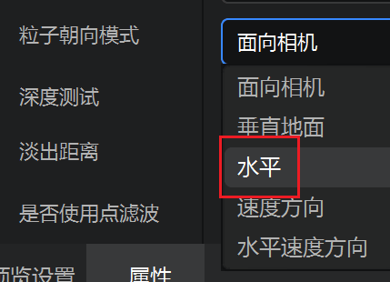

可以看到特效变成了正确的脚底光环：


好了，准备好特效后，返回预设编辑器，创建新的特效预设。

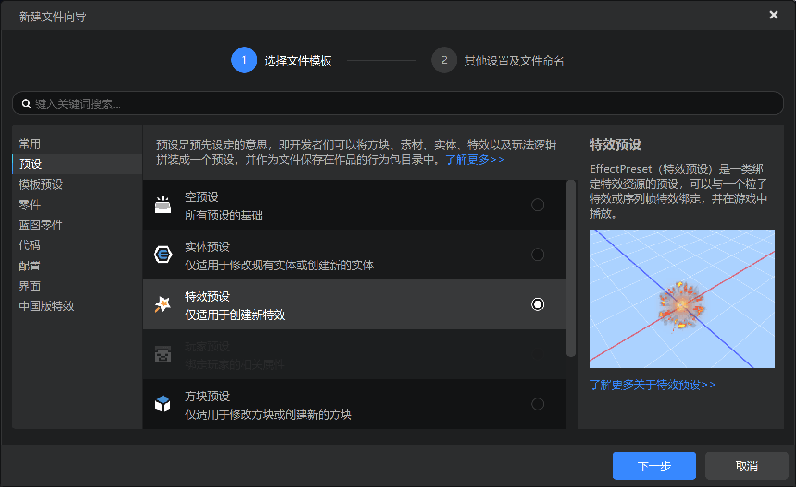

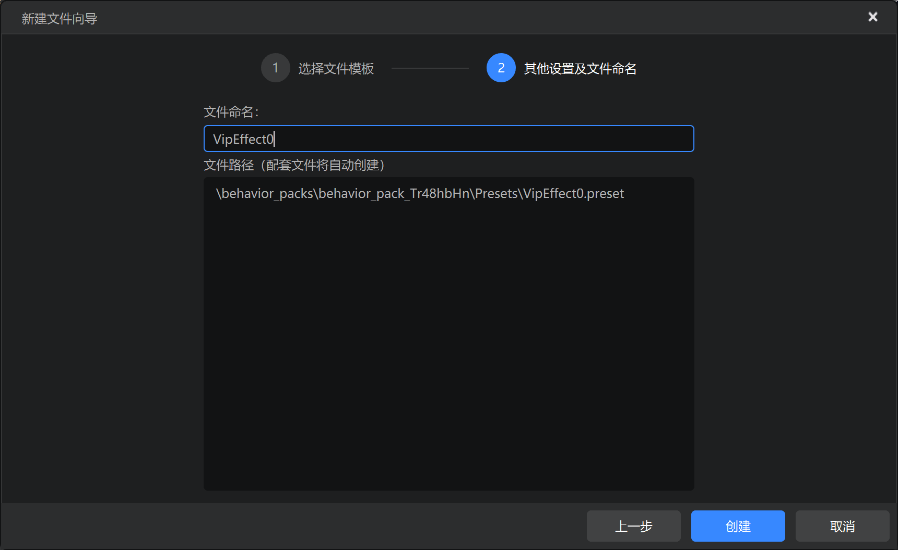

在属性栏选择特效文件，也就是我们刚才挂载的特效文件：


由于这是商品，需要选择性对已购买的玩家生效，所以我们取消勾选属性栏的自动播放：

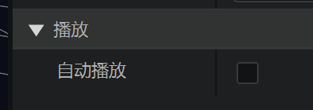

将**特效预设**挂接到**玩家预设**下：

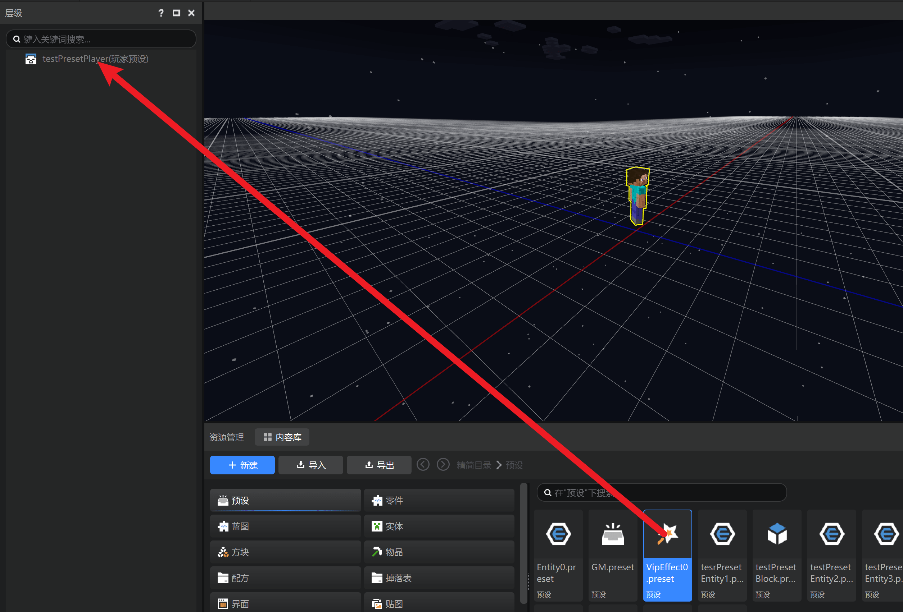

可以看到玩家的脚底有了光环，这里有播放是因为默认勾选了浏览，游戏里是不会播放的

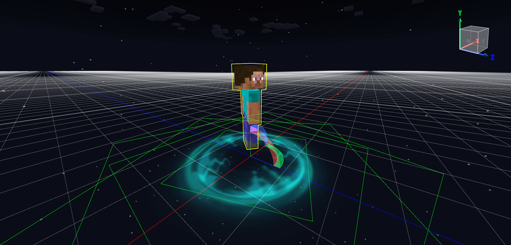

由于脚底光环很容易和地面重合，导致深度检测抽风，所以最好这类特效增加一些y轴坐标变换：


那么上面取消勾选了自动播放，现在特效预设即使挂载也不会播放，就需要一个零件来根据玩家是否有权限控制特效的播放。创建一个VipEffect空零件，命名为会员特效零件，编写代码

```python
def InitClient(self):
	"""
	@description 客户端的零件对象初始化入口
	"""
	PartBase.InitClient(self)
	self.ListenForEngineEvent(ClientEvent.UiInitFinished, self, self.COnUIInitFinished)

def COnUIInitFinished(self, e):
    # 这里就可以判断权限，播放特效
	self.GetParent().ToEffectPreset().Play()
```

将会员特效零件挂载到特效预设下：


返回玩家特效，可以看到玩家预设下有特效预设，特效预设下有一个控制播放的零件：

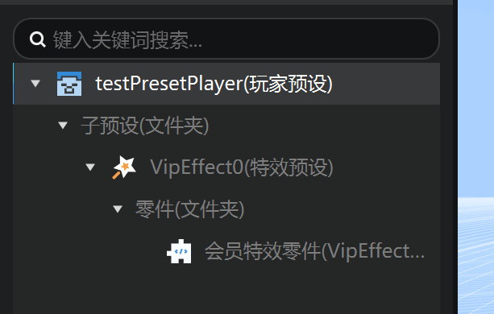

进入游戏，测试效果：


