# 上传并售卖商品

<iframe src="https://cc.163.com/act/m/daily/iframeplayer/?id=63468187c6dfd1bb76f2bfb4" width="800" height="600" allow="fullscreen"/>


## 在开平上传地图和商品，实现指令的设计

创建资源时，资源类别选择**联机大厅**，勾选商业化内购功能。

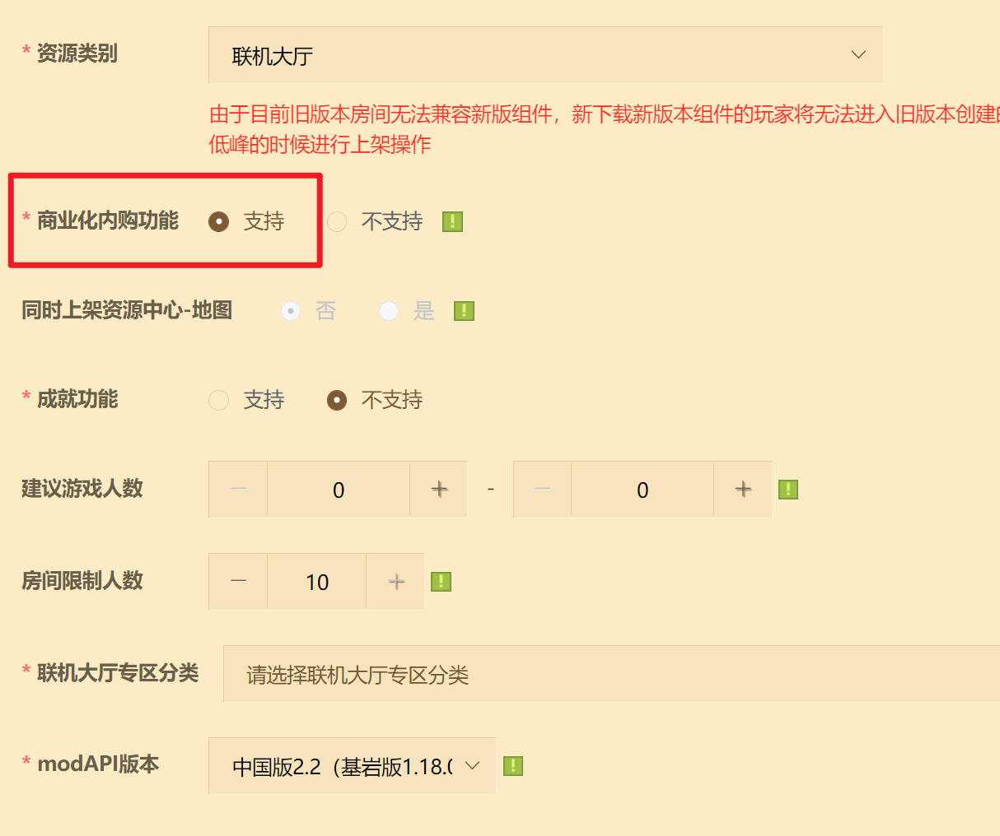

创建好后，该资源将出现在**联机大厅商品栏**。

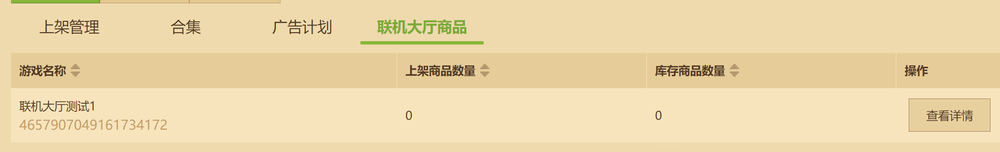

点击**添加商品**。

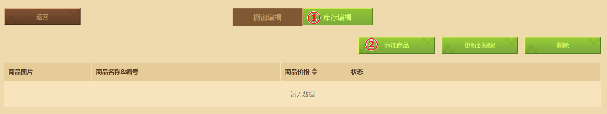

可选：编辑商品分类信息。

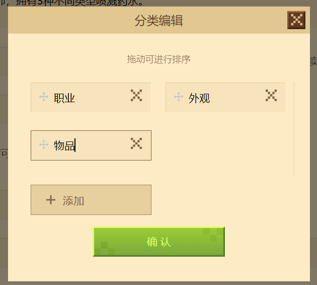

编辑基本信息。

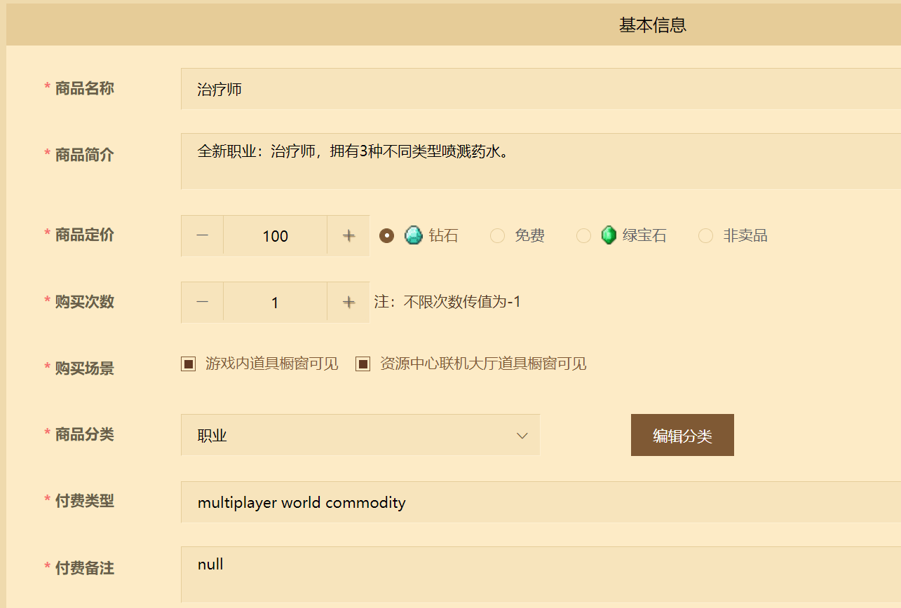

关于实现指令，本意是传递给逻辑系统的内容，作为一个标识符让代码知道这是哪个商品。例如我们最简单的写几个字符：

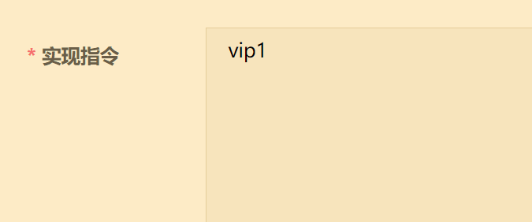

那么在编码时：

```python
def PlayerBuySometing(self, playerId, buyCommand):
	if buyCommand == 'vip1':
		self.GivePlayerVip(playerId, level=1)
		...
```

实现指令格式支持`str`或`json`，用哪种都可以，建议是用`json`为宜，理由是若使用`str`，那么在不更新包体的情况下是万万不可将修改了实现指令的商品上架到橱窗的，修改一个字符都会造成服务不可用。虽然一般情况下不会发生，但还是备有后路比较好。


使用`json`格式，即使需要发生部分变化，只要核心内容没有改变，**仍不会影响识别功能本身**。

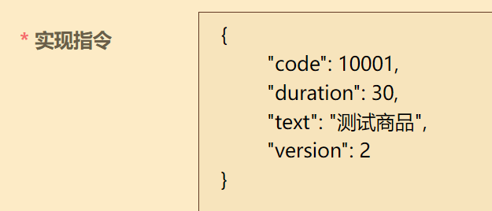

`json`体内可包含任意字段，只要起到标识作用即可，可以是code或name或任意形式，取决于开发者喜好。


实际填写实现指令之前，为了保证不出现无法反序列化错误，建议一定要在格式化工具里校验、压缩json。

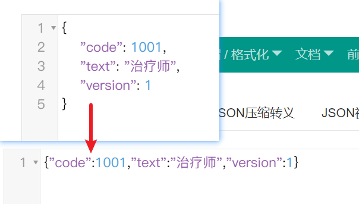


补充剩余商品信息，并保存商品。

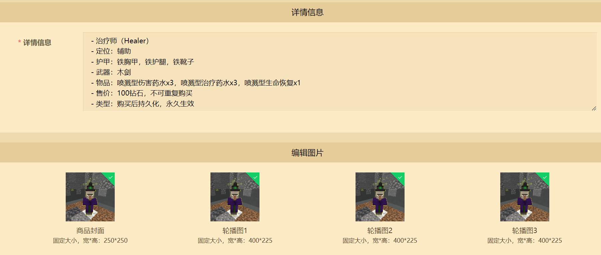

将商品**提交自测**，联机大厅资源本身也**提交自测**，便可看到此商品出现在橱窗。

当然这只是测试版客户端的橱窗，正式版并不会上架此商品，若商品要投入生产环境，需要提交审核，然后更新到橱窗。关于商品上传的更多信息，请查阅<a href="../../../mcguide/26-联机大厅/5-联机大厅作品与商品上传文档.html">商品上传文档</a>。

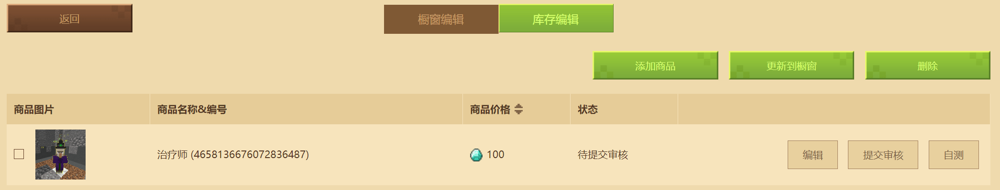

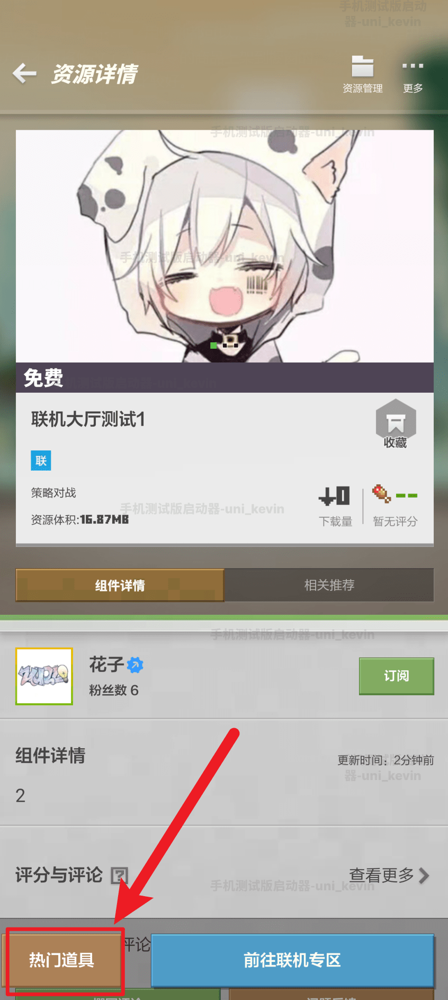


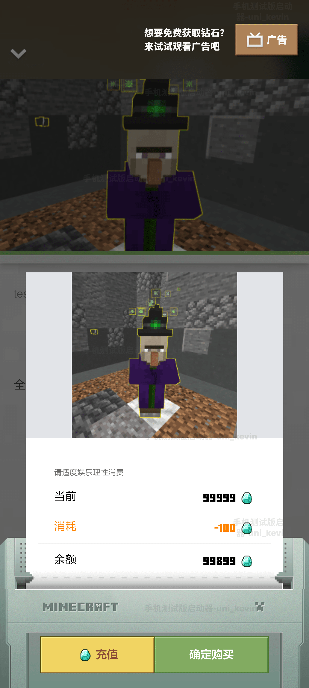

如上所示，添加剩余两个商品。

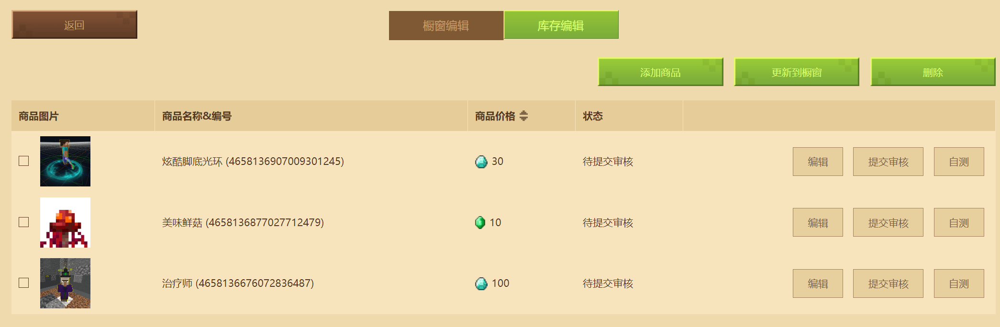

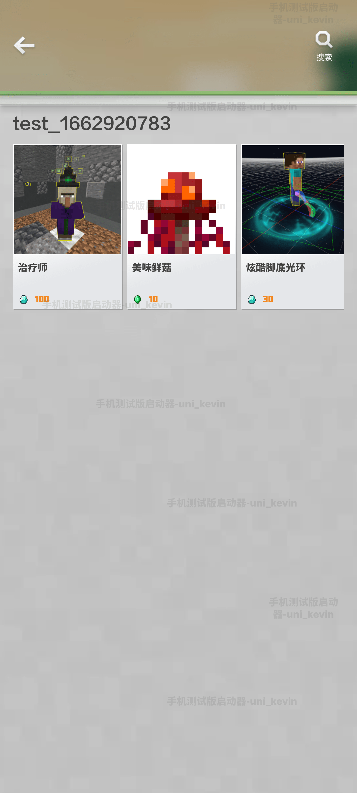

## 通过neteaseStore在游戏中售卖商品

说起来，你还记得我们上一章提到的`neteaseStore`吗？

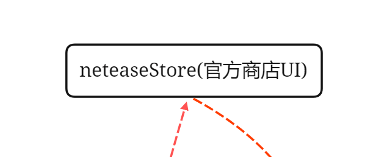

上传好商品后，我们希望玩家不仅可以在橱窗里购买，还希望在游戏中可以购买并立马生效。此时就要借助上一篇中频繁提到的neteaseStore，**它是在游戏中将商品销售给玩家的重要媒介**。


neteaseStore可看作一个UI，打开它的方式有两种：

- 默认自带一个按钮，在左上角，点击即可打开

  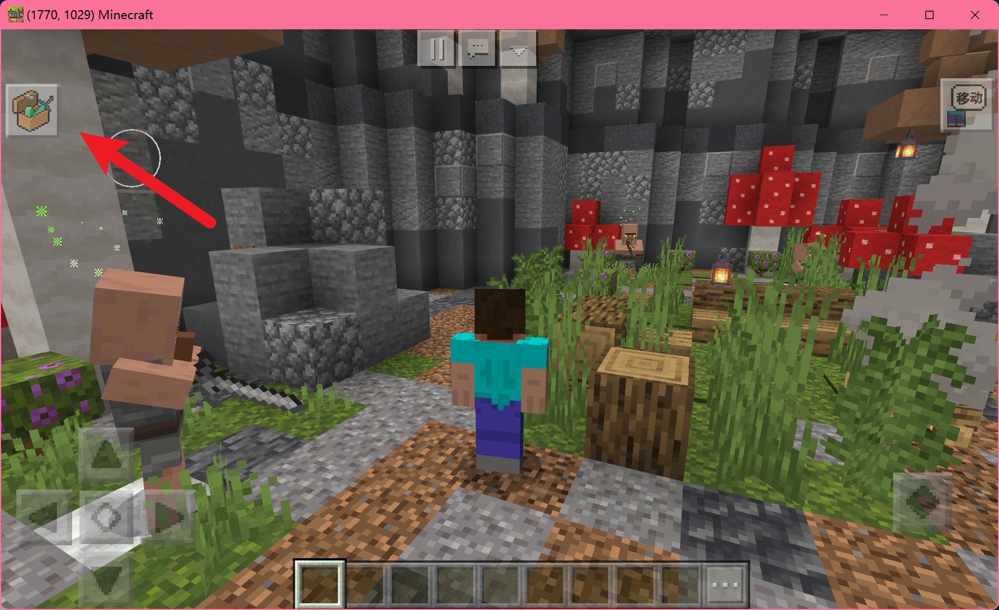

- 不显示自带按钮，通过玩法激起玩家的购买需求，合适时机时用<a href="../../../mcdocs/1-ModAPI/接口/原生UI.html#openneteasestoregui">接口</a>拉起UI，引导玩家购买

  | 参数名       | 数据类型 | 说明         |
  | :----------- | :------- | :----------- |
  | categoryName | str      | 商品分类名称 |
  | itemName     | str      | 商品名称     |

  ```python
  import mod.client.extraClientApi as clientApi
  clientApi.OpenNeteaseStoreGui("商品", "测试商品1")
  ```


为了减少工作量，我们这里使用第一种方法，但neteaseStore的自带按钮并不是一开始就显示的，毕竟不是所有玩法都需要它，所以需要在玩家进入游戏时，调用一个接口显示这个按钮。

创建一个新零件，命名为ShowStorePart，写一行代码：

```python
def InitClient(self):
	PartBase.InitClient(self)
	self.GetApi().HideNeteaseStoreGui(False)
```

将它挂载到**玩家预设**或**GM类预设**下：

**GM类** 预设指GameMananger，通常是勾选常加载、预加载的空预设

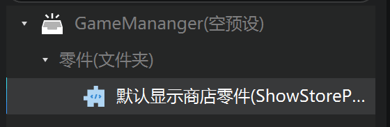

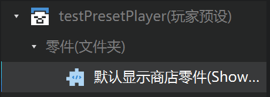

就这么简单，进入游戏即可看到自带商店按钮显示了。

