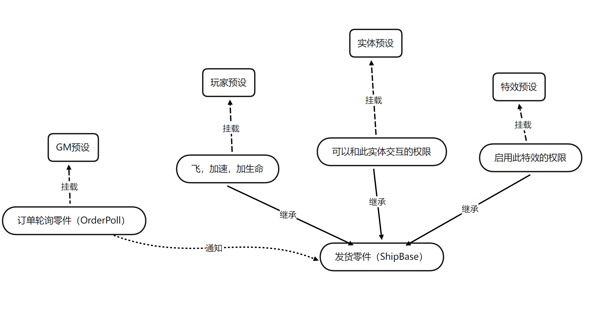
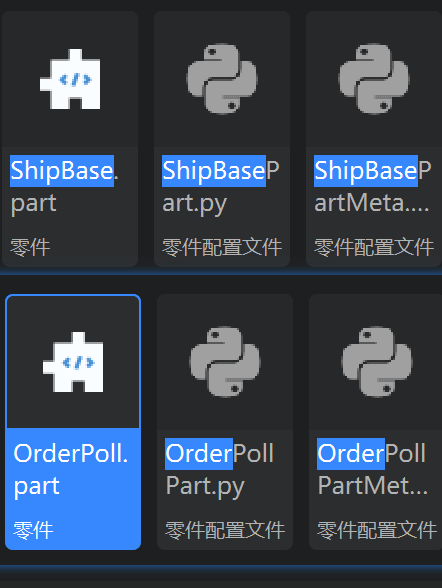
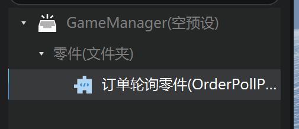
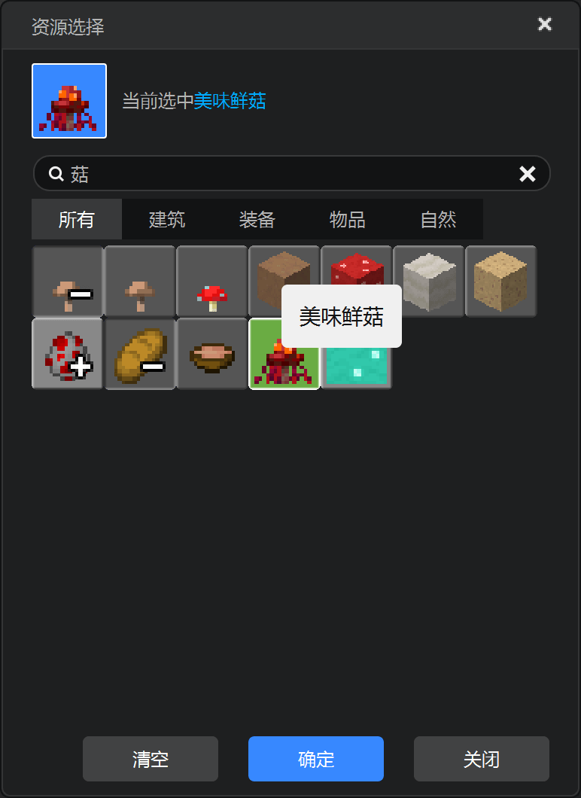
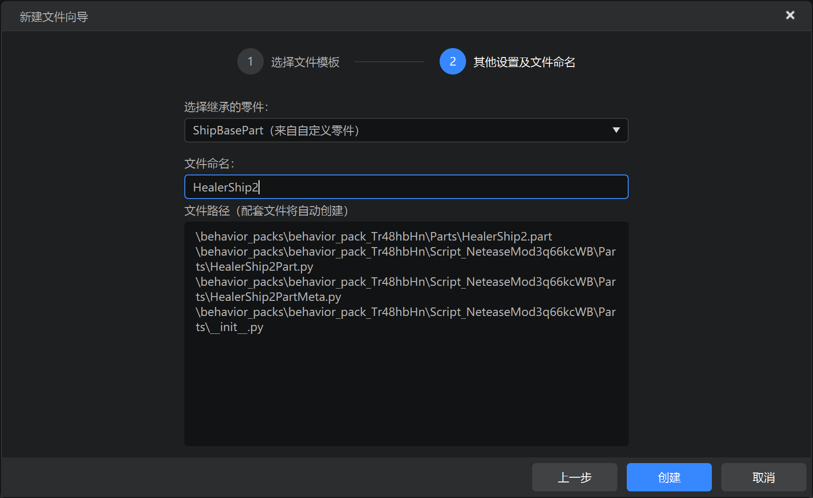
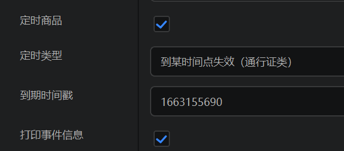
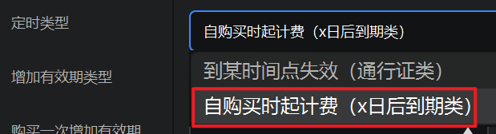
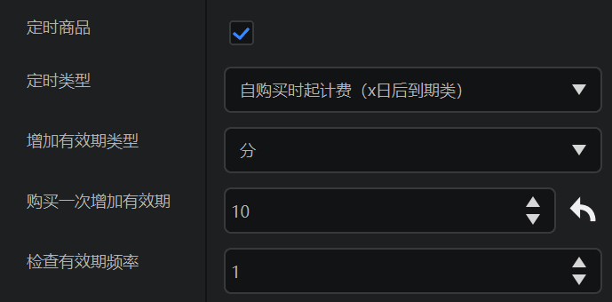

# 实现发货逻辑

<iframe src="https://cc.163.com/act/m/daily/iframeplayer/?id=634681ada240f794f8c6eaef" width="800" height="600" allow="fullscreen"/>

**Demo可在此处下载：[链接](https://g79.gdl.netease.com/in_game_purchases_demo.zip)。**


## 订单轮询、发货零件

工欲善其事，必先利其器。为了使新手开发者更快上手商品的制作，编者准备了两个工具零件，只要在编辑器里使用这两个零件，即可很轻松就实现一个简单的商品。

它们没有经过太多测试验证，建议仅供学习参考，慎重投入生产环境使用。



不要被复杂的图片吓到，这个只是为了更好的说明各部件之间的关系，以及它们如何工作。请下载并导入这两个零件，让我们从一个最简单的物品商品开始做起。



## 美味鲜菇

首先将订单轮询（OrderPoll）零件挂载到GM类预设下，没有就创建一个：

*上一章已经提到，GM类预设指GameMananger，通常是勾选常加载、预加载的空预设



跟随上面下载的两个零件，还会下载到一个物品发货（ItemShip）零件，是使用上述两个零件的一个例子。点击玩家预设，将物品发货零件挂载到玩家预设下。


展开物品发货零件的属性，可以看到如下配置：


其中，实现指令类型、key、值，都根据开平中商品的实现指令配置来填写，例如上图对标的开平中实现指令是`{"code":2001}`。当然写`{"code": 2001,	"text": "美味鲜菇",	"version": 1}`也是可以的。

物品一局里使用掉就没有了，故不属于持久化商品，不勾选；打印事件信息在开发阶段建议勾选以方便调试。

以上都是发货（ShipBase）零件默认提供的配置，剩下一个`给予物品列表`是物品发货（ItemShip）零件提供的配置。

使用喜闻乐见的UI配置好这个商品要发货的物品列表：




Congratulations! 你的第一个商品制作完成！

打包作品并自测，进入游戏查看效果：


## 治疗师

由于治疗师零件为了实现职业功能已经足够复杂，且已经继承自TriggerPart，我们新建一个治疗师发货（HealerShipPart）零件，把权限判定独立出来。

创建空零件，继承ShipBasePart，命名为HealerShipPart：



由于治疗师的商品实现指令是`{"code": 1001}`，所以我们值就填1001。勾选持久化商品，因为职业商品是要求玩家退出换房后仍然记住玩家已购买的状态。

云储存表名按照建议编一个，上线后玩家的购买信息就会保存到这个名称的容器下，若你突然更改，所有之前已购买的玩家都会失去购买记录，而出现权限丢失的情况。当然只要没有覆写或删除，只要改回去就会一切恢复正常，这么说是为了帮助理解它的含义。

治疗师是一个购买后永久生效的商品，所以不需要勾选定时商品。


要写点代码了，不过不多。首先编辑`HealerPart.py`，让治疗师零件将玩家变成治疗师之前，询问一下其他零件要不要阻止：

```python
def OnTriggerEntityEnter(self, e):
	for entityId in e['EnterEntityIds']:
		if entityId in self.GetLoadedPlayers():
			self.NotifyOneMessage(entityId, '你尝试选择治疗师职业')
			eventData = {
				'playerId': entityId,
				'role': self.classType.replace('Part', ''),
				'cancel': False,
			}
			self.BroadcastPresetSystemEvent('PlayerTryChoiceRoleEvent', eventData)
			if not eventData['cancel']:
				self.TurnHealer(entityId)
```

可见，如果监听`PlayerTryChoiceRoleEvent`事件并cancel，玩家就没有办法选择治疗师职业。

接着编辑`HealerShipPart.py`，监听这个事件，并调用一个发货零件提供的接口`IsPlayerService`，传入一个玩家id，它将返回当前此玩家有没有权限享受此商品的服务。若玩家没有权限（也就是没有购买或购买过但过期了），就cancel掉事件，并友好的提示玩家。此时可以发挥才艺，弹出一些吸引消费的浮动窗口之类的，总之你懂的。

- IsPlayerService 服务端
- method in ShipBasePart
- 描述
  - 获取当前此玩家是否有权限享受此商品的服务
- 返回值：bool

| 参数名   | 数据类型 | 说明   |
| -------- | -------- | ------ |
| playerId | str      | 玩家id |

```python
def InitServer(self):
	"""
	@description 服务端的零件对象初始化入口
	"""
	ShipBasePart.InitServer(self)
	self.ListenPresetSystemEvent('PlayerTryChoiceRoleEvent', self, self.PlayerTryChoiceRoleEvent)

def PlayerTryChoiceRoleEvent(self, e):
	if e['role'] == self.classType.replace('ShipPart', ''):
		if not self.IsPlayerService(e['playerId']):
			self.NotifyOneMessage(e['playerId'], '你还没有购买治疗师职业')
			e['cancel'] = True

```

完成啦！进入游戏查看效果（这个gif有点长，于是把购买部分加速了，玩家模型透明了不要问我为啥我也不知道）：


## 会员特效

由于会员特效零件本身并不复杂，主要就是在客户端加载时调用预设的播放方法：

```python
def COnUIInitFinished(self, e):
	self.GetParent().ToEffectPreset().Play()
```

所以重新创建一个VipEffectShip零件，并继承ShipBase即可，将原本上面的代码修改为下面：

```python
def COnPlayerBrought(self, playerId, expireTime=-1.0, newBuy=False, orderTime=None):
	preset = self.GetParent().ToEffectPreset()
	preset.Play()

def COnPlayerExpired(self, playerId):
	preset = self.GetParent().ToEffectPreset()
	preset.Stop()
```

`COnPlayerBrought`是ShipBase提供的一个可供重写的客户端事件（声明同名函数即可监听），当**玩家购买商品**或**已购买过的玩家进入房间时**会触发，所以直接在它下面调用预设的播放即可。

| 参数名     | 数据类型 | 说明                                |
| ---------- | -------- | ----------------------------------- |
| playerId   | str      | 玩家id                              |
| expireTime | flout    | 商品到期时间戳                      |
| newBuy     | bool     | 是否新购买，False则为购买过进入房间 |
| orderTime  | flout    | 订单创建时间戳（购买时间）          |

同理，`COnPlayerExpired`是**玩家权限过期时**会被触发，则停止特效的播放。

展开会员特效零件的属性栏，像刚才一样配置好实现指令、云储存表名。


勾选定时商品。



定时类型选择第二种。



比如我们想让这个商品，每购买一次增加10分钟有效期，每秒检查一次是否过期，就设置为如下图：



保存零件，打包作品并自测，进入游戏查看效果：


#### 至此，我们在章节二设计的三种商品均以实现发货功能。下面是一些ShipBase的接口和事件，希望对你的使用有帮助。 

## 事件

- ## SOnPlayerBrought 服务端，COnPlayerBrought 客户端

- 描述

  - **当玩家购买商品**或**已购买商品的玩家进入房间**时触发

  | 参数名     | 数据类型 | 说明                                |
  | ---------- | -------- | ----------------------------------- |
  | playerId   | str      | 玩家id                              |
  | expireTime | flout    | 商品到期时间戳                      |
  | newBuy     | bool     | 是否新购买，False则为购买过进入房间 |
  | orderTime  | flout    | 订单创建时间戳（购买时间）          |

- ## SOnPlayerExpired 服务端，COnPlayerExpired 客户端

- 描述

  - **当玩家商品权限过期**时触发

  | 参数名   | 数据类型 | 说明   |
  | -------- | -------- | ------ |
  | playerId | str      | 玩家id |

- ## SOnPlayerNeverBought 服务端，COnPlayerNeverBought 客户端

- 描述

  - **当一个从未购买过此零件负责的商品的玩家进入游戏**时触发

  | 参数名   | 数据类型 | 说明                     |
  | -------- | -------- | ------------------------ |
  | playerId | str      | 玩家id                   |
  | regTable | bool     | 是否已经创建表，但空数据 |

  

## 接口

- ## IsMyService 服务端

- method in ShipBasePart

- 描述

  - 此订单是否由本零件负责

- 返回值：bool

| 参数名    | 数据类型 | 说明                               |
| --------- | -------- | ---------------------------------- |
| orderBody | dict     | QueryLobbyUserItem的cb提供的订单体 |

- ## IsPlayerService 服务端

- method in ShipBasePart

- 描述

  - 获取当前此玩家是否有权限享受此商品的服务

- 返回值：bool

| 参数名   | 数据类型 | 说明   |
| -------- | -------- | ------ |
| playerId | str      | 玩家id |

- ## GetPlayerLastServiceTime 服务端

- method in ShipBasePart

- 描述

  - 获取当前此玩家商品权限剩余有效期，-1为永久或非定时商品

- 返回值：flout/int

| 参数名   | 数据类型 | 说明   |
| -------- | -------- | ------ |
| playerId | str      | 玩家id |

- ## SetCloudPersistent 服务端

- method in ShipBasePart

- 描述

  - 在本零件自己的云数据表中记录商品购买订单状态

- 返回值：无

| 参数名     | 数据类型 | 说明                   |
| ---------- | -------- | ---------------------- |
| playerId   | str      | 玩家id                 |
| orderId    | int      | 订单id                 |
| orderTime  | flout    | 订单创建时间戳         |
| expireTime | flout    | 商品到期时间戳，-1永久 |

- ## SetOrderShip 服务端

- method in ShipBasePart

- 描述

  - 通知网易商店系统订单已发货

- 返回值：无

| 参数名   | 数据类型 | 说明   |
| -------- | -------- | ------ |
| playerId | str      | 玩家id |
| orderId  | int      | 订单id |

- ## GetPlayerUid 服务端

- method in ShipBasePart / OrderPollPart

- 描述

  - 同官方httpComp功能，获取玩家uid

- 返回值：str

| 参数名   | 数据类型 | 说明   |
| -------- | -------- | ------ |
| playerId | str      | 玩家id |

- ## ShipPlayer 服务端

- method in **OrderPollPart**

- 描述

  - 此接口零件默认每4s调用一次，你也可以手动调用，检测玩家是否有未发货订单，若有则启动发货流程

- 返回值：无

| 参数名   | 数据类型 | 说明   |
| -------- | -------- | ------ |
| playerId | str      | 玩家id |

- ## CheckExpire 服务端

- method in ShipBasePart

- 描述

  - 此接口零件根据属性面板设置的频率自动调用，你也可以手动调用，检查玩家权限有效期，若过期则取消权限并触发OnPlayerExpired

- 返回值：无

- ## DebugDelTableAllData 服务端

- method in ShipBasePart

- 描述

  - **慎用**，清除云储存表所有订单数据，启用调试功能后聊天框输入`claer 表名`同功能

- 返回值：无

| 参数名   | 数据类型 | 说明   |
| -------- | -------- | ------ |
| playerId | str      | 玩家id |

- ## DiffForHumans 服务端

- method in ShipBasePart

- 描述

  - 将时间戳转换为人类友好语言（仅支持向前），例如`刚刚`，`x分钟前`，这是个残血版，建议只用来描述商品是何时购买的，更好的在GitHub上

- 返回值：无

| 参数名    | 数据类型  | 说明   |
| --------- | --------- | ------ |
| timestamp | int/flout | 时间戳 |

